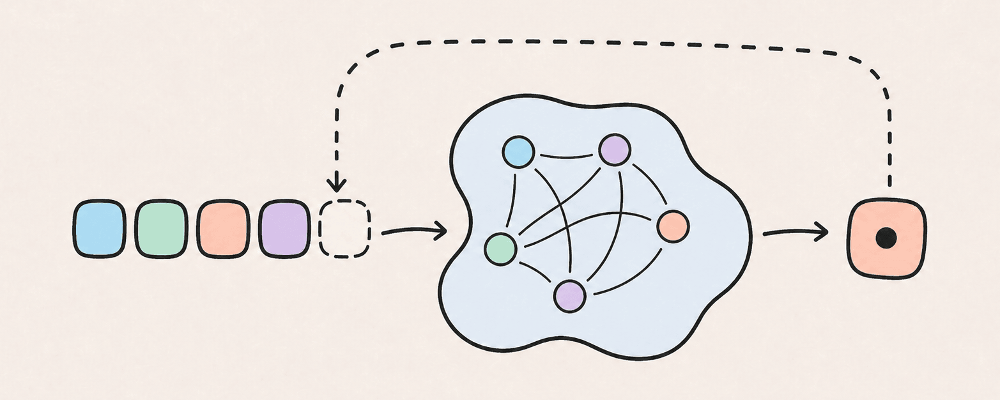

# Jamez 的技术博客

LLM、推理、Agent，以及一些碎碎念。

## 文章

- [Kimi K3 学习笔记：一个 3T 级模型的三项核心设计](https://github.com/jamez-bondos/blog/issues/2) 
  从混合注意力、Stable LatentMoE 和 Block AttnRes 三个方向，拆解 Kimi K3 的核心架构。

- [从零实现 GPT-2 推理](https://github.com/jamez-bondos/blog/issues/1) 
  *大模型推理初学者指南* — 逐层拆解 GPT-2 模型架构，并用 PyTorch 从零实现完整的推理代码。

## RSS

## 许可

- 博客文章正文和图片（包括 GitHub Issue 原文及仓库备份）：[CC BY 4.0](./LICENSES/CC-BY-4.0.txt)
- 文章配套代码与项目代码：[MIT](./LICENSES/MIT.txt)
