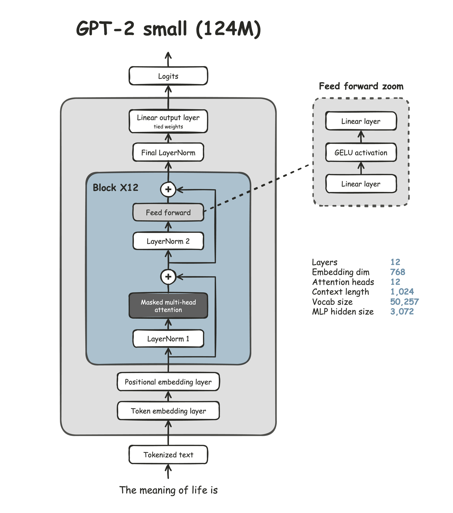
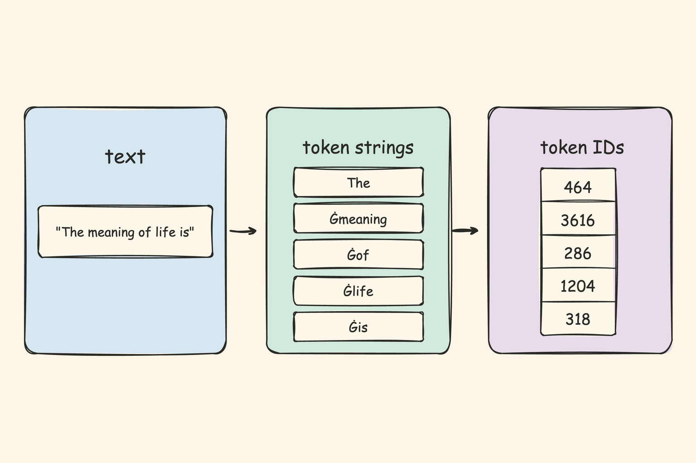
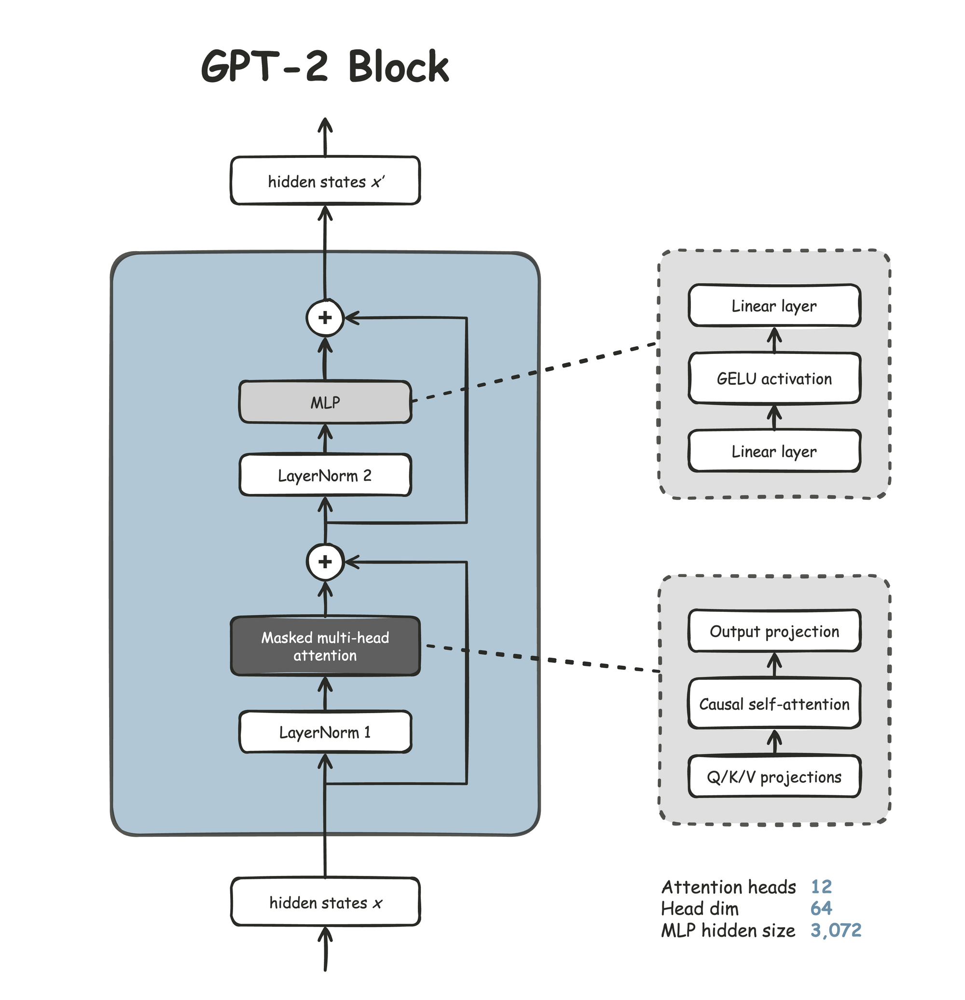
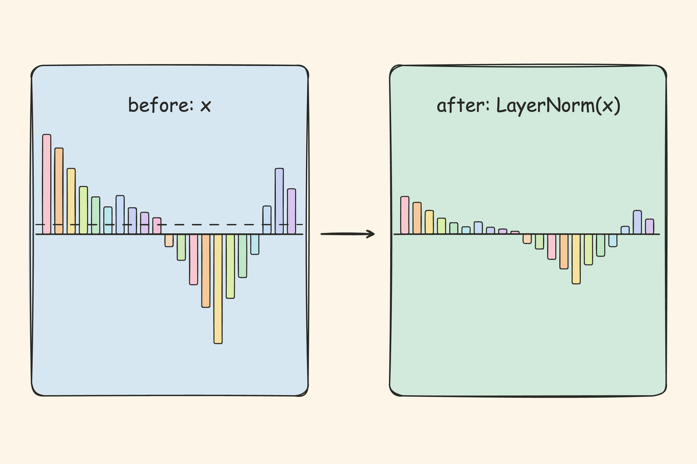
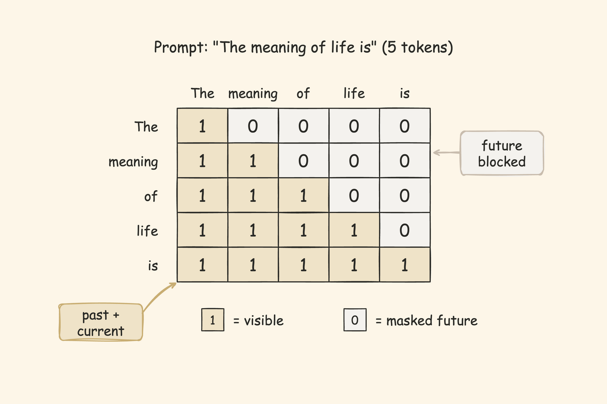
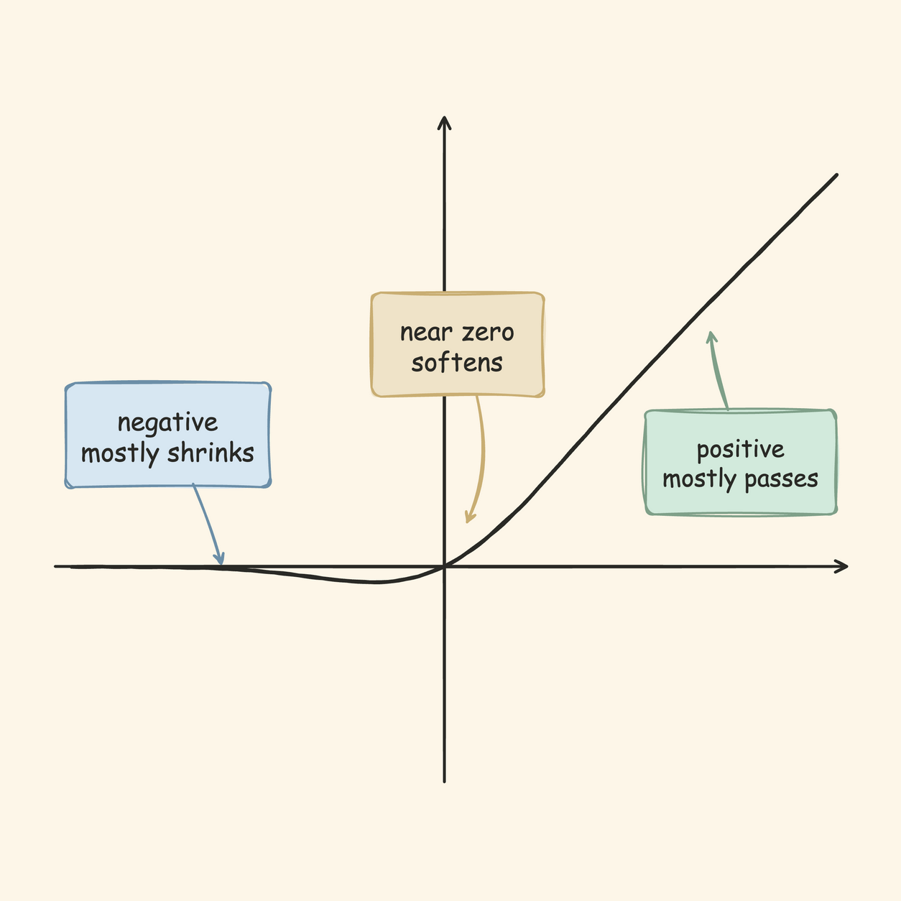
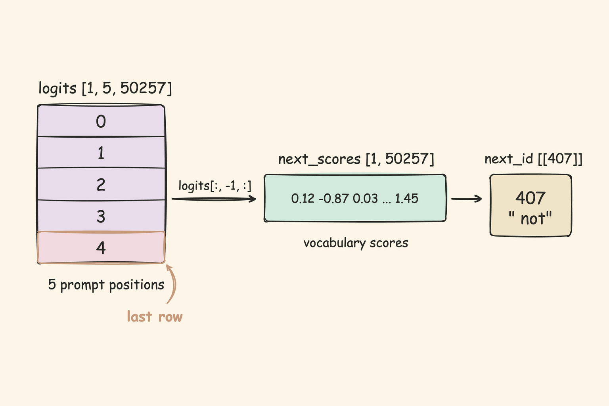
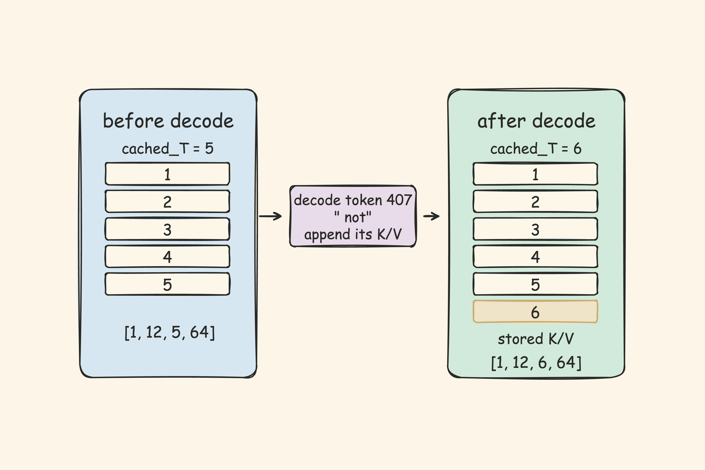
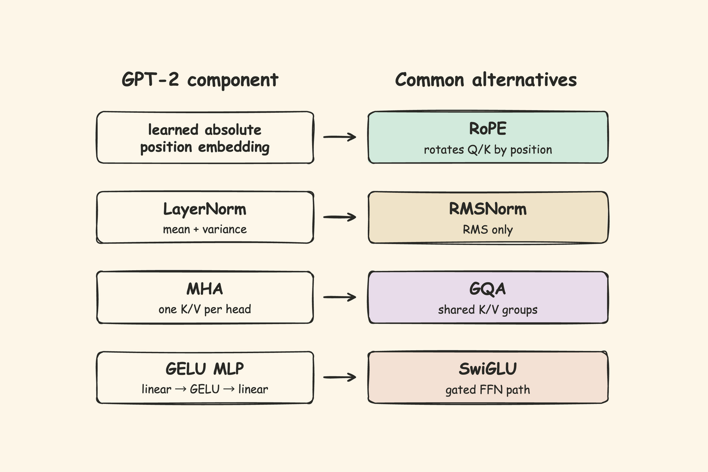

# 从零实现 GPT-2 推理

*大模型推理初学者指南*

大语言模型（LLM）我们几乎每天都在用。但它究竟是如何回答我们的？它输出的每一个字，背后究竟发生了什么？这篇文章想和你一起回答这个问题，我们会把一段文本送进模型，跟着它走完整个内部计算，看清楚模型是怎样一步一步算出下一个 token 的。

## 1. 什么是推理？

一句话说，推理（inference）就是给模型一段文本，它用训练好的权重（weights）算出下一个 token。

怎么理解这个过程？从纯计算角度看，推理本质上是一连串矩阵乘法，核心操作就是 GEMM（矩阵乘矩阵）和 GEMV（矩阵乘向量），不了解模型架构也写得出来。但在我看来，沿着架构把这些运算从零实现一遍，看清楚每一步在哪个模块里、做的是什么变换，是理解模型最好的方式之一。我自己读这类"从零实现"的文章时收获最大，写这篇文章的过程同样如此。所以接下来，我们会用 PyTorch 把 GPT-2 的完整推理路径从零写出来，并且真正跑通它。

我选择 GPT-2 small（[openai-community/gpt2](https://huggingface.co/openai-community/gpt2)）作为拆解对象。它是 OpenAI 于 2019 年发布的公开权重模型，那时候的 OpenAI 还比较 open。GPT-2 small 参数量 124M，权重文件 548 MB，在普通笔记本的 CPU 上就能跑起来。今天的主流模型远比它更大更复杂，但在我看来，GPT-2 可能是理解大模型推理最好的起点：它简单到每一步都能摊开看清楚，不会迷失在复杂的架构设计和层叠的优化技巧里；又完整到足以让我们看清现代 Transformer 模型到底是怎么工作的。

在读这篇文章之前，我假设你已经会写基本的 Python，对 PyTorch 代码也不陌生；至于注意力机制这类概念，你不需要提前掌握细节，我们会把它拆开来讲。还要声明一下范围：模型训练（training）和 GPU 推理加速不在本文范围内，本文只关注推理时模型内部的计算。

我们用一个例子来看推理长什么样。把提示词（prompt）`The meaning of life is` 送进 GPT-2，模型在内部跑完一次 `forward()` 计算，为所有候选 token 各打一个分数，选出分数最高的那个作为预测结果：`' not'`。想生成更长的文本，就把新 token 追加到输入末尾，再跑一轮 `forward()`，如此往复。

那么，`forward()` 里面到底发生了什么？后面的章节会逐步拆解。我们先从 GPT-2 的整体架构看起。

## 2. GPT-2 架构总览

先看 GPT-2 small 的关键尺寸：12 层，隐藏维度（hidden size）768，12 个 attention head（注意力头），词表大小（vocab size）50,257，上下文长度（context length）1,024。GPT-2 还有 medium、large、xl 等变体，架构一致，只是这些尺寸更大。

GPT-2 的内部结构可以画成一条竖线，自底向上，如图 1 所示。图里的 Block（Transformer 块）会重复 12 次，是模型的主要计算层：



*图 1：输入从底部进入，经过 12 个重复的 Block，在顶部输出 logits；最后位置的 logits 用来选择下一个 token。画法参考 Sebastian Raschka 的 [From GPT-2 to GPT-oss: Analyzing the Architecture](https://magazine.sebastianraschka.com/p/from-gpt-2-to-gpt-oss-analyzing-the) Figure 2。*

数据在图 1 中自底向上流动，每一步的形状（shape）变化如下：

1. 输入是一串 token ID，形状 `[1, 5]`（1 条提示词，5 个 token）。
2. 嵌入（embedding）这一步把每个 ID 变成一个 768 维的向量，叠上位置信息。出来后是 `[1, 5, 768]`。
3. 这个向量依次穿过 12 个结构相同的 Block。每个 Block 进出的形状保持不变：`[1, 5, 768]`。
4. 经过最后一层 LayerNorm 后，LM head（语言模型输出头）把 768 维投回词表空间，得到 logits（未归一化分数）：`[1, 5, 768]` 变成 `[1, 5, 50257]`。
5. 取最后一个位置 `[1, 50257]`，argmax 挑出分数最高的 token ID。这种每步都选最高分的做法叫贪心解码（greedy decoding），也是本文唯一会用的解码方式。

Block 内部还有 attention（注意力）和 MLP（前馈网络）两个子结构，后面的章节会分别把它们拆开。

## 3. 模型文件和参照实现

GPT-2 推理需要三类文件：

- `tokenizer.json`、`vocab.json`、`merges.txt`：分词器（tokenizer）文件，负责把文本转成 token ID，也负责把 token ID 解码回文本。
- `config.json`：模型配置，记录层数、隐藏维度、attention head 数量、上下文长度这些尺寸信息。
- `model.safetensors`：模型权重，存着推理时会用到的命名张量（tensor），比如 token 向量表、位置向量表，以及后续各层的参数。

`model.safetensors` 存的是一组命名张量。我们可以把它看成一个 `dict`：key 是权重名，value 是具体张量。后面代码里的 `weights["wte.weight"]`、`weights["wpe.weight"]`，都是从这个字典里取出来的张量。

```text
weights["wte.weight"].shape -> [50257, 768]
weights["wpe.weight"].shape -> [1024, 768]
```

`wte.weight` 是 token 向量表，按 token ID 查向量。`wpe.weight` 是位置向量表，按位置编号查向量。模型其他层的权重也按名字存放，等到代码里用到时我们再展开。

> **运行前准备**
>
> 后面所有代码都假设 GPT-2 文件已经下载到 `models/gpt2` 目录下。
>
> ```text
> pip install torch transformers tokenizers safetensors huggingface_hub
> hf download openai-community/gpt2 \
>   "config.json" "model.safetensors" "tokenizer.json" \
>   "vocab.json" "merges.txt" "tokenizer_config.json" \
>   --local-dir models/gpt2
> ```

在动手拆开模型之前，我想先建立一个参照实现。我们先用 Hugging Face 的 Transformers 写一个完整的推理版本：它代码短、结果可靠。等后面我们用 PyTorch 拆开实现时，就可以拿这个版本做一致性检查（parity check）。这对我来说是一个很重要的习惯：从零实现的时候，手里总要有一个可信的答案可以对。

```python
import torch
from transformers import AutoModelForCausalLM, AutoTokenizer

model_dir = "models/gpt2"
prompt = "The meaning of life is"

hf_tokenizer = AutoTokenizer.from_pretrained(model_dir)
hf_model = AutoModelForCausalLM.from_pretrained(model_dir)
hf_model.eval()

input_ids = hf_tokenizer(prompt, return_tensors="pt").input_ids

outputs = hf_model(input_ids)
logits = outputs.logits
next_id = torch.argmax(logits[:, -1, :], dim=-1, keepdim=True)

print("input_ids:", input_ids.tolist())     # [[464, 3616, 286, 1204, 318]]
print("logits.shape:", list(logits.shape))   # [1, 5, 50257]
print("next_id:", next_id.tolist())          # [[407]]
print("next_token:", repr(hf_tokenizer.decode(next_id[0].tolist())))  # ' not'
```

`logits` 的形状 `[1, 5, 50257]` 和上面第 4 步描述的一致。`next_id` 是 407，解码后是 `' not'`，和前面给出的结果对得上。请记住这几个数值，后面我们拆开实现时，会用它们来对答案。

值得一提的是，GPT-2 的标准配置还包含随机失活（dropout）。训练时，它会随机将部分张量元素置零，并缩放其余元素；本文在推理前调用 `model.eval()`，此时 dropout 会让数值原样通过，因此不影响本文的计算结果，后文也不再展开这部分。

## 4. 从文本到向量

GPT-2 并不直接处理文本。它需要先把文本变成内部能计算的向量表示，这个向量叫 hidden states（隐藏状态）。转换分两步：第一步是分词（tokenization），把字符串切成 token，并把每个 token 映射为一个整数 ID；第二步是嵌入，把 ID 变成向量。

### 4.1 分词

分词器把 `The meaning of life is` 切成 5 个 token，每个 token 对应一个整数 ID，如图 2 所示：



*图 2：一句文本先切成 token 字符串，再转成模型接收的整数 ID。*

只用几行代码，我们就能看到这个过程：

```python
from tokenizers import Tokenizer

model_dir = "models/gpt2"
prompt = "The meaning of life is"

tokenizer = Tokenizer.from_file(f"{model_dir}/tokenizer.json")
encoded = tokenizer.encode(prompt)
input_ids = [encoded.ids]

print(encoded.tokens)   # ['The', 'Ġmeaning', 'Ġof', 'Ġlife', 'Ġis']
print(input_ids)        # [[464, 3616, 286, 1204, 318]]
```

值得注意的是，token 不一定是一个完整单词。GPT-2 使用 byte-level BPE（字节级 BPE）：先从能够表示任意文本的字节单位出发，再把常见的相邻片段合并成更长的 token。空格也参与这个过程，所以 `meaning` 和前面带空格的 ` meaning` 可能是两个不同的 token。输出中的 `Ġ` 只是分词器用来显示前导空格的内部符号，并不是原文中真的有这个字符；这里的 `Ġmeaning` 对应 ID `3616`。

这 5 个 ID 就是模型真正收到的输入。`B = 1` 表示只有一条提示词，`T = 5` 表示序列长度是 5：

```text
input_ids: [B, T] = [1, 5]
[[464, 3616, 286, 1204, 318]]
```

### 4.2 嵌入

token ID 只是整数，还不能直接参与计算。嵌入这一步通过查表把每个 ID 变成一个 768 维的浮点向量。请注意，查表本质上是索引提取（lookup），而不是矩阵乘法：

```text
token_embeds    = wte.weight[input_ids]
position_embeds = wpe.weight[position_ids]
hidden_states   = token_embeds + position_embeds
```

这里做了两件事。`wte.weight` 按 token ID 取对应的向量，这叫 token embedding（token 嵌入）。`wpe.weight` 按位置 0、1、2、3、4 各取一个向量，叫 position embedding（位置嵌入）。这两个权重名在第 3 节的模型文件里已经出现过。两者相加，就得到前面说的 hidden states，也就是每个 token 在模型内部的向量表示，形状 `[B, T, 768]`。

用 PyTorch 写出来，就是这样一个类。本文所有模块都继承 `nn.Module`，它是 PyTorch 的模块基类，负责管理参数和子模块。

```python
import torch
import torch.nn as nn

class Embedding(nn.Module):
    def __init__(self, token_weight, position_weight):
        super().__init__()
        self.token_embedding = nn.Embedding.from_pretrained(token_weight, freeze=True)
        self.position_embedding = nn.Embedding.from_pretrained(position_weight, freeze=True)

    # 方法名固定叫 forward：后面写 self.embed(input_ids) 时，PyTorch 执行的就是它
    def forward(self, input_ids):
        B, T = input_ids.shape
        position_ids = torch.arange(T, device=input_ids.device).unsqueeze(0)
        token_embeds = self.token_embedding(input_ids)
        position_embeds = self.position_embedding(position_ids)
        # 这里只生成一份位置向量；相加时，PyTorch 会沿 batch 维自动广播。
        return token_embeds + position_embeds
```

`token_weight` 和 `position_weight` 对应 safetensors 里的这两个张量：

```text
wte.weight: [vocab_size, n_embd]   = [50257, 768]
wpe.weight: [n_positions, n_embd]  = [1024, 768]
```

`wte.weight` 的每一行是一个 token 的向量，一共 50,257 行。`wpe.weight` 的每一行是一个位置的向量，一共 1,024 行。我们按 ID 取出对应的行，逐元素相加。最后看一遍这一步的形状变化：

```text
input_ids:       [B, T]          = [1, 5]
position_ids:    [1, T]          = [1, 5]
token_embeds:    [B, T, n_embd]  = [1, 5, 768]
position_embeds: [1, T, n_embd]  = [1, 5, 768]
hidden_states:   [B, T, n_embd]  = [1, 5, 768]
```

`hidden_states` 就是接下来 12 层 Block 的起点。

## 5. GPT-2 Block

我们进入 GPT-2 最核心的部分。嵌入这一步已经把文本变成了向量，接下来 12 个 Block 会对这个向量反复加工。每个 Block 的结构完全一样，内部可以分成两块：一个 attention、一个 MLP，各自前面配一个 LayerNorm，最后再通过残差连接（residual connection）把输入和输出加起来。图 3 画出了单个 Block 的全貌：



*图 3：一个 Block 由两个子通路组成，attention 通路和 MLP 通路各自经过 LayerNorm 后计算更新，再通过残差连接加回输入。*

先看残差流这条贯穿 12 层的路径，它决定了子层的输出怎么接回主干；然后逐个拆开 LayerNorm、attention 和 MLP。

### 5.1 残差流

在 GPT-2 里，每个 Block 不替换输入，只往上面加一个修正量。这种做法叫残差连接（residual connection），它为输入保留了一条直接穿过子层的路径，让子层只需要计算对当前表示的更新。残差连接因 2015 年的 [ResNet](https://arxiv.org/abs/1512.03385) 而广为人知，后来成了 Transformer 的标配。这条贯穿 12 层、只加不换的路径，叫残差流（residual stream）。上一节出来的 `hidden_states` 会沿着这条路径往前流，后面我们统一用 `x` 表示它。

核心公式只有两行：

```text
x = x + Attention(LayerNorm_1(x))
x = x + MLP(LayerNorm_2(x))
```

注意，同一个 `x` 在这里被用了两次。每一次都分两路：一路留作备份，另一路先进 LayerNorm、再进子层。子层的输出和备份逐元素相加，得到新的 `x`。

只看形状的话，Block 的进出始终一致：

```text
x: [B, T, 768]
attn_update = Attention(LayerNorm_1(x))  -> [B, T, 768]
x = x + attn_update                      -> [B, T, 768]
mlp_update = MLP(LayerNorm_2(x))         -> [B, T, 768]
x = x + mlp_update                       -> [B, T, 768]
```

### 5.2 LayerNorm

深层网络有个老问题：每一层算完之后，输出的数值尺度会漂移。尺度漂得越远，后面层收到的信号就越不稳定，训练也越难收敛。LayerNorm 最早出自 2016 年的 [Layer Normalization](https://arxiv.org/abs/1607.06450) 这篇论文，它的作用是对每个 token 的隐藏向量单独归一化，把它拉回更稳定的尺度。GPT-2 在 attention 和 MLP 前面各放了一个 LayerNorm。

公式写出来就是：

```math
\mathrm{LayerNorm}(x)
= \frac{x - \mathrm{mean}(x)}
{\sqrt{\mathrm{var}(x) + \mathrm{eps}}}
\cdot \mathrm{weight}
+ \mathrm{bias}
```

- `mean(x)`：`x` 在最后一个维度上的均值。减去均值相当于平移中心，把向量拉到零附近。
- `var(x)`：对应的方差。除以标准差（方差的平方根）相当于压缩尺度，让所有维度的分布宽度统一。
- `eps`：一个很小的常数（GPT-2 里是 `1e-5`），防止分母为零。
- `weight` 和 `bias`：可学习的参数，各 `[768]` 维。归一化之后，网络可以通过它们再做一次缩放和偏移。

图 4 用一个具体的向量展示了归一化前后的效果：数值分布被重新调整到更稳定的尺度，但向量的维度不变。



*图 4：LayerNorm 重新调整每个向量内部的数值分布，但不改变向量维度。*

LayerNorm 对每个 768 维向量独立操作。进去 `[B, T, 768]`，出来还是 `[B, T, 768]`。写成代码就是这样：

```python
import torch
import torch.nn as nn

class LayerNorm(nn.Module):
    def __init__(self, weight, bias, eps: float = 1e-5):
        super().__init__()
        self.weight = weight
        self.bias = bias
        self.eps = eps

    def forward(self, x):
        # dim=-1 表示只在最后一维（768）上算，即每个 token 各算各的；keepdim 保留该维以便相减
        mean = x.mean(dim=-1, keepdim=True)
        var = x.var(dim=-1, unbiased=False, keepdim=True)
        x = (x - mean) / torch.sqrt(var + self.eps)
        return x * self.weight + self.bias
```

GPT-2 把 LayerNorm 放在子层入口前，这种前置归一化称为 Pre-Norm。GPT-2 属于仅解码器 Transformer（decoder-only Transformer），在这类模型里，Pre-Norm 后来成了常见选择之一。

### 5.3 因果自注意力

Transformer 的核心创新是自注意力（self-attention）：每个 token 都可以从可见上下文里读取信息，并给不同位置分配不同权重。自 2017 年的 [Attention Is All You Need](https://arxiv.org/abs/1706.03762) 提出之后，这套机制成了大多数语言模型的核心模块。GPT-2 用的是因果自注意力（causal self-attention）：生成时每个位置只能关注自己和前面的 token，后面的不能看。

那么，attention 具体是怎么做的？它给每个 token 生成三个向量：query（Q）、key（K）、value（V）。我们可以把 Q 想象成“我想找什么”，把 K 想象成“我能提供什么”，把 V 想象成“我的内容是什么”。当然，这些向量具体表达什么并不是预先写死的，而是模型在训练中学到的。当前 token 用自己的 Q 去和所有可见 token 的 K 做匹配，得到一组权重，再用这组权重去混合 V。路径如下：

```text
LayerNorm_1(x)
-> c_attn
-> split Q, K, V
-> causal self-attention
-> c_proj
```

GPT-2 用一个矩阵一次性投影出 Q、K、V：

```text
x:   [B, T, 768]
qkv: [B, T, 2304]
q:   [B, T, 768]
k:   [B, T, 768]
v:   [B, T, 768]
```

`2304 = 768 × 3`，也就是说，Q、K、V 三个向量被拼在一个矩阵乘法里一次算出来，再沿最后一维切开。接着拆成多个 attention head，每个 head 独立做一次 attention，各自关注不同的模式：

```text
q: [B, n_head, T, head_dim] = [1, 12, 5, 64]
k: [B, n_head, T, head_dim] = [1, 12, 5, 64]
v: [B, n_head, T, head_dim] = [1, 12, 5, 64]
```

最后再把 12 个 head 的结果拼回 768 维。

为什么需要 mask？如果不加限制，每个 Q 都能读到所有 K，位置 2 也会看到位置 3、4 的内容，模型就不再遵守从左到右的生成顺序了。GPT-2 用 causal mask（因果掩码）挡住未来列：位置 `i` 只能读取位置 `0` 到 `i`。



*图 5：5×5 的 causal mask。1 表示可见位置，0 表示被 mask 挡住的未来位置。*

attention 公式：

```math
\mathrm{Attention}(Q, K, V)
=
\mathrm{softmax}\left(\frac{QK^\top}{\sqrt{d_k}}\right)V
```

- `Q`（query）：当前 token 的“我想找什么”。
- `K`（key）：每个 token 的“我能提供什么”。
- `V`（value）：每个 token 的“我的内容是什么”。
- `QK^T`：Q 和 K 的内积（对应位置相乘再求和），衡量当前 token 和其他 token 的匹配程度。
- `d_k`：每个 head 里 key 向量的维度，GPT-2 small 中 `d_k = head_dim = 64`。除以 `sqrt(d_k)` 是为了控制内积的尺度，避免 softmax 的结果过于集中。
- `softmax`：把每一行的原始分数转成一组概率，总和为 1。分数高的位置权重更大，低的趋近于零。

用 PyTorch 写出来，就是这样一个类：

```python
import math
import torch
import torch.nn as nn

class CausalSelfAttention(nn.Module):
    def __init__(self, W_qkv, b_qkv, W_proj, b_proj, n_head: int):
        super().__init__()
        self.W_qkv = W_qkv
        self.b_qkv = b_qkv
        self.W_proj = W_proj
        self.b_proj = b_proj
        self.n_head = n_head

    def forward(self, x):
        B, T, n_embd = x.shape
        head_dim = n_embd // self.n_head

        qkv = x @ self.W_qkv + self.b_qkv
        q, k, v = qkv.split(n_embd, dim=-1)

        # view 把 768 按 12×64 切成每个 head 一份，transpose 再把 head 维提到 T 前面，
        # 形状变成 [B, 12, T, 64]，后面的矩阵乘法就在每个 head 内部各算各的。
        q = q.view(B, T, self.n_head, head_dim).transpose(1, 2)
        k = k.view(B, T, self.n_head, head_dim).transpose(1, 2)
        v = v.view(B, T, self.n_head, head_dim).transpose(1, 2)

        scores = q @ k.transpose(-2, -1) / math.sqrt(head_dim)
        mask = torch.tril(torch.ones(T, T, dtype=torch.bool, device=x.device))
        # 未来位置填成极小值，softmax 后权重会变成 0。
        scores = scores.masked_fill(
            ~mask.view(1, 1, T, T),
            torch.finfo(scores.dtype).min,
        )

        attn_weights = torch.softmax(scores, dim=-1)
        output = attn_weights @ v
        # 把 12 个 head 的 64 维结果沿最后一维拼回 768 维。
        output = output.transpose(1, 2).contiguous().view(B, T, n_embd)
        return output @ self.W_proj + self.b_proj
```

对照代码里的变量，形状从头到尾的变化是：

```text
scores:             [B, n_head, T, T]        = [1, 12, 5, 5]
attn_weights:       [B, n_head, T, T]        = [1, 12, 5, 5]
head output:        [B, n_head, T, head_dim] = [1, 12, 5, 64]
merged output:      [B, T, 768]              = [1, 5, 768]
attn_update:        [B, T, 768]              = [1, 5, 768]
```

这里有一点值得说明：`.view(B, T, n_embd)` 不是重新算出一个 768 维向量，而是在 `transpose(1, 2).contiguous()` 之后，把 12 个 head 的 64 维结果沿最后一维直接拼在一起：`12 × 64 = 768`。

从 `scores` 到 `attn_update` 的每一步，形状都和前面推导的对得上。`attn_update` 最终是 `[B, T, 768]`，准备好加回残差流了。

到这里，attention 算出了 `attn_update`，加回残差流。Block 里还有一个更新量，来自 MLP。

### 5.4 MLP

attention 让 token 之间互相读取信息，但每个 token 自己的向量还需要一次非线性变换来增强表达能力，这就是 MLP 的任务。从直觉上理解，MLP 先把每个 token 的向量展开到更高的维度，用激活函数决定哪些信号保留、哪些压掉，再压缩回原来的维度。GPT-2 用的激活函数是 2016 年提出的 [GELU](https://arxiv.org/abs/1606.08415)。在它之前最常见的激活函数是 ReLU：正数原样通过，负数一律压成 0，图像是一个折角。GELU 可以看成 ReLU 的平滑版，正半轴近似线性通过，负半轴逐渐趋近于零，拐弯处是圆的而不是折的。

MLP 的做法是两段线性变换中间夹一个激活函数。先把 768 维扩到 3072 维，让中间层有更多维度来组合特征；再用 GELU 引入非线性；最后压回 768 维，接回残差流。路径如下：

```text
LayerNorm_2(x)
-> c_fc
-> gelu_new
-> c_proj
```

每一步的形状变化：

```text
mlp_input:   [B, T, 768]  = [1, 5, 768]
fc_output:   [B, T, 3072] = [1, 5, 3072]
gelu_output: [B, T, 3072] = [1, 5, 3072]
mlp_update:  [B, T, 768]  = [1, 5, 768]
```

`c_fc` 把 768 维投到 3072 维，`gelu_new` 逐元素引入非线性，`c_proj` 压回 768 维。对应的权重是：

```text
c_fc.weight:   [768, 3072]
c_fc.bias:     [3072]
c_proj.weight: [3072, 768]
c_proj.bias:   [768]
```

GPT-2 使用的 GELU 近似版本叫 `gelu_new`，公式为：

```math
\mathrm{GELU}_{\mathrm{new}}(x)
=
0.5x\left(1 + \tanh\left(\sqrt{\frac{2}{\pi}}\left(x + 0.044715x^3\right)\right)\right)
```

- `tanh`：双曲正切函数，是一条平滑的 S 形曲线，输出始终介于 -1 和 1 之间。
- `0.044715`：一个经验常数，让近似曲线尽可能贴合原始 GELU。

公式写出来有些抽象，画成曲线就清楚了。图 6 是 `gelu_new` 的输出：



*图 6：`gelu_new` 的输出。正半轴近似线性，负半轴逐渐趋近于零。*

用 PyTorch 写出来，就是这样一个类：

```python
import math
import torch
import torch.nn as nn

class MLP(nn.Module):
    def __init__(self, W_fc, b_fc, W_proj, b_proj):
        super().__init__()
        self.W_fc = W_fc
        self.b_fc = b_fc
        self.W_proj = W_proj
        self.b_proj = b_proj

    @staticmethod
    def gelu_new(x):
        return 0.5 * x * (
            1.0
            + torch.tanh(
                math.sqrt(2.0 / math.pi) * (x + 0.044715 * x.pow(3.0))
            )
        )

    def forward(self, x):
        x = x @ self.W_fc + self.b_fc
        x = self.gelu_new(x)
        return x @ self.W_proj + self.b_proj
```

注意，MLP 没有任何跨位置操作。`T = 5` 时，5 个位置各走各的 `c_fc → gelu_new → c_proj`，互相独立。这和 attention 的跨位置读取，恰好形成了 Block 里两种互补的机制。

`mlp_update` 的形状和输入端一样，是 `[B, T, 768]`，加回残差流。到这里，attention 和 MLP 两个更新量就都就位了。

### 5.5 Block 类的实现

拆完三个零件，Block 的核心代码其实只有两行：

```python
x = x + self.attn(self.ln_1(x))
x = x + self.mlp(self.ln_2(x))
```

构造时要从 `weights` 字典里取这一层的参数。GPT-2 small 有 12 个 Block，权重名前缀是 `h.{i}`，`i` 从 0 到 11。比如：

```text
h.0.ln_1.weight
h.0.attn.c_attn.weight
h.0.mlp.c_proj.bias
```

`h.0.attn.c_attn.weight` 是第 0 个 Block 里 attention 的 Q/K/V 投影权重，`h.0.mlp.c_proj.bias` 是第 0 个 Block 里 MLP 输出投影的 bias。其他层只是把 `h.0` 换成 `h.1`、`h.2`，一直到 `h.11`。

把这些权重装进一个 Block：

```python
class Block(nn.Module):
    def __init__(self, weights, layer_idx, n_head, eps=1e-5):
        super().__init__()
        self.ln_1 = LayerNorm(
            weight=weights[f"h.{layer_idx}.ln_1.weight"],
            bias=weights[f"h.{layer_idx}.ln_1.bias"],
            eps=eps)
        self.attn = CausalSelfAttention(
            W_qkv=weights[f"h.{layer_idx}.attn.c_attn.weight"],
            b_qkv=weights[f"h.{layer_idx}.attn.c_attn.bias"],
            W_proj=weights[f"h.{layer_idx}.attn.c_proj.weight"],
            b_proj=weights[f"h.{layer_idx}.attn.c_proj.bias"],
            n_head=n_head)
        self.ln_2 = LayerNorm(
            weight=weights[f"h.{layer_idx}.ln_2.weight"],
            bias=weights[f"h.{layer_idx}.ln_2.bias"],
            eps=eps)
        self.mlp = MLP(
            W_fc=weights[f"h.{layer_idx}.mlp.c_fc.weight"],
            b_fc=weights[f"h.{layer_idx}.mlp.c_fc.bias"],
            W_proj=weights[f"h.{layer_idx}.mlp.c_proj.weight"],
            b_proj=weights[f"h.{layer_idx}.mlp.c_proj.bias"])

    def forward(self, x):
        x = x + self.attn(self.ln_1(x))
        x = x + self.mlp(self.ln_2(x))
        return x
```

12 个这样的 Block 首尾相连，`x` 从头到尾形状不变：`[B, T, 768]` 进去，`[B, T, 768]` 出来。一层一层，attention 和 MLP 交替往残差流里添加更新。

## 6. 跑通 GPT-2 推理

从嵌入这一步出来的向量，穿过了 12 层 Block，停在最后一层的出口。`x` 的形状还是 `[B, T, 768]`。我们可以把整条主路径从头画到尾：

```text
input_ids -> embeddings -> 12 blocks -> final LayerNorm -> tied LM head -> logits
```

左边已经走完了，这一节我们走完右边：`x` 如何变成 logits，又如何从 logits 选出下一个 token。

### 6.1 从 hidden states 到 logits

最后一层 Block 输出的 `x`，先经过一次 final LayerNorm。它和 Block 里的 LayerNorm 完全一样，进去 `[B, T, 768]`，出来 `[B, T, 768]`。

接下来是 LM head。GPT-2 在这里的做法很省参数：直接复用输入侧的 `wte.weight`，这种设计称为权重绑定（weight tying）：

- 输入时，`wte.weight` 是一张 50,257 × 768 的查找表，按 token ID 取对应的行。
- 输出时，同一张表转置成 768 × 50,257，用矩阵乘法把 `x` 的 768 维向量投回词表空间，给每个 token 一个分数。

写成代码：

```python
x = ln_f(x)                     # [B, T, 768]
logits = x @ wte.weight.T       # [B, T, 768] @ [768, 50257] -> [B, T, 50257]
```

`logits` 的形状是 `[B, T, vocab_size]` = `[1, 5, 50257]`。5 个位置，每个位置对 50,257 个候选各有一个分数。生成时我们只用最后一个位置：

```python
last_logits = logits[:, -1, :]  # [B, 50257]
```

图 7 展示了这个操作：



*图 7：logits 的最后一个位置 `[1, 50257]`，这就是选择下一个 token 的依据。*

从 `last_logits` 到选出的 token，只差一个 argmax：找分数最高的那一列索引。

### 6.2 组装 GPT2 类

现在，我们把前面写好的零件全部拼起来：嵌入、12 个 Block、final LayerNorm、LM head。用 PyTorch 写出来，就是这样一个类：

```python
import torch
import torch.nn as nn

class GPT2(nn.Module):
    def __init__(self, weights, n_layer, n_head, eps=1e-5):
        super().__init__()
        self.embed = Embedding(weights["wte.weight"], weights["wpe.weight"])
        self.lm_head_weight = weights["wte.weight"]
        self.blocks = nn.ModuleList(
            [Block(weights, layer_idx=i, n_head=n_head, eps=eps)
             for i in range(n_layer)]
        )
        self.ln_f = LayerNorm(
            weight=weights["ln_f.weight"],
            bias=weights["ln_f.bias"],
            eps=eps)

    def forward(self, input_ids):
        x = self.embed(input_ids)
        for block in self.blocks:
            x = block(x)
        x = self.ln_f(x)
        return x @ self.lm_head_weight.T

    @torch.inference_mode()
    def inference(self, input_ids):
        logits = self(input_ids)
        last_logits = logits[:, -1, :]
        return torch.argmax(last_logits, dim=-1, keepdim=True)
```

### 6.3 生成文本

下面加载权重，用同一条提示词跑一次：

```python
import json
from pathlib import Path

import torch
from safetensors.torch import load_file
from tokenizers import Tokenizer

model_dir = Path("models/gpt2")
prompt = "The meaning of life is"

config = json.loads((model_dir / "config.json").read_text())
tokenizer = Tokenizer.from_file(str(model_dir / "tokenizer.json"))
weights = load_file(str(model_dir / "model.safetensors"), device="cpu")

model = GPT2(
    weights=weights,
    n_layer=config["n_layer"],
    n_head=config["n_head"],
    eps=config["layer_norm_epsilon"],
)
model.eval()

encoded = tokenizer.encode(prompt)
input_ids = torch.tensor([encoded.ids], dtype=torch.long)

next_id = model.inference(input_ids)
next_text = tokenizer.decode(next_id[0].tolist())

print(input_ids.tolist())   # [[464, 3616, 286, 1204, 318]]
print(next_id.tolist())     # [[407]]
print(repr(next_text))      # ' not'
```

把单步推理放进循环，贪心生成 8 个新 token：

```python
max_new_tokens = 8
output_ids = input_ids

for _ in range(max_new_tokens):
    next_id = model.inference(output_ids)
    output_ids = torch.cat([output_ids, next_id], dim=1)

output_text = tokenizer.decode(output_ids[0].tolist())

print(output_ids.tolist())
# [[464, 3616, 286, 1204, 318, 407, 262, 976, 355, 262, 3616, 286, 1918]]
print(output_text)
# The meaning of life is not the same as the meaning of death
```

### 6.4 与 Transformers 对照

最后，我们用第 3 节建立的 Transformers 参照实现做一次对照。固定同一个提示词，只比较两边最后位置的 logits：

```python
from transformers import AutoModelForCausalLM

hf_model = AutoModelForCausalLM.from_pretrained(str(model_dir))
hf_model.eval()

with torch.inference_mode():
    reference_last_logits = hf_model(input_ids).logits[:, -1, :]
    rebuilt_last_logits = model(input_ids)[:, -1, :]

last_logits_close = torch.allclose(
    rebuilt_last_logits,
    reference_last_logits,
    atol=5e-4,
    rtol=5e-4,
)

print("last_logits_close:", last_logits_close)  # True
```

两边最后位置的 logits 在设定容差内一致。这说明对于这个输入，前面手写的 LayerNorm、attention、MLP 和 Block 组合起来之后，与 Transformers 的结果对得上。

到这里，我们已经从零走完了 GPT-2 的完整推理路径。接下来的第 7 节是一个重要的进阶话题：如何用 KV cache（键值缓存）消除生成过程中的重复计算。如果你想先消化前面的内容，可以在这里暂停；如果你准备好了，我们继续。

## 7. KV cache

到目前为止，我们的实现已经可以正确生成文本了，但它并不高效。前面 6.3 节的贪心生成循环（greedy loop），每一轮都把完整的 `output_ids` 传进模型。提示词一开始有 5 个 token，第一轮 forward 处理这 5 个 token；第二轮会把新生成的 token 也放进去，一共处理 6 个 token，后面一路涨到 12 个 token。每一轮我们最终只用最后一个 token 的输出去预测下一个 token，但为了拿到这个输出，模型会把前面所有 token 重新跑一遍。生成得越长，重复计算越多。

KV cache 解决的就是这部分重复。它是生产环境中高效 LLM 推理最关键的技术之一：把 attention 里可以复用的中间结果保存下来，让后续生成每次只处理当前 token，而不是反复处理完整的 `output_ids`。

### 7.1 为什么缓存的是 K 和 V

新 token 的 attention 输出，由它自己的 Q 和所有历史位置的 K、V 共同决定。因果注意力保证每个位置只依赖自己和前面的 token，在序列末尾追加新 token 不会改变前面位置的计算，因此历史位置的 K 和 V 不会变化，重算它们是纯粹的浪费。把每层的 K 和 V 保存下来，新 token 到来时就不必把完整序列重跑一遍。

那 Q 呢？每个历史位置的 Q 只在计算该位置的 attention 输出时使用，后续生成不会再用到，因此无需缓存。

值得注意的是，KV cache 省去了历史 token 的重复计算，但每次生成新 token 的开销仍会随着上下文变长。新 token 的 Q 要和 KV cache 里的全部 K 计算匹配分数，再按权重读取全部 V；序列越长，这一步的计算量越大，K/V 占用的内存也越多。可以说，KV cache 是一笔用内存换计算的交易，序列越长，这笔交易的两端就越明显。

所以，KV cache 里存的是每层 attention 的 K 和 V。GPT-2 有 12 个 Block，每个 Block 存一组，一共 12 组 `(key, value)`。以提示词的 5 个 token 为例，单层 K/V 在 KV cache 中的形状是：

```text
key:   [B, n_head, cached_T, head_dim] = [1, 12, 5, 64]
value: [B, n_head, cached_T, head_dim] = [1, 12, 5, 64]
```

后续每次传入一个新 token（`T = 1`），attention 算出它的 K 和 V 之后，追加到 KV cache 末尾：

```text
past_k: [1, 12, 5, 64]
k:      [1, 12, 1, 64]
k_all:  [1, 12, 6, 64]
```

V 的拼接同理，得到 v_all。当前 token 的 Q 去读 k_all 和 v_all，scores 的形状是 `[1, 12, 1, 6]`：一个新 token，看见提示词的 5 个历史位置，加上它自己。

### 7.2 prefill 和 decode

缓存机制把一次生成自然地拆成了两个阶段。

第一个阶段叫 prefill（预填充）：整段提示词一次传入，forward 过程和前面几节一样。12 层 attention 各自算出提示词所有位置的 K 和 V，并写入初始 KV cache；最后位置的 logits 用来选第一个新 token（`407`）。

```text
input_ids:      [1, 5]
prefill logits: [1, 5, 50257]
KV cache:       12 层 × [1, 12, 5, 64]
```

第二个阶段叫 decode（解码）：每次只传入一个新 token，它的 Q 去读 KV cache 里存好的全部 K 和 V，算出 logits。算完之后，新 token 自己的 K 和 V 追加到 KV cache 后面，留给下一轮。每一步只算 1 个位置，KV cache 却可以读到整段历史。下面仍然用单层 K/V 的形状表示追加前后的变化：

```text
decode input_ids: [1, 1]
KV cache before:  [1, 12, 5, 64]
KV cache after:   [1, 12, 6, 64]
decode logits:    [1, 1, 50257]
```

prefill 和 decode 的接力关系是：prefill 的最后位置 logits 选出 `407`，`decode(407)` 的最后位置 logits 选出 `262`，`decode(262)` 选出 `976`，依次推进。图 8 画出了 KV cache 在这个过程中的增长：



*图 8：一次 decode 会追加新 token 的 K/V，单层 KV cache 长度从 5 变成 6。*

### 7.3 KV cache 实现

KV cache 有很多种实现方式，核心思想都一样：每个生成步骤只计算新 token 的 K 和 V。加 KV cache 时，我们需要改这几个代码模块：

- 嵌入层：新 token 的位置编号要接在提示词后面。
- attention：接收旧 K/V，拼上新 K/V。
- Block：把每层自己的 KV cache 传进去，再带回来。
- GPT2：保存 12 层 Block 各自的 KV cache。
- 生成循环：先跑完整提示词，之后每轮只传入最新 token。

这里我选择了一种强调代码可读性的写法。和 5.3 节的版本相比，attention 的 `forward` 只多了三处，已在代码里标出：

```python
def forward(self, x, past_kv=None):
    B, T, n_embd = x.shape
    head_dim = n_embd // self.n_head

    qkv = x @ self.W_qkv + self.b_qkv
    q, k, v = qkv.split(n_embd, dim=-1)
    q = q.view(B, T, self.n_head, head_dim).transpose(1, 2)
    k = k.view(B, T, self.n_head, head_dim).transpose(1, 2)
    v = v.view(B, T, self.n_head, head_dim).transpose(1, 2)

    # 变化 1：把新 K/V 拼到旧 K/V 后面
    if past_kv is not None:
        past_k, past_v = past_kv
        k = torch.cat([past_k, k], dim=-2)
        v = torch.cat([past_v, v], dim=-2)
    new_kv = (k, v)

    # 变化 2：causal mask 向后偏移 past_len 行
    past_len = k.shape[-2] - T
    scores = q @ k.transpose(-2, -1) / math.sqrt(head_dim)
    total = k.shape[-2]
    # diagonal 把下三角的斜边往右上推 past_len 格，于是这 T 行每行都能多看见前面 past_len 个历史位置
    mask = torch.tril(
        torch.ones(T, total, dtype=torch.bool, device=x.device),
        diagonal=past_len,
    )
    scores = scores.masked_fill(
        ~mask.view(1, 1, T, total),
        torch.finfo(scores.dtype).min,
    )

    out = torch.softmax(scores, dim=-1) @ v
    # 同样把各 head 的输出拼回 n_embd。
    out = out.transpose(1, 2).contiguous().view(B, T, n_embd)
    # 变化 3：返回新 K/V，供外层缓存
    return out @ self.W_proj + self.b_proj, new_kv
```

这里用 `torch.cat` 逐步扩展 K/V，是为了把缓存增长写得直观，也避免一开始按最大上下文预留整块内存。代价是每次拼接都会创建新张量，并复制已有缓存。如果更强调推理效率，可以预先分配缓存，再按位置写入；本文保留更易读的写法，用来展示 KV cache 的核心机制。

prefill 时 `past_kv` 为 `None`，`past_len = 0`，mask 退化成普通的下三角。第一步 decode 时 `T = 1`，`past_len = 5`，`diagonal=5` 让这唯一一行读到全部 6 个 key 位置；之后每步 `past_len` 随 KV cache 长度继续增长。

Block 的 `forward` 只加两样：接收 `past_kv`，传出 `new_kv`。其余不动。

```python
def forward(self, x, past_kv=None):
    attn_out, new_kv = self.attn(self.ln_1(x), past_kv=past_kv)
    x = x + attn_out
    x = x + self.mlp(self.ln_2(x))
    return x, new_kv
```

GPT2 的 `forward` 维护一个 `cache` 列表逐层传递，并根据已有 `cache` 长度算出 `past_len` 交给 Embedding。

```python
def forward(self, input_ids, cache=None):
    past_len = cache[0][0].shape[-2] if cache is not None else 0
    x = self.embed(input_ids, position_offset=past_len)
    new_cache = []
    for i, block in enumerate(self.blocks):
        layer_past = cache[i] if cache is not None else None
        x, new_kv = block(x, past_kv=layer_past)
        new_cache.append(new_kv)
    x = self.ln_f(x)
    return x @ self.lm_head_weight.T, new_cache
```

注意，`forward` 的返回值从 logits 变成了 `(logits, cache)` 元组，6.2 节里的 `inference` 方法不再适用，要同步更新或移除；后面的生成循环直接使用 `forward` 的返回值。

Embedding 的 `forward` 多收一个 `position_offset`：prefill 时从 0 开始编号，decode 时从 `past_len` 开始。

```python
def forward(self, input_ids, position_offset=0):
    B, T = input_ids.shape
    position_ids = torch.arange(position_offset, position_offset + T,
                                device=input_ids.device).unsqueeze(0)
    # 这里只生成一份位置向量；相加时，PyTorch 会沿 batch 维自动广播。
    return self.token_embedding(input_ids) + self.position_embedding(position_ids)
```

生成分成 prefill 和 decode 两步。prefill 跑完整提示词，拿到第一个新 token 和初始 KV cache。之后每轮只把新 token 和 `cache` 传进去。

```python
max_new_tokens = 8

logits, cache = model(input_ids)
next_id = torch.argmax(logits[:, -1, :], dim=-1, keepdim=True)
output_ids = torch.cat([input_ids, next_id], dim=1)

for _ in range(max_new_tokens - 1):
    logits, cache = model(next_id, cache=cache)
    next_id = torch.argmax(logits[:, -1, :], dim=-1, keepdim=True)
    output_ids = torch.cat([output_ids, next_id], dim=1)
```

### 7.4 结果验证

那么，怎么知道我们的 KV cache 实现是对的？这里有一个关键认知：KV cache 改的不是计算结果，而是计算路径。所以验证方法很简单：把同一段生成用完整重算路径（naive）和缓存路径（cached）各跑一遍，比较生成的 token ID 是否完全一致。

```python
input_ids = torch.tensor([[464, 3616, 286, 1204, 318]], dtype=torch.long)
max_new_tokens = 8

# naive：每次传完整的 output_ids
naive_ids = input_ids
for _ in range(max_new_tokens):
    logits, _ = model(naive_ids)
    next_id = torch.argmax(logits[:, -1, :], dim=-1, keepdim=True)
    naive_ids = torch.cat([naive_ids, next_id], dim=1)

# cached：prefill 后每次只传新 token
logits, cache = model(input_ids)
next_id = torch.argmax(logits[:, -1, :], dim=-1, keepdim=True)
cached_ids = torch.cat([input_ids, next_id], dim=1)

for _ in range(max_new_tokens - 1):
    logits, cache = model(next_id, cache=cache)
    next_id = torch.argmax(logits[:, -1, :], dim=-1, keepdim=True)
    cached_ids = torch.cat([cached_ids, next_id], dim=1)

print(torch.equal(naive_ids, cached_ids))  # True
```

结果是 `True`：完整重算路径和缓存路径每步选出的 token 完全相同，生成结果一个不差。这告诉我们 KV cache 的实现是正确的。这类代码很容易在索引上犯错，任何索引错误都会立刻让两条路径的结果分叉。KV cache 没有改变模型的输出，它只是把每轮重算完整 `output_ids`，改成复用旧 K/V、追加新 K/V。

## 8. 结语

让我们回顾一下这一路走了什么。我们从一条 5 个 token 的提示词出发，先把它分词、嵌入成向量，再让向量穿过 12 个由 LayerNorm、因果自注意力和 MLP 组成的 Block，最后经 final LayerNorm 和权重绑定的 LM head 得到 logits，用贪心解码选出下一个 token。在此之上，我们又实现了 KV cache，把一次生成拆成 prefill 和 decode 两个阶段，消除了历史 token 的重复计算，并用对照实验验证了实现的正确性。

GPT-2 的规模已经不代表今天的主流模型，但这条路径到今天依然适用。Llama、Qwen、DeepSeek、Gemma 大多沿着同一条路径运行，变化主要发生在四个零件上，图 9 标出了常见的替换方向：



*图 9：GPT-2 的四个零件，以及现代模型里的常见替换方向。*

- 位置嵌入 → RoPE：用旋转编码替代查表，更适合处理长上下文。
- LayerNorm → RMSNorm：更简单的归一化方式，效果接近。
- MHA（多头注意力）→ GQA（分组查询注意力）：让多个 Q head 共享 K/V，减少 KV cache 的存储量。
- GELU MLP → SwiGLU：引入门控机制，激活能力更强。

本文的代码有两个完整版本，其中一个加入了 KV cache，方便对比缓存机制带来的变化，见[仓库中的配套代码](../../code/001/)。

如果读完之后，你对一段文本进入模型后发生了什么更清楚一些，我会很高兴。关于代码实现，你也许还有疑问，把文章扔给你的 Codex 或 Claude，可以得到更加详细的解释。

<!-- issue-blog:article-id=001-beginners-guide-to-llm-inference -->
