# Kimi K3 学习笔记：一个 3T 级模型的三项核心设计

2026 年 7 月 16 日，月之暗面（Moonshot AI）发布了 [Kimi K3](https://www.kimi.ai/blog/kimi-k3)。它是一个原生多模态模型，官方主打长程编程、知识工作和复杂推理。在 [Artificial Analysis](https://artificialanalysis.ai/articles/kimi-k3-achieves-3-in-the-artificial-analysis-intelligence-index-comparable-to-opus-4-8-and-gpt-5-5/) 7 月 17 日公布的 Intelligence Index 排名中，K3 排名第三，仅次于 Claude Fable 5 和 GPT-5.6 Sol。7 月 27 日，月之暗面又放出了[完整模型权重](https://huggingface.co/moonshotai/Kimi-K3)，K3 由此成为全球首个开放权重的 3T 级模型。K3 发布后很快引发了社区热议，其中对它的前端开发和游戏制作能力评价尤其高。

从规格来看，K3 采用 MoE（混合专家模型）架构，总参数约 2.8T，每个 token 的激活参数约为 104B，上下文长度上限达到 1M。K3 对 Transformer 的三个核心部件都作了调整。注意力层交替使用 Kimi Delta Attention（KDA）和 Gated MLA，组成混合注意力；稀疏前馈网络采用 Stable LatentMoE；Block AttnRes 则改变残差流的组织方式，重新安排层与层之间的信息传递。本文先从 K3 的整体结构入手，然后逐个拆解这三项设计，讲清楚它们各自解决什么问题、怎样工作。

## 1. 模型架构

我们先看看 [K3](https://huggingface.co/moonshotai/Kimi-K3) 的整体结构。一个标准的仅解码器 Transformer（decoder-only Transformer）通常采用下面这条处理路径。

```text
input → embedding → N-layer decoder → LM head → output
```

K3 也遵循这条路径。文本先由分词器转换成 token ID，再通过 embedding（嵌入）得到 7168 维向量，形成送入解码器的初始 hidden states（隐藏状态）。这些状态会在后续各层中不断更新。

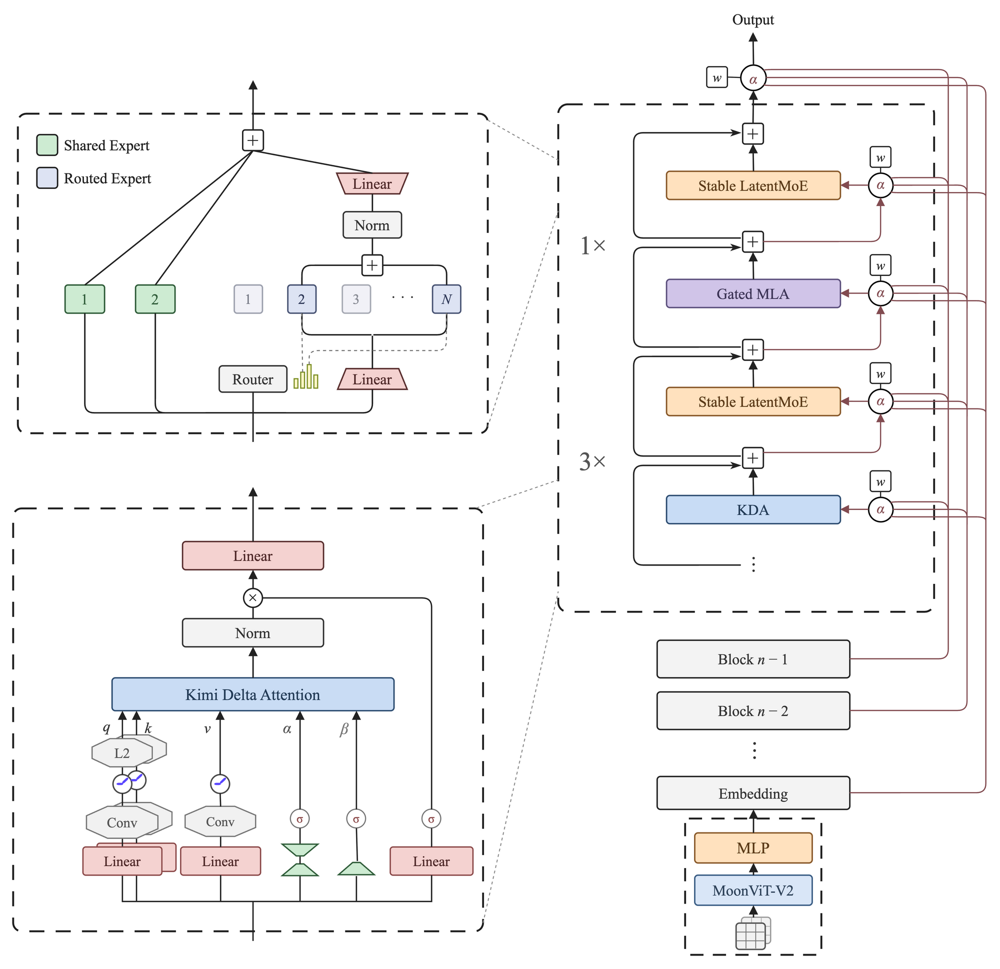

*图 1　Kimi K3 的整体架构。图右侧展示模型主干和视觉输入路径。左上展开 Stable LatentMoE 的专家结构，其中路由器（router）为每个 token 选择路由专家（routed expert），共享专家（shared expert）始终参与计算。左下展示 KDA 的状态更新过程。配图参考 [Kimi K3 Technical Report](https://raw.githubusercontent.com/MoonshotAI/Kimi-K3/main/k3_tech_report.pdf?download=1) Figure 2。*

图 1 右侧展示了 K3 的模型主干。K3 共有 93 个解码器层（decoder layer）。本文把包含一个 Attention 子层和一个 FFN 子层的完整一层称为解码器层。三个关键部件采用了新设计。

**KDA 和 Gated MLA 的混合注意力**。K3 的混合注意力（hybrid attention）以 3 层 KDA、1 层 Gated MLA 的方式交错排列，最后再接 1 层 Gated MLA，共有 69 层 KDA 和 24 层 Gated MLA。KDA 把读过的内容汇总到一份固定大小的状态中，这份状态不会随着上下文增长。MLA（Multi-head Latent Attention，多头潜在注意力）为每个历史 token 保留一份压缩表示，可以直接访问任意历史位置。K3 使用的 Gated MLA 在注意力输出端增加了门控。这套混合方案继承自 [Kimi Linear](https://arxiv.org/abs/2510.26692)。KDA 的状态更新过程见图 1 左下角。

**Stable LatentMoE**。每个 Attention 子层后面都接一个前馈网络（feed-forward network，FFN）。K3 的第 1 个解码器层使用稠密（dense）FFN，其余 92 个解码器层使用 Stable LatentMoE。MoE 把参数拆分成多套独立的 FFN，每套称为一个专家（expert）。每次只调用其中一部分专家，所以模型的总参数可以远大于激活参数。每个 Stable LatentMoE 层都有 896 个路由专家和 2 个共享专家，每个 token 会选用其中 16 个路由专家，共享专家则始终参与计算。专家的选择和组合过程见图 1 左上角。

**Block AttnRes**。标准残差连接（standard residual connection）让各层输出沿同一条残差流（residual stream）逐层更新。K3 使用 AttnRes（Attention Residuals，注意力残差）的分块形式 Block AttnRes（Block Attention Residuals）改变了这种方式，将 93 个解码器层划分为 8 个 block。这里的 block 由连续的解码器层组成，前 7 个 block 各有 12 个解码器层，最后一个 block 有 9 个。每个子层都可以从 embedding、已经完成的各 block 输出和当前 block 正在累加的输出中重新组合输入。全部解码器层运行结束后，输出端再聚合 embedding 和 8 个 block 的输出。

图像走另一条入口（图 1 右下角），由 MoonViT-V2 编码后投影成同样 7168 维的视觉 token，插入文本序列。从这里开始，视觉 token 和文本 token 走完全相同的路径。

## 2. 注意力

模型每生成一个新 token，都要回看前文。标准注意力会用当前 token 的 query 与每个历史 token 的 key 计算相关程度，再按权重汇总相应的 value。每个历史位置都有独立的 key 和 value 表示，因此都能直接参与当前 token 的注意力计算。代价是推理时每新增一个 token，都要为它保存一份 key 和 value。上下文越长，KV cache（键值缓存）越大，生成时需要读取的历史也越多。

K3 的注意力层用两种机制控制 KV cache 的规模。KDA 把历史信息汇总到一份固定大小的状态中，每来一个新 token 就更新一次，无须逐条保留历史 token 的 K/V。状态大小不随上下文增长，但容量有限，较早的信息会逐渐被覆盖或干扰。Gated MLA 为每个历史位置保存一份压缩表示，并通过全局注意力直接访问任意历史位置。它的 KV cache 随上下文线性增长，每个 token 占用的缓存远少于标准注意力。

K3 把这两种机制交错排列在 93 层中，KDA 占多数，Gated MLA 周期性插入，两者互补。这套混合方案来自月之暗面此前发布的 [Kimi Linear](https://arxiv.org/abs/2510.26692)，K3 将它应用到了 2.8T 参数规模的模型中。

### 2.1 KDA

KDA 属于递归式线性注意力（recurrent linear attention），来自一条与标准注意力平行发展的路线。这条路线的核心想法是把历史信息压入固定大小的状态，让每一步的处理成本不随序列增长。从最早的因果线性注意力到 KDA，中间经历了一系列关键演进。

#### 2.1.1 线性注意力的演进

**因果线性注意力**

标准注意力先计算 Q 与 K 的相似度，再用 softmax（将分数转为概率分布的函数）得到注意力权重。一次处理长度为 $`n`$ 的序列时，所有位置两两比较会产生 $`n \times n`$ 个分数，计算量随序列长度平方增长。[因果线性注意力](https://arxiv.org/abs/2006.16236)用一份固定大小的状态汇总历史 token 的 key-value 关联，当前 query 直接从中读取信息，无须逐个比较全部历史 key。

下面用简化公式表示这一过程，省略 q、k 的预处理和归一化。

```math
S_t = S_{t-1} + k_t v_t^\top, \quad o_t = S_t^\top q_t
```

$`k_t v_t^\top`$ 表示当前 token 写入的 key-value 关联，与旧状态 $`S_{t-1}`$ 相加后得到新状态 $`S_t`$。当前 query $`q_t`$ 再从 $`S_t`$ 中读取输出 $`o_t`$。新状态只依赖旧状态和当前 token，这种逐步更新就是状态递推。

状态 $`S`$ 是一个 $`d \times d`$ 矩阵，大小不随序列变长。处理一段序列时，每个 token 只需更新一次固定大小的状态，计算量随序列长度线性增长。由于状态只做累加，没有遗忘机制，不同时刻写入的信息会随着序列变长逐渐互相干扰。

**衰减与遗忘门**

[RetNet](https://arxiv.org/abs/2307.08621)、[GLA](https://arxiv.org/abs/2312.06635) 等工作在写入新信息之前，先对已有状态施加衰减，从而缓解状态无限累加的问题。简化后的更新形式如下。

```math
S_t = \alpha \cdot S_{t-1} + k_t v_t^\top
```

RetNet 为每个注意力头（attention head）设置一个固定的标量衰减，GLA 则根据当前输入生成逐通道的衰减向量。不同通道可以由此保留不同时间尺度的信息。衰减只能控制各通道整体保留多少，无法针对某一条发生冲突的关联进行更新。

**DeltaNet 与 delta rule**

DeltaNet 引入联想记忆中的 [delta rule](https://arxiv.org/abs/2406.06484)。写入新关联时，它先用当前 key 从状态中读出已有结果，再将这个结果与新的 value 比较，只把两者之间的差异写回状态。

```math
S_t = (I - \beta_t k_t k_t^\top) S_{t-1} + \beta_t k_t v_t^\top
```

公式中的 $`(I - \beta_t k_t k_t^\top)`$ 会削弱状态中与当前 $`k_t`$ 方向对齐的分量，为新的 key-value 关联腾出空间。随后，$`\beta_t k_t v_t^\top`$ 写入新关联，$`\beta_t`$ 控制这次更新的强度。DeltaNet 会根据当前 key 定向修正已有内容，但没有让整份状态随时间统一衰减的机制。

**Gated DeltaNet**

[Gated DeltaNet](https://arxiv.org/abs/2412.06464) 在 DeltaNet 的定向更新之外，又加入了一个由当前输入决定的标量衰减 $`\alpha_t`$。

```math
S_t = \alpha_t (I - \beta_t k_t k_t^\top) S_{t-1} + \beta_t k_t v_t^\top
```

每次更新时，旧状态先整体衰减，随后由 delta rule 削弱与当前 key 对齐的分量并写入新关联。这样可以同时清理过时信息和处理发生冲突的关联。$`\alpha_t`$ 是标量，对所有通道施加相同的衰减速度，不能逐通道调节保留时间。

**KDA**

KDA 保留 delta rule，并把 Gated DeltaNet 中的标量衰减扩展成逐通道向量。

```math
S_t = (I - \beta_t k_t k_t^\top) \mathrm{Diag}(\alpha_t) S_{t-1} + \beta_t k_t v_t^\top
```

$`\alpha_t`$ 的每个分量分别控制一个通道的保留程度。部分通道衰减较快，更侧重近期信息；另一些通道衰减较慢，可以把信息保留得更久。同一份状态由此能够覆盖多种时间尺度。图 2 汇总了这条演进路线中各代方法的状态更新方式。

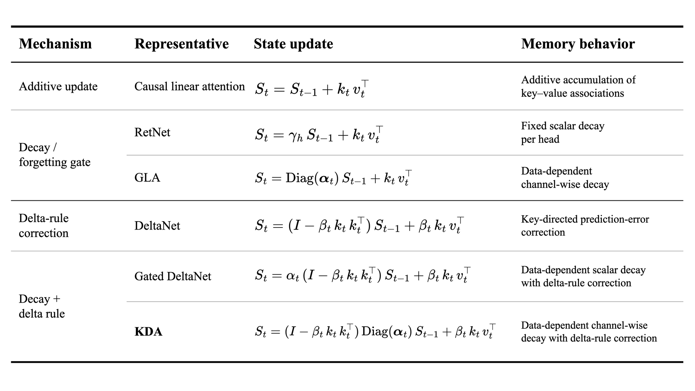

*图 2　线性注意力各代方法的状态更新方式。RetNet 和 GLA 引入衰减，DeltaNet 增加定向更新。Gated DeltaNet 与 KDA 随后将两种机制结合。图中公式均为简化形式。*

#### 2.1.2 KDA 在 K3 中的工作方式

注意力在每层内部分成多个并行的注意力头，各自独立工作。K3 的 KDA 有 96 个注意力头，每个注意力头维护一块固定大小的白板（128 × 128 的状态矩阵）。每来一个新 token，白板依次完成四项操作。

1. **褪色**，白板上已有内容按通道分别变淡，有的通道褪得快（容易忘），有的慢（记得久）。
2. **擦除冲突**，检查新 token 的 key 和白板上旧内容有没有方向冲突，有的话先把冲突部分擦掉。
3. **写入**，把新 token 的 key-value 关联写上白板。
4. **读取**，用当前 token 的 query 从白板上提取与自己相关的信息。

对应到公式，单个注意力头在第 $`t`$ 步的状态更新如下。

```math
S_t = (I - \beta_t k_t k_t^\top) \mathrm{Diag}(\alpha_t) S_{t-1} + \beta_t k_t v_t^\top
```

```math
o_t = S_t^\top q_t
```

公式中的四项依次对应前面的四步。

1. $`\mathrm{Diag}(\alpha_t)`$ 表示逐通道衰减。$`\alpha_t`$ 是一个向量，每个元素控制对应通道的保留程度。
2. $`(I - \beta_t k_t k_t^\top)`$ 完成方向性擦除。$`\beta_t`$ 是标量写入强度，$`(I - \beta_t k_t k_t^\top)`$ 削弱状态中与 $`k_t`$ 方向对齐的分量。
3. $`\beta_t k_t v_t^\top`$ 用于写入新的 key-value 关联。
4. $`S_t^\top q_t`$ 负责从更新后的状态中读取输出。

第 1、2 步合在一起构成对 $`S_{t-1}`$ 的一次复合变换，先逐通道缩放，再做方向性擦除。图 3 展示了单个注意力头状态在这三步中的变化。

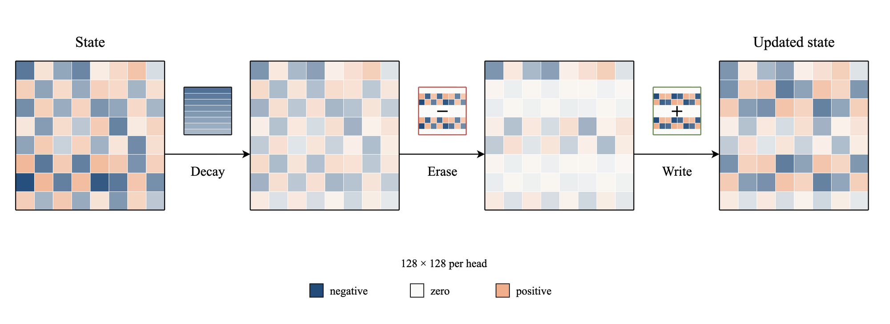

*图 3　KDA 单个注意力头的状态更新。四块方格依次展示同一份 `128 × 128` 状态的初始状态，以及经过逐通道衰减、方向性擦除和写入后的变化。图中的 Decay、Erase 和 Write 分别对应这三步。*

图 4 展示了完整的 KDA 模块路径，从输入生成 q、k、v、衰减和更新强度，到输出经输出门控（output gate）调制后投影回模型维度。

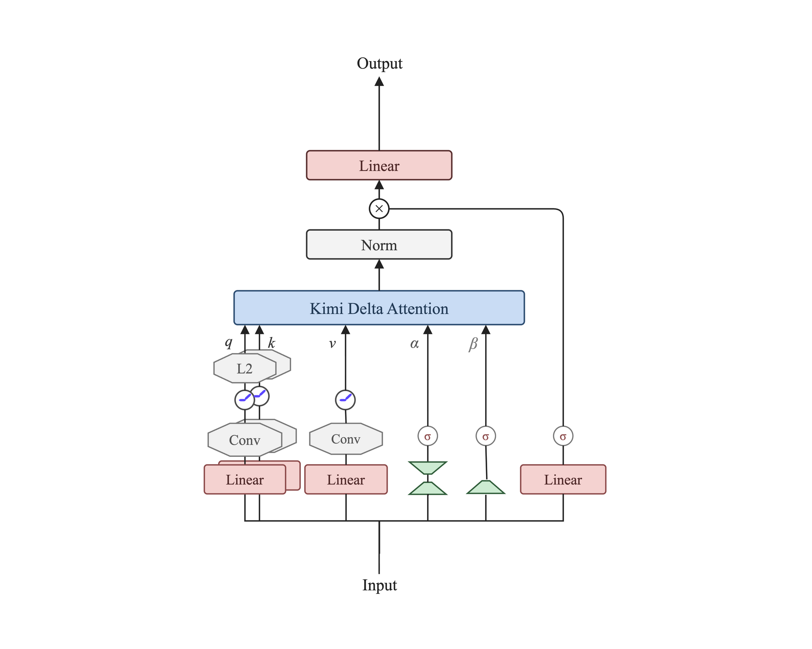

*图 4　K3 的完整 KDA 模块。输入生成 q、k、v、逐通道衰减 α 和更新强度 β，KDA 输出经过归一化和输出门控后投影回模型维度。配图参考 [Kimi K3 Technical Report](https://raw.githubusercontent.com/MoonshotAI/Kimi-K3/main/k3_tech_report.pdf?download=1) Figure 2。*

K3 在 Kimi Linear 的 KDA 基础上做了两项工程调整。

第一项是衰减下限（lower-bounded decay）。K3 给每个通道的衰减设置下限，单步最低仍保留原值的约 0.67%，以防止并行计算中的数值溢出。

第二项是将输出门控改为满秩投影。KDA 的 96 个注意力头各输出 128 维，拼接后的宽度为 12288。Kimi Linear 的输出门控采用秩为 128 的低秩参数化，中间的 128 维形成了低秩瓶颈。K3 去掉这层中间投影，直接使用 `7168 → 12288` 的满秩投影。

```math
y = W_o [\sigma(W_g x) \odot \mathrm{RMSNorm}(o)]
```

$`\sigma(W_g x)`$ 为每个注意力头的每个输出通道生成一个门控值，再逐元素调制归一化后的 KDA 输出。直接投影去掉了原来的 128 维低秩瓶颈，门控不再受这个中间维度限制。

逐通道衰减和方向性擦除提高了固定状态的利用效率。固定状态的容量依然有限，经过足够多的 token 后，早期信息仍会被覆盖或干扰。这个约束也是 K3 周期性引入全局注意力的原因。

### 2.2 Gated MLA

Gated MLA 沿用全局注意力。每个位置都可以对全部历史 token 计算注意力权重，因此保留了按位置访问历史的能力。它为每个历史位置保存一份压缩表示，KV cache 随上下文线性增长。从最初的 MHA 到 MLA，这条路线的主要变化是不断减少每个 token 需要缓存的数据。

#### 2.2.1 全局注意力的演进

**MHA**

MHA（Multi-Head Attention，多头注意力）是 Transformer 最初采用的注意力形式。每个注意力头都有独立的 Q、K 和 V。计算当前位置的输出时，各个注意力头用自己的 Q 与已有的 K 计算分数，softmax 将这些分数转成注意力权重，再按权重汇总对应的 V。推理时，KV cache 要为每个历史 token 保存全部注意力头的 K/V，因此随序列长度线性增长。

**MQA**

[MQA（Multi-Query Attention，多查询注意力）](https://arxiv.org/abs/1911.02150)保留多个查询头（query head），同时让它们共享同一组 K 和 V。每个查询头仍用自己的 Q 计算注意力权重，而每个历史 token 只需缓存一组 K/V。在各查询头维度相同的情况下，KV cache 约为 MHA 的 $`1/h`$，其中 $`h`$ 是查询头数。缓存明显缩小，各个查询头也不再拥有独立的 K/V。

**GQA**

GQA（Grouped-Query Attention，分组查询注意力）把查询头分成若干组，同组共享一组 K/V。组数为 1 时等价于 MQA，组数等于查询头数时等价于 MHA。组数越多，每组共享 K/V 的查询头越少，缓存也越大。[GQA 论文](https://arxiv.org/abs/2305.13245)的实验中，GQA 的质量接近 MHA，推理速度接近 MQA。[Llama 2 70B](https://arxiv.org/abs/2307.09288) 和 [Llama 3](https://arxiv.org/abs/2407.21783) 均采用了 GQA。

**MLA**

MLA 使用联合低秩参数化。每个 token 先形成一份 KV latent（低维键值表示）。计算注意力时，MLA 再通过重建投影（up-projection），从这份表示生成各个注意力头的 K/V。推理时主要缓存 KV latent，不必为每个历史 token 保存展开后的多头 K/V，因此缓存成本主要取决于 KV latent 的维度。

GQA 让一组查询头直接共享 K/V。MLA 共享的是更小的 KV latent，计算注意力时再从中生成各个注意力头的 K/V。[DeepSeek-V2](https://arxiv.org/abs/2405.04434) 提出了 MLA。论文中的对照实验显示，MLA 在大多数评测中优于 MHA，同时大幅减小了 KV cache。图 5 对比了四种结构的缓存方式。

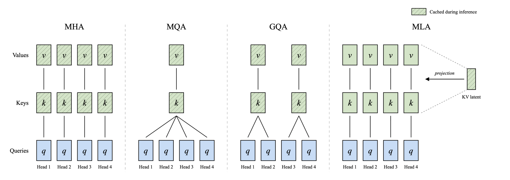

*图 5　MHA、MQA、GQA 与 MLA 的 KV cache 组织方式。斜线部分表示主要缓存内容。MHA 为每个注意力头保存独立 K/V，MQA 和 GQA 通过不同程度的共享减少缓存；MLA 保存低维 KV latent，再由它生成各个注意力头的 K/V。整体构图参考 [DeepSeek-V2](https://arxiv.org/abs/2405.04434) Figure 3，四个查询头和两组 GQA K/V 仅用于说明共享关系。*

#### 2.2.2 MLA 的权衡与 K3 的选择

选择注意力方案既要看模型效果和训练计算量，也要考虑 KV cache 与生成阶段的计算量。[苏剑林的分析](https://spaces.ac.cn/archives/11848)围绕这些因素比较了不同方案。MLA 的低维缓存可以显著减少显存占用，生成阶段的计算量相对较高。在 K3 的常规四层周期中，Gated MLA 只占一层，因此这部分计算不会落到所有注意力层上。

K3 的 Gated MLA 有 96 个注意力头，使用 1536 维 query latent（低维查询表示）和 512 维 KV latent。每个注意力头的 Q/K 均为 192 维，V 为 128 维。完整 K 由 128 维 K 内容分量（content K）和 64 维 K 共享分量（shared K）拼接而成，前者由 KV latent 为每个注意力头分别生成，后者在 96 个注意力头之间复用。这两个名称只描述 K 的内部组成，送入注意力计算的仍是完整的 Q/K/V。

K3 的 Gated MLA 分四步运行。

1. Q 路径把 7168 维 hidden states 压缩为 1536 维 query latent。它经过 RMSNorm 和后续投影，为 96 个注意力头分别生成 192 维 Q。
2. KV 路径用另一组投影生成 512 维 KV latent 和 64 维 K 共享分量。K 共享分量在 96 个注意力头之间复用。
3. 计算注意力时，KV latent 经过 RMSNorm 和 MLA 重建投影，为每个注意力头生成 128 维 K 内容分量和 128 维 V。K 内容分量与 K 共享分量拼接，组成该注意力头的 192 维 K。
4. 面向 MLA 优化的推理实现只需为每个 token 缓存 KV latent 和 K 共享分量，共 576 维。query latent 只参与当前 token 的 Q 计算，不进入历史 KV cache。

以上缓存口径针对面向 MLA 优化的推理实现，它可以在注意力计算中处理 MLA 重建投影。公开的 Transformers 参考实现为了兼容通用缓存接口，会显式生成并缓存 K/V。

Gated MLA 的 Gated 指输出门控。门控投影 `W_g` 将 7168 维输入直接映射到 12288 维，对应 96 个注意力头的 128 维输出。投影结果经过 sigmoid 后，逐元素调制每个注意力头的注意力输出，再由 `o_proj` 投影回 7168 维。这道门控位于注意力汇总之后，负责调节输出通道的幅度；历史位置的权重已经在此前的注意力计算中确定。

KDA 和 Gated MLA 都使用满秩 `7168 → 12288` 投影，投影结果经过 sigmoid 后形成输出门控。KDA 在门控前先对各注意力头的输出做 RMSNorm；Gated MLA 直接调制注意力输出。图 6 展示了 K3 Gated MLA 的完整路径。

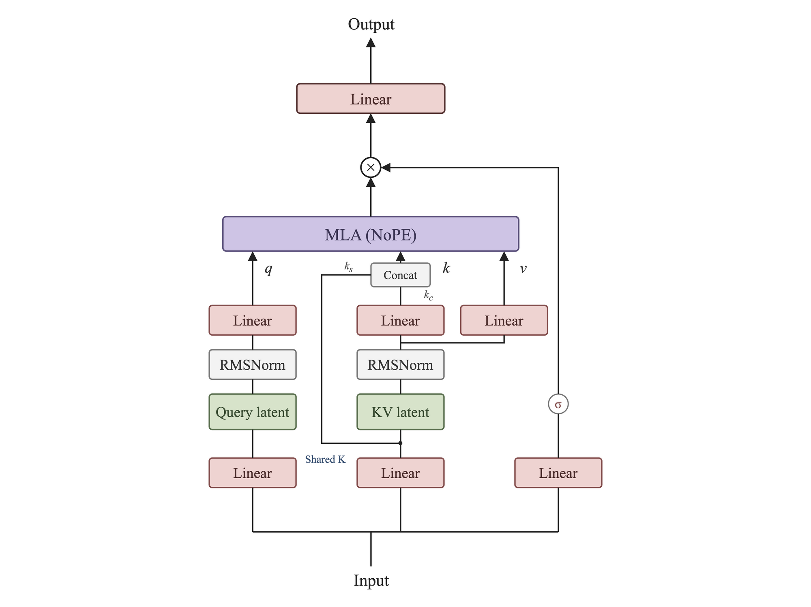

*图 6　K3 的 Gated MLA 内部路径。左侧 Q 路径把当前输入压缩为 Query latent，再生成各个注意力头的 Q。中间 KV 路径生成 KV latent 和 Shared K。KV latent 经重建投影生成各个注意力头的 K 内容分量 $`k_c`$ 和 V；图中的 Shared K 是跨注意力头复用的 64 维 K 共享分量 $`k_s`$。两部分拼接成完整 K。MLA (NoPE) 中的 NoPE（No Position Encoding，无显式位置编码）表示该层不额外加入显式位置编码。右侧路径根据当前输入生成满秩输出门控，调制注意力输出后再投影回模型维度。*

### 2.3 两条路线的汇合

KDA 使用固定状态，状态大小和单步处理成本不随上下文增长，但容量有限；Gated MLA 为每个历史位置保留压缩表示，可以直接访问任意历史位置，但 KV cache 和全局注意力开销会随上下文增长。K3 将两者交错排列，让 KDA 承担大部分序列混合，再由 Gated MLA 周期性补充全局访问。

3∶1 的比例来自 Kimi Linear 在 16 层模型上的消融实验。实验在相同训练计算量和训练设置下比较了多种 KDA 与 MLA 配比。这里沿用 Kimi Linear 论文的 MLA 命名，它指论文消融中的全局注意力层；K3 在对应位置使用 Gated MLA。增加 MLA 层没有明显改善模型效果，却会提高推理开销；继续减少 MLA 层，模型效果又会下降。因此，3∶1 是这些配置中效果和成本最均衡的一种，K3 也沿用了这一比例。

具体到 93 层，前 92 层将 `[KDA, KDA, KDA, Gated MLA]` 这个四层周期重复 23 次，第 93 层再追加一层 Gated MLA，使最后一层的注意力始终为全局注意力。完整排布见图 7。

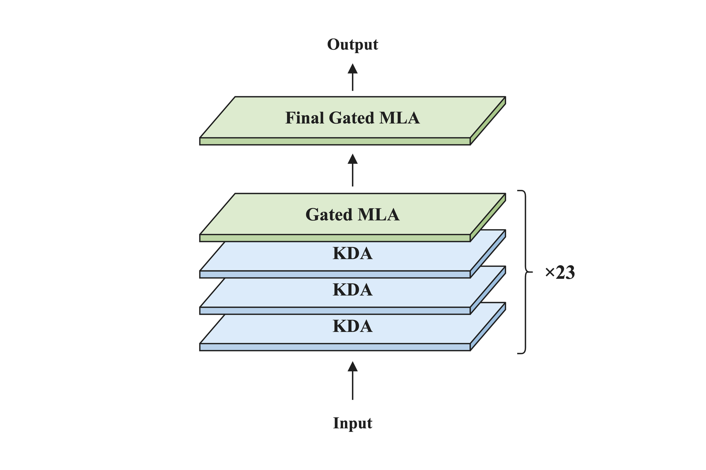

*图 7　K3 的 93 层注意力排布。前 92 层重复 23 次“3 层 KDA 加 1 层 Gated MLA”，第 93 层追加一层 Gated MLA，共有 69 层 KDA 和 24 层 Gated MLA。这里的四层周期只表示注意力类型，与第 4 章 Block AttnRes 中每个 block 包含 12 个解码器层的设置无关。*

结合图 7 中的层数和前面给出的维度，可以估算两类注意力状态的存储量。下面按单条序列、BF16（bfloat16，每个元素占 2 字节）存储计算，只统计 KDA 的递归状态矩阵，以及 Gated MLA 缓存的 KV latent 和 K 共享分量，不代表推理服务的总显存。

KDA 共有 69 层，每层 96 个注意力头，每个注意力头维护一块 128 × 128 的状态矩阵。按 BF16 存储，全部递归状态合计为 207 MiB。正在处理一条序列时，KDA 当前递归状态的大小不随上下文长度增长。

Gated MLA 共有 24 层。在使用 MLA 专用缓存的推理实现中，每层的每个 token 保存 512 维 KV latent 和 64 维 K 共享分量，共 576 个元素。按 BF16 存储，24 层合计为 27 KiB/token；上下文达到 1,048,576 token 时，合计为 27 GiB。这部分缓存仍会随着上下文长度线性增长。

### 2.4 NoPE

NoPE 表示不额外给注意力加入 RoPE 一类显式位置编码。它描述的是一种模型配置，本身不指代新的位置编码方法。RoPE（Rotary Position Embedding，旋转位置编码）会按照 token 的位置旋转 Q 和 K，让注意力分数反映 token 之间的相对位置。K3 延续 Kimi Linear 的设计，没有额外使用 RoPE，Gated MLA 所需的位置感知主要由交错排列的 KDA 层提供。

将 KDA 的状态递推从 $`S_0=0`$ 开始展开，就能看到位置信息来自哪里。令第 $`j`$ 步对旧状态的变换为

```math
M_j = (I - \beta_j k_j k_j^\top) \mathrm{Diag}(\alpha_j)
```

历史 token $`i`$ 对当前位置 $`t`$ 的贡献系数可以写成

```math
w_{t,i}
=
\beta_i q_t^\top
M_t M_{t-1} \cdots M_{i+1}
k_i
```

当前位置的输出则为

```math
o_t=\sum_{i=1}^{t}w_{t,i}v_i
```

关键在于中间的矩阵连乘。历史 token 写入状态后，需要连续经过此后每一步的逐通道衰减和方向性擦除，才会影响当前位置。两者相隔的步数不同，中间 token 生成的变换矩阵也不同，最终的贡献系数便会随之变化。

K3 的 KDA 还会在状态更新前，让 Q、K、V 的投影结果分别经过核大小为 4 的短卷积（报告记作 ShortConv），用来补充局部 token 依赖。

广义乘法位置编码中，若第 $`j`$ 步的位置变换记为 $`R_j`$，位置 $`t`$ 的 query 与位置 $`i`$ 的 key 之间的相关性分数可以写成

```math
s_{t,i}
=
q_t^\top
R_t R_{t-1} \cdots R_{i+1}
k_i
```

RoPE 使用预先确定的正交旋转，KDA 的状态转移矩阵则由输入决定，并在训练中学习。[Kimi Linear](https://arxiv.org/abs/2510.26692) 因此将 KDA 解释为一种可学习、数据相关的乘法位置编码。

在 K3 的混合注意力中，KDA 让序列混合反映位置和新旧差异，Gated MLA 负责全局内容交互。Kimi Linear 论文称，NoPE 的短上下文表现与 RoPE 相当。论文给出的长上下文评测中，NoPE 的平均结果更好。

## 3. 前馈网络

注意力处理 token 之间的信息流动，前馈网络（FFN）则对每个 token 单独做变换。标准 Transformer 的每个解码器层都有一个稠密 FFN，每个 token 都会经过该层的整套 FFN 参数。通过扩宽 FFN 增加模型容量时，每个 token 的计算量也会随之增长。

MoE 在一个解码器层中设置多个独立的 FFN，每套都是一个专家，再由路由器为每个 token 选择其中少数几个。增加专家数量可以扩大模型容量，而每个 token 只计算被选中的专家，计算量不会随专家总数同比增长。

K3 的第 1 个解码器层使用稠密 FFN，其余 92 个解码器层使用 MoE。模型 2.8T 总参数中的大部分都集中在这些 MoE 层中，模型处理每个 token 时，约有 104B 参数参与计算，这就是开篇提到的激活参数。

### 3.1 Stable LatentMoE

K3 的这 92 个解码器层都采用 Stable LatentMoE。每层有 896 个路由专家和 2 个共享专家，路由器为每个 token 选择 16 个路由专家，只有入选专家参与当前 token 的计算；两个共享专家则始终参与。这个名称包含两层意思。Latent 表示路由专家在压缩后的低维空间中工作，Stable 表示 K3 还为这条路径加入了稳定化设计。先看 LatentMoE 怎样压缩路由分支。

标准 MoE 会把完整的 7168 维 hidden states 发送给入选专家。当这些专家分布在不同设备上时，传输完整向量会增加通信量，每个路由专家也要读取更大的输入和输出权重矩阵。LatentMoE 在分发前加入共享降维投影（down-projection），聚合专家输出后再用共享升维投影（up-projection）恢复原始宽度。图 8 对比了这两种路径。

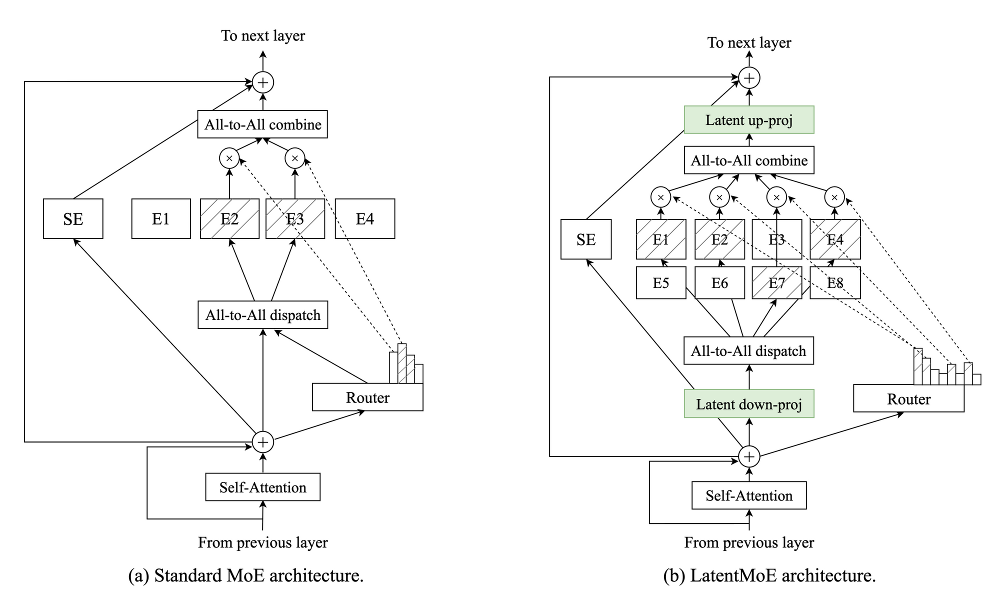

*图 8　标准 MoE 把完整的 hidden states 分发给入选专家。LatentMoE 在分发前使用共享降维投影，聚合专家输出后再用共享升维投影恢复原始宽度。图中的 SE（Shared Expert）表示共享专家，All-to-All dispatch / combine 表示 all-to-all（全交换通信）中的 token 分发（token dispatch）与结果汇合，Latent down-proj / up-proj 分别对应共享降维投影和共享升维投影。右图按相同比例增加专家总数和 top-k，用来表示原论文把低维路由节省下来的参数与计算用于扩展专家容量。K3 的实际配置以正文中的 896 个路由专家和 top-16 为准。配图参考 [LatentMoE 论文](https://arxiv.org/abs/2601.18089) Figure 1。*

K3 沿用 [LatentMoE](https://arxiv.org/abs/2601.18089) 的设计，让路由器根据完整的 7168 维输入计算专家分数，真正发送给入选专家的向量则经共享降维投影压缩到 3584 维。原始 LatentMoE 将专家聚合结果直接送入共享升维投影，K3 在这次升维投影前增加了一次 RMSNorm。K3 的路由分支可以写成下面三式。

```math
z=W_{\text{down}}x
```

```math
u=\sum_{i\in\mathcal T}p_iE_i(z)
```

```math
y_{\text{routed}}=W_{\text{up}}\mathrm{RMSNorm}(u)
```

- $`x`$ 是 7168 维输入，共享降维投影 $`W_{\text{down}}`$ 将它压缩成 3584 维的 $`z`$。
- $`\mathcal{T}`$ 是 top-16 入选专家的集合，$`p_i`$ 是相应的路由权重（routing weights）。每个专家 $`E_i`$ 都是一个 FFN，将 3584 维输入映射到 3072 维中间层，再映射回 3584 维。
- $`u`$ 是入选专家输出的加权聚合，经 RMSNorm 后送入共享升维投影 $`W_{\text{up}}`$，恢复到 7168 维，得到路由分支的输出 $`y_{\text{routed}}`$。

降维投影和升维投影都由整层共享，每个 token 各执行一次，不会为 16 个入选专家重复计算。路由宽度降到 3584 维后，跨设备发送的向量更小，各个路由专家的输入和输出权重矩阵也随之缩小。

两个共享专家直接处理完整的 7168 维输入，不经过共享降维投影。整层输出由路由分支和共享分支相加得到。

```math
y=y_{\text{routed}}+\sum_jE_j^{\text{shared}}(x)
```

共享分支承担每个 token 都需要的通用变换，路由分支则在 3584 维空间中提供不同的专家组合。图 9 将这两条分支放在一起，展示了 K3 完整的 Stable LatentMoE 结构。

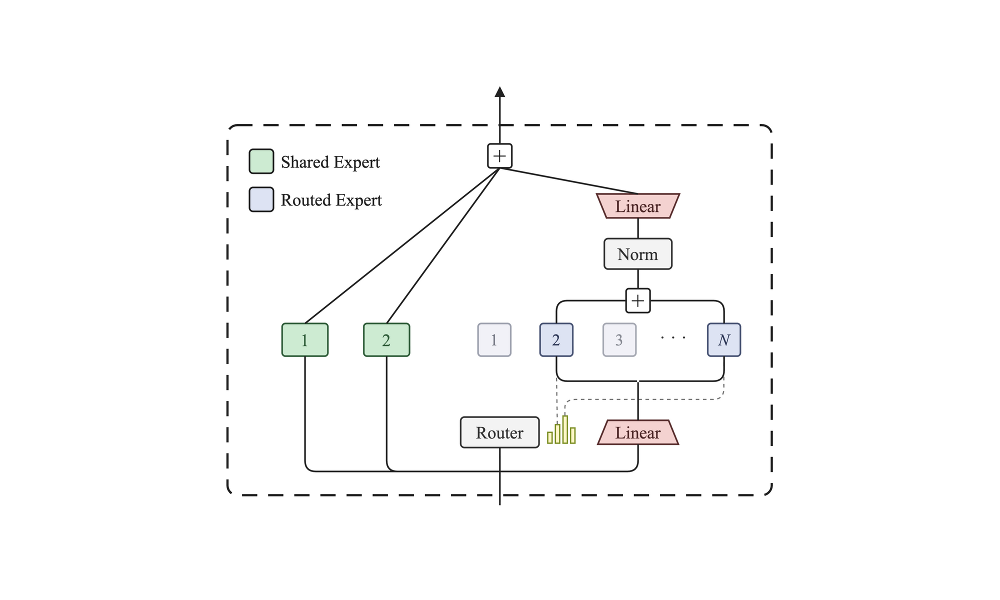

*图 9　K3 的 Stable LatentMoE。两个共享专家直接处理完整输入，路由器也根据完整输入选择 16 个路由专家。路由分支依次经过共享降维投影、入选专家、RMSNorm 和共享升维投影，最后与共享分支相加。配图参考 [Kimi K3 Technical Report](https://raw.githubusercontent.com/MoonshotAI/Kimi-K3/main/k3_tech_report.pdf?download=1) Figure 2。*

低维路由减少了 token 分发和专家权重读取的开销，使 K3 能把路由专家扩展到 896 个。K3 还为这条路径增加了三项稳定化设计。SiTU-GLU 和 RMSNorm 分别控制专家内部的激活幅度与聚合结果的尺度，路由器另有专门的负载均衡机制。它们共同构成名称中的 Stable，下面两节继续展开。

### 3.2 SiTU-GLU

路由专家内部的 FFN 会把输入送进 gate 和 up 两条分支，再将两条分支的结果逐元素相乘，这类结构统称为 GLU（Gated Linear Unit，门控线性单元）。SwiGLU 是目前常用的变体，它的两条分支都没有固定上界。当对应位置同时出现大数值时，相乘后的结果会快速增大。K3 的路由分支还串联了共享降维投影、专家 FFN 和共享升维投影。技术报告指出，这条路径在 K3 的规模下会出现内部激活爆炸，增加训练不稳定和低精度计算溢出的风险。

SiTU-GLU（Sigmoid Tanh Unit GLU）在 SwiGLU 的基础上，用缩放后的 tanh 平滑限制两条分支中的线性输出，同时保留 gate 分支的 sigmoid。K3 将 gate 分支的限制参数设为 4，up 分支设为 25。以路由专家为例，第一式对应 gate 分支，第二式对应 up 分支，第三式将两条分支的结果逐元素相乘。

```math
g=4\tanh(W_gz/4)\odot\sigma(W_gz)
```

```math
a=25\tanh(W_uz/25)
```

```math
h=g\odot a
```

- $`z`$ 是进入路由专家的 3584 维输入。
- 第一式中的 $`W_g`$ 是 gate 分支的投影矩阵，$`W_gz`$ 经过 sigmoid 和缩放后的 tanh，得到 3072 维输出 $`g`$。$`g`$ 的每个坐标绝对值都小于 4。
- 第二式中的 $`W_u`$ 是 up 分支的投影矩阵，$`W_uz`$ 经过缩放后的 tanh，得到同为 3072 维的输出 $`a`$。$`a`$ 的每个坐标绝对值都小于 25。
- 第三式将 $`g`$ 与 $`a`$ 逐元素相乘，得到专家的中间激活 $`h`$，其每个坐标绝对值都小于 100。其中，$`\sigma`$ 表示 sigmoid，$`\odot`$ 表示逐元素相乘。

输入较小时，缩放后的 tanh 近似线性，SiTU-GLU 的输出与 SwiGLU 接近。随着正向输入增大，两条分支逐渐接近各自的上限，它们的乘积也趋近 100，整个变化过程保持平滑。图 10 对比了相同输入下三种 GLU 的输出曲线。

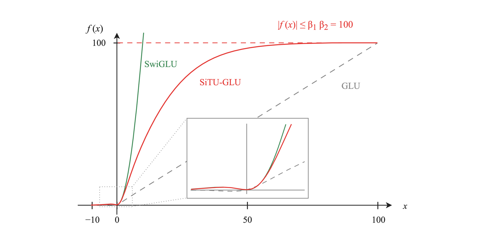

*图 10　GLU、SwiGLU 与 SiTU-GLU 的输出曲线。为便于比较，图中让 gate 和 up 两条分支接收同一个输入值 $`x`$，插图放大了原点附近的差异。SiTU-GLU 在原点附近接近 SwiGLU，随着正向输入增大逐渐趋近 100 的上限，SwiGLU 则继续增长。曲线按报告公式生成，配图参考 [Kimi K3 Technical Report](https://raw.githubusercontent.com/MoonshotAI/Kimi-K3/main/k3_tech_report.pdf?download=1) Figure 4 的右侧曲线面板。*

K3 的所有 FFN 路径都使用 SiTU-GLU。第 1 个解码器层中稠密 FFN 的中间维度为 33792，后续 92 个解码器层中路由专家的中间维度为 3072；每个 MoE 层的两个共享专家也采用同一种激活函数。

### 3.3 路由与负载均衡

SiTU-GLU 控制了专家内部的激活，Stable LatentMoE 还要处理专家负载不均和路由聚合结果的尺度波动。先看路由器怎样选择专家。

路由器根据每个 token 的完整输入，为 896 个路由专家分别计算一个分数，sigmoid 将每个分数限制在 0 到 1 之间。

```math
s=\sigma(W_{\text{router}}x)
```

训练期间更新的校正偏置（correction bias）$`b`$ 只参与选择哪些专家进入 top-16。

```math
\mathcal T=\mathrm{argtop}_{16}(s+b)
```

入选专家的路由权重仍由原始 sigmoid 分数归一化得到。

```math
p_j=\frac{s_j}{\sum_{i\in\mathcal T}s_i},\qquad j\in\mathcal T
```

这样，校正偏置可以调整哪些专家入选，又不会直接改变它们的路由权重。

每个 token 只从 896 个路由专家中选择 16 个。路由长期集中到少数专家时，负载较高的专家会拖慢并行训练，较少入选的专家又得不到充分训练。Quantile Balancing（QB）对每个专家统计整个训练批次的分数边际，也就是原始路由分数与该 token 入选门槛之差，再按目标负载取得相应的分位数阈值（quantile threshold），用来更新校正偏置，使各专家的入选次数接近目标负载。训练结束后，校正偏置固定下来，推理时不再更新。

图 11 用一个 top-1 的最小示例展示这种调整。8 个 token 从 4 个专家中各选 1 个，目标是让每个专家接收 2 个 token。左侧的初始负载为 4、3、1、0，经过 QB 调整后，右侧负载变为 2、2、2、2。

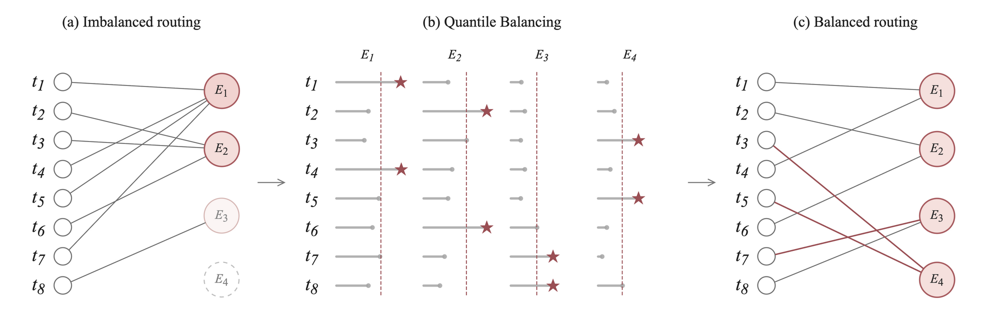

*图 11　Quantile Balancing 的最小示例。左侧是负载为 $`(4,3,1,0)`$ 的初始路由。中间的红色虚线表示按目标负载取得的分位数阈值，星号标出调整后的选择。右侧负载变为 $`(2,2,2,2)`$，红色连线表示被改变的路由。图中参数只用于说明算法，不是 K3 的实际路由规模。配图参考 [Kimi K3 Technical Report](https://raw.githubusercontent.com/MoonshotAI/Kimi-K3/main/k3_tech_report.pdf?download=1) Figure 5。*

路由聚合结果的尺度会随入选专家和路由权重变化。K3 在共享升维投影前加入 RMSNorm，减小路由分支对这种变化的敏感程度。

这里的 896 个路由专家都是结构相同的 FFN，没有预设的领域标签，具体分工在训练过程中逐渐形成。

## 4. 残差连接

前两章分别拆解了注意力和前馈网络，它们改变的是单层内部的计算。这一章看层与层之间的信息怎样传递。

K3 共有 93 个解码器层，每层包含一个 Attention 子层和一个 FFN 子层，整个模型共执行 186 个子层。Block AttnRes 改变了各子层汇总前序表示的方式，这就是本章讨论的重点。

### 4.1 标准残差连接

Transformer 解决层间信息传递的默认方式是标准残差连接。每个子层算完之后，都会把计算结果加回输入。

```math
x = x + \mathrm{Attention}(x)
```

```math
x = x + \mathrm{FFN}(x)
```

同一个 $`x`$ 经过每个子层时，都会加上该子层的输出，再传给下一个子层。残差加法为当前输入保留了一条不经过子层变换的直接路径。经过多层之后，embedding 和各子层的输出以累加形式汇入同一个向量。

三种残差机制的结构差异见图 12。其中 (a) 是标准 Transformer 使用的标准残差连接，(b) 是 Full AttnRes（Full Attention Residuals，保留全部前序子层输出的完整形式），(c) 是 K3 使用的 Block AttnRes。

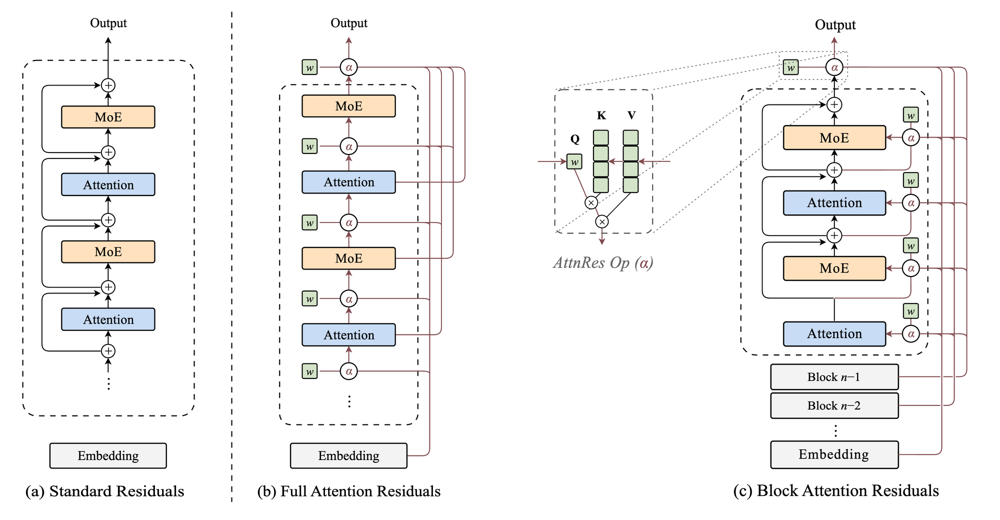

*图 12　图中的 Standard Residuals、Full Attention Residuals 和 Block Attention Residuals 分别对应标准残差连接、Full AttnRes 和 Block AttnRes。(a) 在每个子层两侧保留直接相加的捷径；(b) 将各子层输出分别提供给后续子层；(c) 维护 block 内累加和（partial sum），各子层输出依次写入，block 完成后再保存为 block 表示。中间的 AttnRes Op (α) 表示根据权重 α 组合候选表示。配图参考 [Attention Residuals](https://arxiv.org/abs/2603.15031) Figure 1。*

这种设计简单有效。每个子层的输出都会叠加到同一个向量上，后面的子层收到的 $`x`$ 是 embedding 与前面所有子层输出的累加结果。各项输出在 $`x`$ 中已经混合，标准残差连接没有把它们作为独立候选提供给后面的子层。

### 4.2 AttnRes

注意力的核心做法是让每个 token 从所有历史 token 中有选择地取用信息。[AttnRes](https://arxiv.org/abs/2603.15031) 把同样的思路从 token 之间搬到子层之间，让每个子层从前面各子层产生的表示中有选择地组合输入。

图 12(b) 展示了这种结构，每个子层都可以读取所有前序子层的输出。做法是把这些输出保留下来，作为一组候选。当前子层用一个学习到的伪查询（pseudo-query）给这些候选打分，再按 softmax 得到的权重组合出自己的输入。

对第 $`l`$ 个子层，AttnRes 定义的打分和组合过程写成

```math
s_i=w_l^\top\mathrm{RMSNorm}(v_i)
```

```math
\alpha_i=\mathrm{softmax}_i(s_i)
```

```math
h_l=\sum_i\alpha_i v_i
```

这套打分和组合过程在下文简称选择器。

- $`h_l`$ 是选择器为第 $`l`$ 个子层组合出的输入。当前子层产生的输出会进入后续子层的候选集合。
- $`v_i`$ 是同一 token 在不同深度位置的表示，包括 embedding 和各前序子层的输出。
- $`w_l`$ 是第 $`l`$ 个子层学习到的一个固定向量，扮演打分用的伪查询，不随 token 改变。参与打分的 $`v_i`$ 来自当前 token，因此分数和权重仍然随 token 变化。
- RMSNorm 只出现在打分路径，把向量缩放到统一尺度，让不同深度来的候选在可比的大小下比较。实际参与加权组合的仍是未经 RMSNorm 的原始 $`v_i`$，打分在统一尺度下进行，组合时保留原始幅度。

这种保留全部前序子层输出的形式称为 Full AttnRes。它让每个子层都能选择任意前序输出，也要求模型把各子层产生的 hidden states 分别保留下来。模型越深，需要保存的完整表示越多；当模型拆分到多台设备上训练时，这些表示还要传给后续设备。K3 技术报告指出，Full AttnRes 的打分计算可以承受，主要问题是这些历史表示带来的显存占用和设备间通信。

### 4.3 Block AttnRes

K3 采用了 Full AttnRes 的分块形式 Block AttnRes。它把连续的解码器层划入若干 block，前序历史表示改为按 block 保存和传递，从而降低上一节提到的显存和通信开销。

当前 block 各子层的输出先汇入一份累加和。block 完成后，这份累加和保存为 block 表示，供后续选择器读取。AttnRes 的实验显示，约 8 个 block 已经可以保留 Full AttnRes 的大部分收益，K3 也采用了 8 个 block。选择器读取三类来源。

- token embedding，相当于底稿。
- 已完成的 block 表示，每个 block 完成时保存一份，相当于阶段存档。
- 当前 block 的累加和。

图 12(c) 展示了 Block AttnRes 的结构。

把 embedding 记为 $`b_0`$，第 $`n`$ 个 block 完成后的结果记为 $`b_n`$。当前 block 累加了前 $`i`$ 个子层的输出后，block 内累加和记为 $`b_n^i`$。这里沿用 AttnRes 原论文和 K3 技术报告的记号。原论文把 Attention 和 FFN 分别计为一层，本文统一称为子层。结合 K3 的参考实现，$`i`$ 表示当前 block 中已经写入这份累加和的子层数量。

每个子层计算前都会执行一次选择器，选择器组合出的结果作为当前子层的输入，子层输出随后写入当前 block 的累加和。一个 block 刚开始时还没有 $`b_n^i`$，首个子层的输出会初始化 $`b_n^1`$。整个模型的首个子层只有 $`b_0`$ 一个来源，选择器会自动跳过。

K3 的 `attn_res_block_size` 是 12，这里的 12 以解码器层为单位。93 个解码器层被划分为 8 个 block，前 7 个 block 各有 12 个解码器层，最后一个 block 有 9 个，因此一个完整 block 包含 24 个子层，最后一个 block 包含 18 个。以第一个 block 为例，第一个解码器层的两个子层依次写入当前 block 的累加和，完成后得到 $`b_1^2`$。每经过一个解码器层，上标增加 2；第 12 个解码器层结束时得到 $`b_1^{24}`$，随后保存为完整的 block 表示 $`b_1`$。进入第二个 block 后，$`b_1`$ 作为只读来源保留，首个子层从 $`[b_0,b_1]`$ 中组合输入，其输出初始化 $`b_2^1`$。

最后一个 block 计算时，选择器最多读取 $`[b_0,b_1,\ldots,b_7,b_8^i]`$ 这 9 个来源。全部 8 个 block 完成后，最终选择器对 $`[b_0,b_1,\ldots,b_8]`$ 做最后一次聚合。

前面的执行顺序和实例展示了 Block AttnRes 的递推逻辑。下一节换一个角度来审视标准残差连接和 Block AttnRes，看看这种视角能揭示哪些从公式中不容易看出的性质。

### 4.4 残差流视角

#### 4.4.1 标准残差流

标准残差连接的公式里，同一个 $`x`$ 经过每个子层被叠加一次修改，从 embedding 一路传到最后一层。但图 12(a) 把这条贯穿始终的 $`x`$ 画成了旁边的支线，Attention 和 FFN 反而占据了主线。换一个视角，让 $`x`$ 的传递成为主线，子层变成在主线上读写的支线，就得到了图 13。这条主线就是残差流。

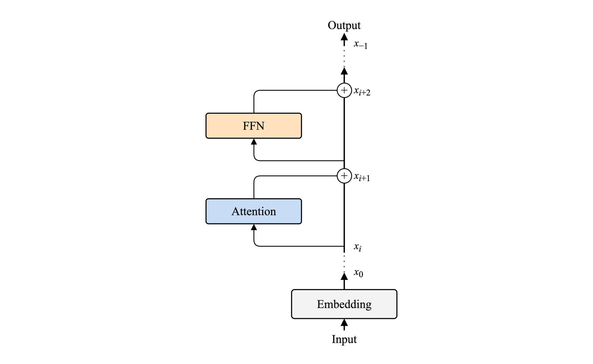

*图 13　标准 Transformer 的残差流。Attention 和 FFN 从通道读取当前状态，并将增量写回同一通道。图示方法参考 [A Mathematical Framework for Transformer Circuits](https://transformer-circuits.pub/2021/framework/index.html) Figure 1；结构对应 [Attention Residuals](https://arxiv.org/abs/2603.15031) Figure 1(a)。*

图中的 $`x_0`$ 是 embedding，$`x_0`$ 到 $`x_i`$ 之间省略了若干中间状态。图中展开的两个子层依次把主线状态更新为 $`x_{i+1}`$ 和 $`x_{i+2}`$。前面两行公式的通用写法是

```math
x_i = x_{i-1} + F_i(x_{i-1})
```

$`F_i`$ 代表第 $`i`$ 个子层（Attention 或 FFN），图 13 画的就是这条从 $`x_0`$ 一路写到底的主线。

这个视角揭示了几个从标准画法中不容易看出的性质。

- **共享通道。** 残差流本身不做任何计算，它只是一条所有子层共用的信息通道。Attention 和 FFN 是从通道分出的支线，各自读取当前状态、完成计算，再把结果写回通道。信息由此沿同一条通道从输入端传到输出端。
- **跨层通信。** 从公式可以看到，每个子层读取的 $`x`$ 是 embedding 与所有前序子层输出的累加结果。当一个较深的子层读取 $`x`$ 时，它会同时接收到上一个子层刚写入的输出和更早各子层留下的贡献。第一个子层写入的贡献会作为 $`x`$ 的一部分沿残差流继续向后传递，不需要由中间子层的计算分支重新生成。后面的子层读取 $`x`$ 时，也能利用其中保留下来的早期信息。所有子层，无论相隔多远，都在通过这条共享通道间接通信。
- **信息持久。** 写入通道的信息默认会一直保留，除非被后续某个子层主动消除，比如读取已有信息后写回它的负值。通道中的内容是持久的，但不是不可修改的。

#### 4.4.2 Block AttnRes 的残差流

Block AttnRes 在每个 block 内维护一份累加和 $`b_n^i`$，用于累加当前 block 各子层的输出。当前子层的实际输入 $`h_l`$ 由选择器另行组合，这两个变量分别对应写入和读取两个过程。

图 14 沿用同样的主线视角，画出了 K3 Block AttnRes 如何在 block 内累加各子层输出。

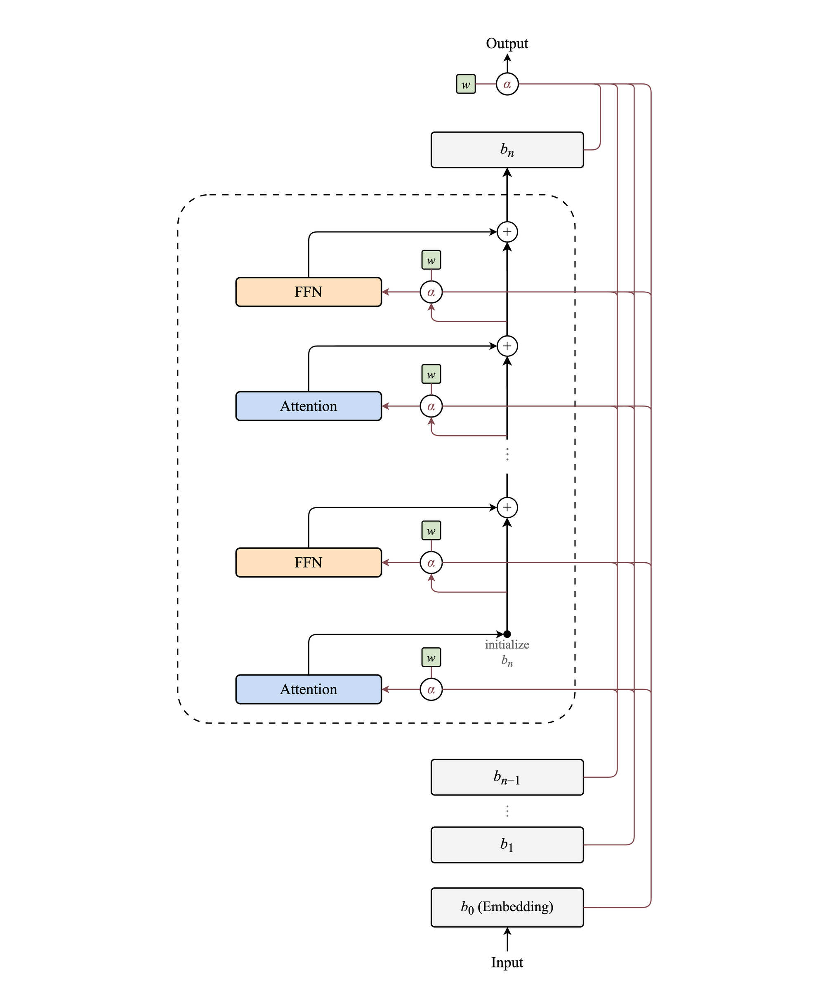

*图 14　K3 Block AttnRes 在 block 内维护的累加和 $`b_n^i`$。block 内第一个 Attention 子层的输出初始化 $`b_n^1`$，后续子层将各自增量依次写入 $`b_n^i`$，block 完成后 $`b_n^i`$ 固化为 $`b_n`$；$`b_0,\ldots,b_{n-1}`$ 始终只读。图中省略了中间解码器层的重复结构；顶部 $`w/\alpha`$ 表示只在模型末尾执行一次的最终聚合。依据 [Attention Residuals](https://arxiv.org/abs/2603.15031) Figure 1(c) 与 [Kimi K3 Technical Report](https://raw.githubusercontent.com/MoonshotAI/Kimi-K3/main/k3_tech_report.pdf?download=1) §2.2。*

沿着这个视角，可以看到三个变化。

- **读写分离。** 标准残差流中的 $`x`$ 同时是子层输入和累加结果。Block AttnRes 中，选择器输出 $`h_l`$ 作为当前子层的输入，$`b_n^i`$ 负责累加当前 block 的子层输出。这份累加和会参与下一次选择，但只是候选来源之一。
- **分块固化。** 一个 block 完成后，这份累加和作为只读的 $`b_n`$ 保存，供后续选择器读取。它保存的是当前 block 各子层输出的和，并不等同于包含全部历史信息的状态快照。进入新 block 后，首个子层的输出会初始化新的累加和。
- **动态选择。** 每个子层拥有一个学习得到的伪查询 $`w_l`$，并根据当前 token 的候选表示计算权重 $`\alpha`$。不同子层可以形成不同的深度偏好，同一子层面对不同 token 时也可以采用不同的组合。

理解了这三个变化之后，可以通过一个思想实验看得更深。如果把选择器的权重全部设为相等，让它对所有来源一视同仁，会发生什么？选择器的输出变成 $`b_0 + b_1 + \cdots + b_{n-1} + b_n^i`$ 的等权平均。$`b_0`$ 是 embedding，$`b_1`$ 到 $`b_{n-1}`$ 分别是已完成 block 内所有子层输出的求和，$`b_n^i`$ 是当前 block 内前 $`i`$ 个子层输出的求和。这些表示的和正好等于 embedding 加上所有前序子层输出的总和。选择器取其平均值，因此与标准残差连接中的 $`x_t`$ 只差一个整体倍数。Attention 和 FFN 在计算前都会先做 RMSNorm，这个尺度差异基本会被归一化消去。Block AttnRes 由此可以在选择器等权时复现标准残差连接的计算方式。在此基础上，选择器还可以根据当前 token 和子层为不同来源分配不同权重。

前面的等权情形也解释了 Block AttnRes 为什么按 block 求和。[AttnRes 论文](https://arxiv.org/abs/2603.15031)在一个包含 16 个解码器层的实验模型上比较了不同的跨层访问方式。滑动窗口聚合（sliding-window aggregation，SWA）只保留 embedding 和最近 8 个子层输出，结果略优于标准残差连接，但仍落后于 Full AttnRes 和 Block AttnRes。[苏剑林的回忆文章](https://spaces.ac.cn/archives/11664)在回顾早期 SWA 尝试时，将结果不理想的原因归结为滑动窗口丢掉了较早的状态，无法再覆盖全部历史输出的等权聚合。Block AttnRes 将连续子层的输出合并为 block 表示。这种压缩会失去 block 内逐层选择的能力，但保留了各个深度区间的汇总结果，仍能覆盖全部历史输出的等权聚合。

论文还可视化了这个 16 层实验模型的选择器权重。无论 Full 还是 Block 形式，权重通常集中在最近的来源，但 embedding 在不少深层位置仍能获得一定权重。这篇回忆文章还提到，Full AttnRes 中观察到的这一现象，也促使团队在 Block AttnRes 中把 embedding 单独保留为一个来源。

## 5. 结语

回看全文，K3 对 Transformer 的改造沿着三个方向展开。KDA 使用固定状态，Gated MLA 则按 token 保存压缩表示。Stable LatentMoE 让路由专家在较窄的 latent 空间中工作，并增加配套的稳定化设计。Block AttnRes 则把前序子层的输出按 block 汇总，供后续子层重新组合输入。

K3 是我认真研究的一款国产开放权重大模型。它的架构设计有清晰的取舍，技术报告也把设计思路和工程细节交代得很完整。能把这些设计组合进一套 2.8T 参数、1M 上下文的模型中，也让我更直观地感受到团队的工程实力。期待国内的大模型越来越强！

<!-- issue-blog:article-id=101-kimi-k3 -->
