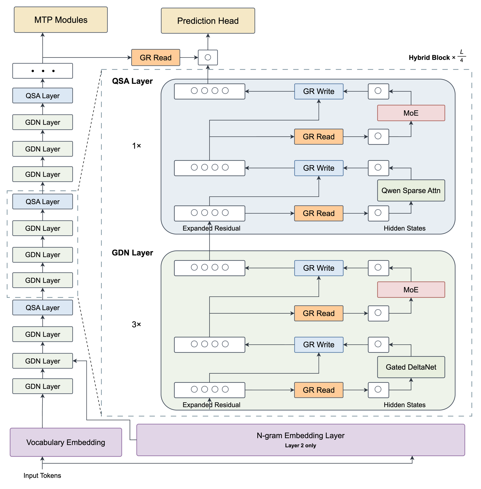
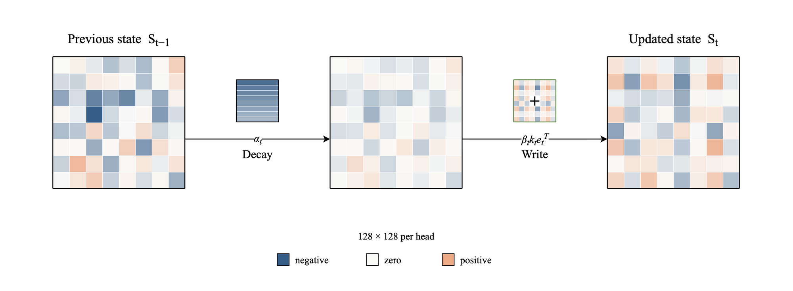
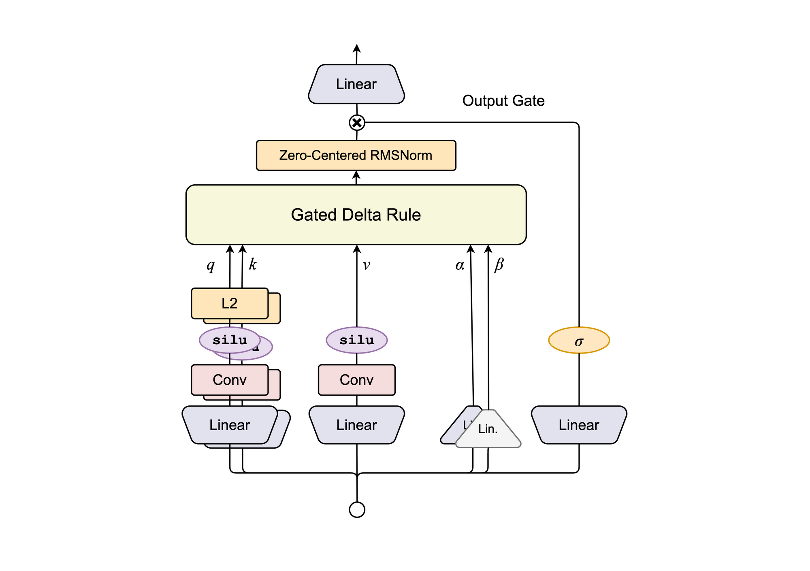
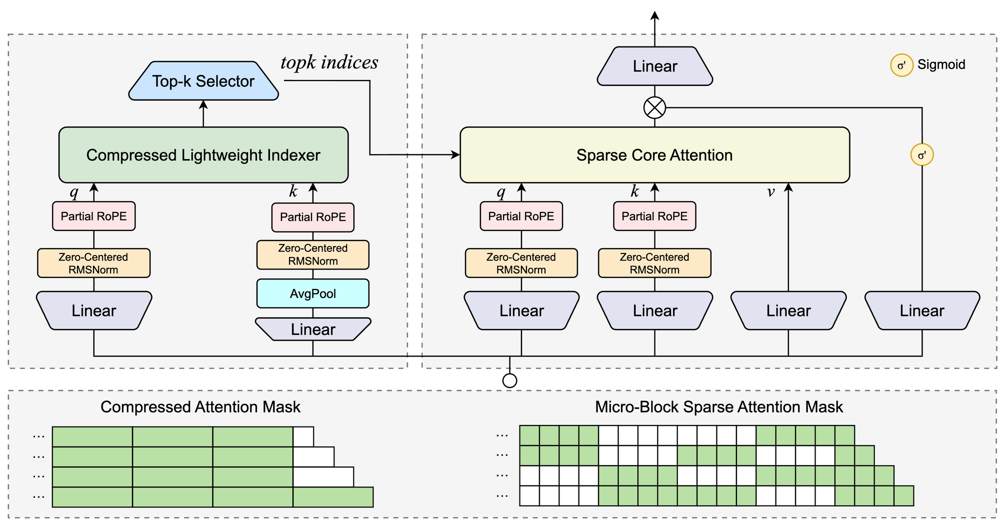
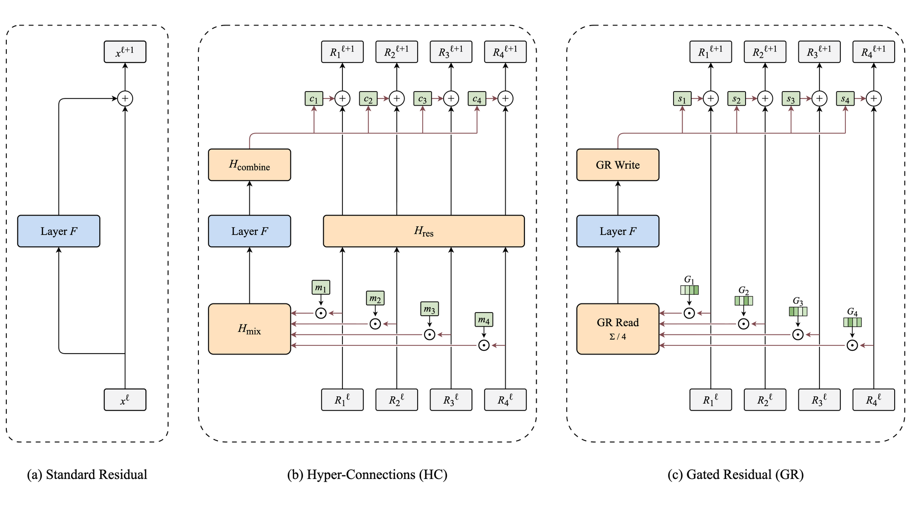
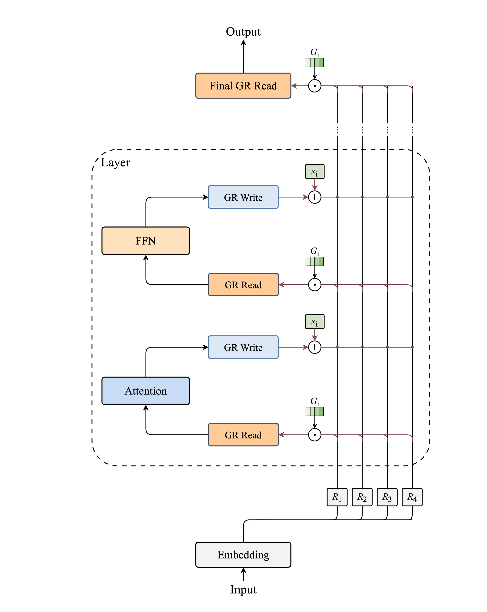
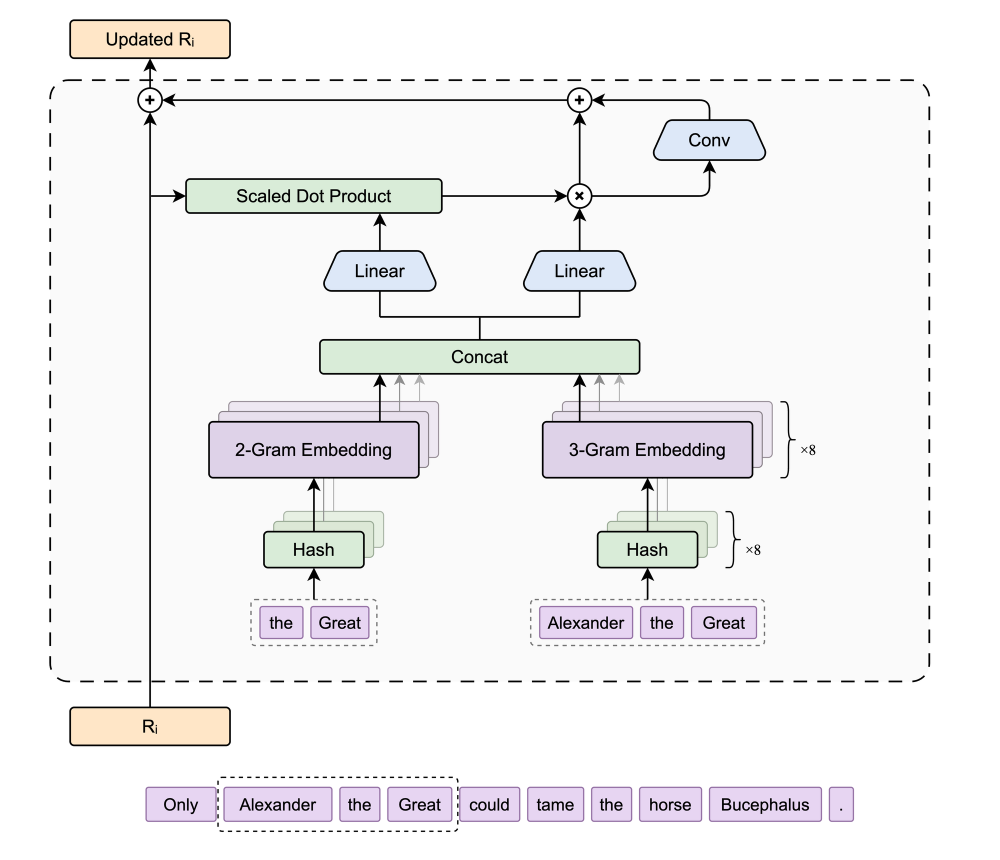

# Qwen3.8-Flash-Next 架构学习笔记

2026 年 8 月 26 日，通义千问团队发布了 [Qwen3.8-Flash-Next](https://huggingface.co/Qwen/Qwen3.8-Flash-Next)，作为下一代 Qwen4 架构的公开预览。它延续了 Qwen3-Next 的做法，在完整系列发布之前先公开新架构，让社区提前熟悉这套设计。

此前 Qwen3.8-27B 发布时，我对它的能力提升印象很深，也留意到模型架构仍然沿用 Qwen3.5 的设计。新模型一款接着一款发布，我也期待看到架构上有些新的变化。Qwen3.8-Flash-Next 正好提供了这样一个学习机会，从注意力到残差连接，再到额外加入的查表表示，都值得仔细看看。

本文是我学习这套新架构的笔记，重点梳理混合注意力、四路残差，以及 N-gram 查表与写入的过程。主要参考资料是 [Qwen3.8-Flash-Next 技术报告](https://github.com/QwenLM/Qwen3.8-Flash-Next/blob/69885871a64393807d988b27b1b5e380e8f28526/tech_report.pdf)，后续就简称为技术报告。

## 1. 模型架构

Qwen3.8-Flash-Next 采用多模态 MoE（混合专家模型）架构，文本主干是一套仅解码器 Transformer。

主模型共有 125B 参数，激活参数为 6B，原生上下文长度为 262,144 token。文本主干包含 48 个解码器层，每层都有一个注意力子层和一个 MoE 子层，隐藏维度为 2560。MoE 每层配置 512 个路由专家，每 token 选择其中 10 个，另有一个共享专家。

在 125B 主模型之外，模型还加入了一组约 51B 参数的 N-gram embedding 表。此外，模型包含一个约 4B 参数的单层 MTP（Multi-Token Prediction）模块，用于预测后续多个 token。视觉编码器则负责把图像和视频转换成文本主干可以处理的表示。MTP 与视觉编码器都不在本文的展开范围。



*图 1　Qwen3.8-Flash-Next 的整体架构。配图参考 [Qwen3.8-Flash-Next Technical Report](https://github.com/QwenLM/Qwen3.8-Flash-Next/blob/69885871a64393807d988b27b1b5e380e8f28526/tech_report.pdf) Figure 1。*

**Gated DeltaNet 和 Qwen Sparse Attention 的混合注意力**。48 个解码器层按 12 组循环排列，每组前三层使用 Gated DeltaNet（GDN），第 4 层使用 Qwen Sparse Attention（QSA），全模型共有 36 层 GDN 和 12 层 QSA。GDN 属于线性注意力，将历史 token 信息更新到固定大小的状态中；QSA 属于稀疏注意力，从历史 token 中选择一部分重要的位置，对其执行注意力计算。图 1 左侧用虚线框圈出了一个四层循环，右侧将它展开为一个混合块（Hybrid Block）。

**Gated Residual**。模型的残差状态由四条并行分支组成。每个注意力子层和 MoE 子层都有独立的 GR Read 与 GR Write，进入子层前按通道读取四路状态，子层计算完成后再按分支写回。图 1 右侧四个一组的圆点表示四路残差状态，单个圆点表示送入子层的隐藏状态（hidden states）。GDN、QSA 与 MoE 前后的 GR Read 和 GR Write 画出了完整的读写关系，主干顶部最后一次 GR Read 将四路状态合并为最终的隐藏状态。

**N-gram embedding 与 PLE**。模型在第 2 个解码器层查询 N-gram 哈希表，查询地址由当前 token 及其前几个 token 决定，得到的局部短语表示经 Per-Layer Embedding（PLE）门控后写入四路残差状态。这张表约有 51B 参数，位于 125B 主模型之外。图 1 将这部分画在主干底部，位置对应第 2 个解码器层。

## 2. GDN 与 QSA 的混合注意力

标准注意力让当前 token 可以直接访问此前的任意位置，从上下文中寻找并组合相关信息。推理时，每个注意力层都要为历史 token 保存 K/V，KV cache（键值缓存）会随上下文线性增长。处理一段完整序列时，每个位置还要分别与此前的位置计算注意力，计算量接近平方增长。

Qwen3.8-Flash-Next 采用 GDN 与 QSA 组成的混合注意力。48 个注意力层以 4 层为一组，每组前 3 层使用 GDN，第 4 层使用 QSA，混合比例为 3 比 1。GDN 用固定大小的状态持续压缩历史，QSA 从完整历史中选择少量原始 token 进入核心注意力。本章将分别学习两种机制的工作方式。

### 2.1 Gated DeltaNet

[Gated DeltaNet](https://arxiv.org/abs/2412.06464)（GDN）从 Qwen3.5 沿用下来，在混合注意力中负责持续压缩历史。它属于递归式线性注意力，序列每前进一步便更新一次固定大小的矩阵状态。在 Qwen3.8-Flash-Next 中，每个 GDN 层的 48 个 value 头各自对应一份 $`128\times128`$ 的矩阵状态。这些状态的大小不会随上下文变长而增加。

#### 2.1.1 从线性注意力到 Gated DeltaNet

**最简单的线性注意力。** 注意力层会从 token 表示中生成 query、key 和 value，通常分别记作 $`q`$、$`k`$ 和 $`v`$。在标准注意力中，当前 $`q`$ 与各个可见位置的 $`k`$ 计算匹配分数。这些分数进而变成注意力权重，各位置的 $`v`$ 再按权重相加，形成当前 token 的注意力输出。

线性注意力保留了 $`q`$、$`k`$ 和 $`v`$ 的功能分工，同时把历史信息压入一份矩阵状态。第 $`t`$ 个 token 到来时，模型先用 $`k_t`$ 和 $`v_t`$ 将 $`S_{t-1}`$ 更新为 $`S_t`$，再用 $`q_t`$ 从 $`S_t`$ 计算当前输出。最简单的因果线性注意力可以写成

```math
S_t=S_{t-1}+k_t v_t^{\mathsf T},
\qquad
y_t=S_t^{\mathsf T}q_t
```

$`k_t v_t^{\mathsf T}`$ 是当前 token 对矩阵状态的一次更新，形状与 $`S_t`$ 相同。$`S_t^{\mathsf T}q_t`$ 则利用当前 query 和这份状态计算输出。各个 token 写入的信息都累积在同一份矩阵中。上下文继续变长时，模型需要保存和更新的仍是这份固定形状的矩阵，因此这份状态的存储量和单步递推的计算量都不会随上下文增长。

这种递推每一步都只做加法。已经写入状态的内容不会自行减弱，序列越长，更多内容便会继续叠加在同一份矩阵中。如果同一个 key 再次出现，当前 value 仍会完整加进去，无法根据状态中已有的结果只补上差额。这就引出了两种处理方式。遗忘让旧内容在状态中的影响逐渐减弱，修正则根据当前 key 改写已有结果。

**用衰减实现遗忘。** [RetNet](https://arxiv.org/abs/2307.08621)、[GLA](https://arxiv.org/abs/2312.06635) 等工作在写入当前内容以前，先让旧状态衰减。忽略衰减门在不同方法中的具体形状，其共同思路可以简写为

```math
S_t=\alpha_t S_{t-1}+k_t v_t^{\mathsf T}
```

RetNet 为每个注意力头设置固定的标量衰减率，GLA 则根据当前输入生成更细粒度的向量衰减门。旧状态经过连续衰减，早先写入的内容会逐渐减弱，这便实现了遗忘。

衰减只控制旧状态保留多少，并不检查状态已经为当前 key 给出了什么结果。相同或相近的 key 再次出现时，当前 value 仍然采用加法写入，已有结果无法得到针对性的修正。

**用 delta rule 实现修正。** [DeltaNet](https://arxiv.org/abs/2406.06484) 在写入当前 value 以前，先用当前 key 计算状态中已有的结果，再求出它与当前 value 之间的差额。更新过程可以写成

```math
\hat v_t=S_{t-1}^{\mathsf T}k_t,
\qquad
e_t=v_t-\hat v_t
```

```math
\begin{aligned}
S_t
&=S_{t-1}+\beta_t k_t e_t^{\mathsf T} \\
&=(I-\beta_t k_t k_t^{\mathsf T})S_{t-1}
+\beta_t k_t v_t^{\mathsf T}
\end{aligned}
```

$`I`$ 是单位矩阵。$`\hat v_t`$ 是状态已经为当前 key 给出的结果，$`e_t`$ 是它与当前 value 之间的差额。已有结果越接近当前 value，写入状态的差额就越小。$`\beta_t`$ 控制这次修正的强度。DeltaNet 因而能够根据当前 key 修正已有结果，但它没有独立的全局衰减门，无法让整份旧状态随时间逐渐减弱。

**Gated DeltaNet 合并遗忘与修正。** Gated DeltaNet 先用当前输入生成的标量 $`\alpha_t`$ 衰减旧状态，再用 delta rule 修正当前 key 对应的结果。合并后的更新公式如下。

```math
S_t=\alpha_t(I-\beta_t k_t k_t^{\mathsf T})S_{t-1}
+\beta_t k_t v_t^{\mathsf T}
```

$`\alpha_t`$ 控制整份旧状态保留多少，实现遗忘。$`\beta_t`$ 控制差额写回多少，实现修正。

#### 2.1.2 GDN 怎样完成一次计算

**状态更新与读取。** 把上面的合并公式拆开，一次 GDN 的状态更新与读取可以写成四步。

```math
\widetilde S_{t-1}=\alpha_t S_{t-1}
```

```math
\hat v_t=\widetilde S_{t-1}^{\mathsf T}k_t,
\qquad
e_t=v_t-\hat v_t
```

```math
S_t=\widetilde S_{t-1}+\beta_t k_t e_t^{\mathsf T}
```

```math
y_t=S_t^{\mathsf T}q_t
```

$`\alpha_t`$ 先让旧状态整体衰减，$`k_t`$ 随后计算这份状态已经给出的结果 $`\hat v_t`$。$`e_t`$ 是当前 value 与 $`\hat v_t`$ 的差额，$`\beta_t`$ 控制其中多少被写回状态。状态更新完成后，$`q_t`$ 与 $`S_t`$ 共同计算当前输出。

**用 $`2\times2`$ 矩阵手算。** 下面把矩阵缩小到 $`2\times2`$，手算一次完整的更新过程。取 $`S_{t-1}=\begin{bmatrix}4&1\\0&2\end{bmatrix}`$、$`\alpha_t=0.5`$，当前 token 的 key 为 $`k_t=(1,0)^{\mathsf T}`$，希望写入的 value 为 $`v_t=(3,2.5)^{\mathsf T}`$，暂时令 $`\beta_t=1`$。这里的 $`k_t`$ 只有第一维为 1，因此这次更新只会改变矩阵的第一行。

旧状态先整体衰减。

```math
\widetilde S_{t-1}
=0.5\begin{bmatrix}4&1\\0&2\end{bmatrix}
=\begin{bmatrix}2&0.5\\0&1\end{bmatrix}
```

随后用 $`k_t`$ 计算衰减后的状态在当前 key 下已经给出的结果。

```math
\hat v_t=\widetilde S_{t-1}^{\mathsf T}k_t
=\begin{bmatrix}2\\0.5\end{bmatrix}
```

当前 value 与已有结果之间的差额为 $`e_t=(1,2)^{\mathsf T}`$。外积 $`k_t e_t^{\mathsf T}`$ 将这份差额转换成与状态同形的更新量。

```math
k_t e_t^{\mathsf T}
=\begin{bmatrix}1\\0\end{bmatrix}
\begin{bmatrix}1&2\end{bmatrix}
=\begin{bmatrix}1&2\\0&0\end{bmatrix}
```

把这块更新量加到衰减后的状态上，得到

```math
S_t=
\begin{bmatrix}2&0.5\\0&1\end{bmatrix}
+\begin{bmatrix}1&2\\0&0\end{bmatrix}
=\begin{bmatrix}3&2.5\\0&1\end{bmatrix}
```

由于这里取 $`\beta_t=1`$，更新后的第一行正好等于当前 value。若直接把完整的 $`(3,2.5)`$ 加到衰减后的状态上，第一行会变成 $`(5,3)`$，超过希望得到的结果。Delta rule 只补上缺少的 $`(1,2)`$。如果再取 $`q_t=(1,0)^{\mathsf T}`$，输出 $`y_t`$ 就是 $`(3,2.5)^{\mathsf T}`$。



*图 2　GDN 单个注意力头的状态更新。旧状态先乘以衰减系数 $`\alpha_t`$，再加上更新量 $`\beta_t k_t e_t^{\mathsf T}`$，得到新的状态 $`S_t`$。*

**完整的 GDN 模块。** 状态递推只描述了 GDN 中间的一步读写。实际模块还要从输入生成 q、k、v、$`\alpha`$ 和 $`\beta`$，并在状态输出后完成归一化、门控和线性投影。

在 Qwen3.8-Flash-Next 中，输入先经过线性投影，形成 q、k 和 v 三路表示。三路表示分别经过短因果卷积与 SiLU，q 和 k 随后再做 L2 归一化。GDN 配置了 16 个 Q/K 头和 48 个 value 头，每个头都是 128 维。实现把每组 q 和 k 复制三份，与 48 组 value 配对，因此每层维护 48 份 $`128\times128`$ 的矩阵状态。

状态读取结果经过零中心 RMSNorm，再乘以由当前输入生成的输出门，最后投影回模型维度。原始 GDN 的输出门采用 SiLU。Qwen3.8-Flash-Next 使用取值有界的 sigmoid，技术报告在实验中观察到这一设置带来一致改进。



*图 3　Gated DeltaNet 的完整模块。输入分别生成 q、k、v、$`\alpha`$、$`\beta`$ 和输出门，矩阵状态完成衰减、差额写入和读取，结果再经归一化、输出门和线性投影。配图参考 [Qwen3.8-Flash-Next Technical Report](https://github.com/QwenLM/Qwen3.8-Flash-Next/blob/69885871a64393807d988b27b1b5e380e8f28526/tech_report.pdf) Figure 2。*

### 2.2 Qwen Sparse Attention

Qwen Sparse Attention（QSA）把一次注意力分为选择和计算两个阶段。轻量 indexer 先在完整历史中给微块评分，选出少量候选；核心注意力再读取这些微块内各个 token 的原始 K/V，执行 softmax 注意力。每个 query 最多从完整微块中选出 512 个，对应最多 2,048 个历史 token，末尾尚未填满的微块还会直接加入核心注意力。

QSA 延续了 [DeepSeek-V3.2](https://arxiv.org/abs/2512.02556) 中 DeepSeek Sparse Attention（DSA）的两段式结构。DSA 的 indexer 为当前 query 与每个历史 token 计算分数，核心注意力只处理分数最高的 2,048 个位置。它缩小了核心注意力的计算范围，indexer 仍需逐 token 扫描完整历史。QSA 将 indexer 的评分单位改为由 4 个 token 组成的微块，先压缩历史 key 序列，再进行评分和选择。



*图 4　QSA 将选择与核心注意力分成两条路径。左侧 indexer 在压缩后的历史上给微块评分，top-k 结果展开成右侧的微块稀疏掩码，核心注意力随后读取入选位置的原始 K/V。配图参考 [Qwen3.8-Flash-Next Technical Report](https://github.com/QwenLM/Qwen3.8-Flash-Next/blob/69885871a64393807d988b27b1b5e380e8f28526/tech_report.pdf) Figure 3。*

#### 2.2.1 微块和压缩 key

每个历史 token 先经过 indexer 的 key 投影，得到一份 128 维表示。模型按顺序每 4 个 key 做一次平均池化，经过零中心 RMSNorm，再以微块起始位置应用部分旋转位置编码（partial RoPE），即只对部分维度施加旋转。这里 128 个维度中的 64 维参与旋转，最终生成一份微块 key。在模型 262,144 token 的最大上下文长度下，完整前缀最多生成 65,536 份微块 key。

先池化再旋转的顺序，避免了先按各个 token 的位置旋转 key、再求平均时混合不同的旋转相位。

这些压缩 key 只供 indexer 评分。核心注意力的 K/V 仍然按 token 分别生成。一个微块入选后，其中四个位置会重新展开，核心注意力读取各个位置原始的 K/V。

#### 2.2.2 Indexer 如何评分和选择

**计算评分。** Indexer 采用 MQA（多查询注意力）结构，包含 4 个查询头（query head）和 1 个共享 key 头，每个头为 128 维。位置 $`i`$ 的当前 token 生成 4 份 indexer query，经过零中心 RMSNorm，并按照当前位置应用 partial RoPE。它们分别与微块 $`b`$ 的压缩 key 计算点积，负值经过 ReLU 归零，剩余结果相加。

只有 4 个 token 都已出现的完整微块才能参加评分。把微块 $`b`$ 的起始位置记作 $`p_b`$，这一条件就是 $`p_b+3\le i`$，技术报告将其称为块级因果。

把完整微块 $`b`$ 的压缩 key 记作 $`\bar{k}_b`$，评分可以写成

```math
I_{ib}
=
\sum_{h=1}^{4}
\mathrm{ReLU}
\left(
\left\langle q_{ih},\bar{k}_{b}\right\rangle
\right)
```

**选择微块。** QSA 按照 $`I_{ib}`$ 从高到低选出最多 512 个完整微块。上下文中完整微块不足 512 个时，它们会全部入选。末尾尚未填满的微块不经过 indexer，已经出现的 0 到 3 个 token 会直接保留。Indexer 交给下一步的是入选微块的位置，评分本身不会作为核心注意力的权重。

#### 2.2.3 稀疏核心注意力

Indexer 选出的每个微块会展开为 4 个原始 token 位置，再与末尾微块中已经出现的 0 到 3 个 token 合并，形成当前 query 的稀疏可见集合，记作 $`\mathcal S_i`$。

图 4 左侧给出的 top-k 微块索引，经过展开后成为右下方的微块稀疏掩码。不同 query 会生成各自的 $`\mathcal S_i`$。

核心注意力使用独立于 indexer 的 Q/K/V 投影。它采用 GQA（分组查询注意力），共有 24 个查询头和 2 个 KV 头，每个头为 256 维，因此每组 12 个查询头共享一组 K/V。Q 和 K 经过零中心 RMSNorm，并在其中 64 个维度上应用 partial RoPE。核心 K/V 始终保持 token 粒度，没有使用 indexer 的微块平均结果。

对于任意一个查询头，把 $`\mathcal S_i`$ 中的 key 和 value 分别写成 $`K_{\mathcal S_i}`$ 与 $`V_{\mathcal S_i}`$，核心注意力可以写成

```math
o_i
=
\mathrm{softmax}
\left(
\frac{q_iK_{\mathcal S_i}^{\mathsf T}}{\sqrt{d}}
\right)
V_{\mathcal S_i},
\qquad d=256
```

计算形式与标准注意力相同，参与计算的 K/V 仅来自 $`\mathcal S_i`$。Indexer 的分数只用来确定这个集合，核心注意力会用自己的 Q/K 重新计算 token 之间的权重。各个查询头的输出最后经过 sigmoid 输出门，再投影回模型维度。

### 2.3 混合注意力的缓存与取舍

在这套混合注意力中，GDN 和 QSA 用两种方式保留历史。36 个 GDN 层把过去压入固定形状的矩阵状态，12 个 QSA 层保留 token 粒度的 K/V，以便后来的 query 重新访问具体位置。这两部分共同决定了推理时的缓存规模。

**GDN 的状态保持固定。** 每个 GDN 层有 48 个 value 头，每个头维护一份 $`128\times128`$ 的矩阵状态。Qwen3.8-Flash-Next 共有 36 个 GDN 层，矩阵状态采用 FP32，单序列所需空间约为

```math
36\times48\times128\times128\times4\ \text{bytes}
=108\ \text{MiB}
```

这个估算只计算主要的矩阵状态，没有计入体量小得多的短卷积状态。上下文继续变长时，GDN 仍然更新这些矩阵，不需要为新的 token 追加缓存。相应的代价是，历史已经压缩进矩阵，某个 token 的原始 K/V 不再单独保留。

**QSA 的读取稀疏，缓存仍按长度增长。** 每个 query 最多选择 512 个完整微块，将其中至多 2,048 个历史 token 送入核心注意力，末尾微块中已经出现的位置也会直接加入。这个预算限制的是一次核心注意力读取多少位置。未来的 query 仍可能选中完整历史中的任意微块，因此每个 QSA 层都要保留全部历史的核心 K/V。

每个 QSA 层有 2 个 KV 头，key 和 value 的维度均为 256，因此每层每个 token 需要保存 1,024 个 BF16 数值。公开的 [Transformers 参考实现](https://github.com/huggingface/transformers/tree/83d024e1bfed0d425d20bcde2b46a56b2333906e/src/transformers/models/qwen4_exp)还会按 token 保存一份 128 维的原始 indexer key。12 个 QSA 层合在一起，缓存量约为

```math
12\times\left[2\times(256+256)+128\right]\times2\ \text{bytes}
=27\ \text{KiB/token}
```

在模型支持的最大上下文长度 262,144 token 下，单序列逻辑缓存约为 6.75 GiB。

**3 比 1 的排布组合了两种取舍。** 与 48 层都保留 token 级 K/V 相比，Qwen3.8-Flash-Next 将这部分线性增长的缓存限制在 12 个 QSA 层。其余 36 个 GDN 层用固定状态持续压缩历史，QSA 则保留对原始 token 的直接检索。整套模型的缓存仍会随上下文增长，但增长集中在四分之一的注意力层中。

## 3. Gated Residual

标准 Transformer 让所有子层共用一条残差流。第 $`\ell`$ 个子层读取当前状态 $`x^\ell`$，产生一个增量，再把增量加回原状态。

```math
x^{\ell+1}=x^\ell+F^\ell\!\left(x^\ell\right)
```

$`F^\ell`$ 代表第 $`\ell`$ 个子层的计算。把连续的子层更新展开以后，最终状态可以写成

```math
x^L=x^0+\sum_{\ell=0}^{L-1}F^\ell\!\left(x^\ell\right)
```

$`x^0`$ 是 token embedding（token 嵌入），求和中的每一项来自一个子层。展开以后，残差状态可以看成初始输入 $`x^0`$ 与此前各子层更新的累加结果。当某个子层从残差流中读取状态时，读到的是这份累加后的整体，仅凭这条状态无法直接区分其中哪些来自初始输入，哪些来自某个特定子层。

Gated Residual（GR）是 Qwen3.8-Flash-Next 使用的一种四路残差结构。残差状态由四条并行分支组成，每个子层从四条分支中合成输入，计算完成后再把输出写回各条分支。

### 3.1 GR 的四路读写

GR 的四条残差分支从同一份 token embedding 开始。模型得到这份 2560 维向量后，把它复制成四份，作为四条分支的初始值。残差状态由此从一条向量扩展为四条并行分支，每条分支仍是 2560 维。GR Read 合成的子层输入和子层输出也保持 2560 维，注意力与 MoE 子层的内部计算宽度无需随残差状态的加宽而改变。



*图 5　(a) 为标准单路残差，(b) 为 Hyper-Connections 的读取、分支混合与写回，(c) 为 Gated Residual 的逐通道读取与逐分支写回。*

图 5(c) 画出了 GR 的主数据流。底部的 $`R_1^{\ell},\ldots,R_4^{\ell}`$ 是四条分支在这一子层之前持有的状态。这些状态先分别乘以逐通道读取门 $`G_i`$，四路结果由 GR Read 取平均，再送入子层 $`F`$。子层输出经过 GR Write，用四个写入系数 $`s_i`$ 分别缩放，再加回各条分支，得到顶部的 $`R_1^{\ell+1},\ldots,R_4^{\ell+1}`$。

这张图省略了各条分支的归一化，以及 $`G_i`$ 和 $`s_i`$ 的生成过程。两组参数都会随 token 位置变化，由该位置归一化后的四路状态共同预测。图中从子层 $`F`$ 指向 GR Write 的箭头表示对子层输出进行缩放和写回，写入系数 $`s_i`$ 在子层计算前已经算出。

GR 的一次**读取**从归一化开始。四条分支分别做 RMSNorm，并各自使用一组缩放参数，随后拼接成一个 10240 维向量。这个向量经过 `10240 → 320 → 10240` 的低秩网络，中间经 SiLU 激活，最后由 sigmoid 生成四组 2560 维读取门。每组门都能按通道调节对应分支，门控后的四条分支取平均，得到子层输入。

下面省略层号，把四条分支记作 $`R_1,\ldots,R_4`$，归一化结果记作 $`\hat R_i`$，拼接操作记作 $`\mathrm{vec}`$，读取过程可以写成

```math
\hat R_i=\mathrm{RMSNorm}(R_i;\gamma_i),\qquad
z=\mathrm{vec}(\hat R_1,\ldots,\hat R_4)
```

```math
G=\mathrm{unvec}\!\left(\sigma\!\left(W_u\mathrm{SiLU}\!\left(\tfrac14W_dz\right)\right)\right),
\qquad
x=\frac14\sum_{i=1}^{4}G_i\odot\hat R_i
```

$`\mathrm{unvec}`$ 将向量拆回四路，$`\odot`$ 表示逐元素相乘，$`\sigma`$ 表示 sigmoid 函数。

$`W_d`$ 把 10240 维状态压到 320 维，$`W_u`$ 再把它升回 10240 维。$`G_i`$ 是第 $`i`$ 条分支的逐通道读取门，元素位于 0 到 1 之间。GR 已经在这里完成了归一化和门控，得到的 $`x`$ 可以直接送入子层。

GR 的一次**写入**使用从同一个 $`z`$ 预测出的四个写入系数。子层算出 $`y`$ 后，每条分支保留原值，再加上对应系数乘以 $`y`$。

```math
s=2\sigma\!\left(\tfrac14W_wz\right),\qquad
y=F(x),\qquad
R_i'=R_i+s_i y
```

$`s_i`$ 位于 0 到 2 之间。读取门细化到了每个通道，写入端只为每条分支生成一个标量。四条分支都会接收子层输出，接收强度可以不同。

Qwen3.8-Flash-Next 的每个解码器层都执行两次这样的读写。注意力子层（GDN 或 QSA）与后面的 MoE 子层各执行一次，机制完全相同，各用一套独立的 GR 参数。48 层共有 96 个层内 GR 模块。全部层结束后，模型还会使用一个只读 GR，把四条分支合成为 2560 维状态，再送入 LM head（语言模型输出头）。

### 3.2 从 AltUp 到 GR

前一节介绍了 GR 怎样读写四路状态。下面沿着 AltUp、HC 和 mHC 的设计变化，看看 GR 为什么采用这样的读写方式。AltUp 先把残差状态扩展为多路，读写仍然固定；HC 让读写随输入变化，同时引入分支混合矩阵，这个矩阵缺少约束，深层连乘时会放大或缩小信号；mHC 把混合矩阵约束为双随机矩阵，控制了这个风险，但分支混合的计算和约束成本仍然保留。GR 最后删除了分支混合，把读取细化到每个通道，写入保持每条分支一个系数。

#### 3.2.1 AltUp 扩展残差状态

[AltUp](https://arxiv.org/abs/2301.13310)（Baykal et al., 2023）把 token 表示从 $`d`$ 维扩展到 $`Kd`$ 维，Transformer 层本身仍按 $`d`$ 维计算。Qwen 在设计 GR 时，首先需要确认单纯扩展残差状态是否有效。技术报告因此简化了 AltUp，只保留多路状态、固定读取和轮流写入。

简化版的残差状态由 $`n_r`$ 条独立分支组成，每条仍然是 $`d`$ 维。下面把分支记作 $`R_0,\ldots,R_{n_r-1}`$，子层编号 $`\ell`$ 也从 0 开始，与轮流写入的取模运算对齐。子层按照一组固定的可学习标量读取所有分支，输出则按编号轮流写入一条分支。

```math
x^\ell=\sum_{i=0}^{n_r-1}h_iR_i^\ell,\qquad
R_i^{\ell+1}
=R_i^\ell+\mathbf{1}[i=\ell\bmod n_r]\,y^\ell
```

当 $`n_r=4`$ 时，每个子层只增加四个读取标量 $`h_i`$，分别控制四路残差状态的读取权重。同一个子层处理不同 token 时，始终使用同一组标量。第 0 个子层写入 $`R_0`$，第 1 个子层写入 $`R_1`$，第 4 个子层再回到 $`R_0`$。在一组 25B-A3B、训练 400B token 的实验中，单纯扩展残差状态的训练损失（loss）就明显低于单路残差。

#### 3.2.2 HC 引入动态读写

[Hyper-Connections](https://arxiv.org/abs/2409.19606)（HC, Zhu et al., 2024）把 AltUp 的固定读写推广成三个随输入变化的算子。图 5(b) 展示了这套结构。$`H_{\mathrm{mix}}`$ 将各分支合成子层输入，$`H_{\mathrm{combine}}`$ 将子层输出分配回各分支，$`H_{\mathrm{res}}`$ 则直接对四条残差分支做加权混合。把 $`n_r`$ 条分支合记为 $`R^\ell`$，读写可以写成

```math
x^\ell=H_{\mathrm{mix}}^{\mathsf T}R^\ell
```

```math
R^{\ell+1}=H_{\mathrm{res}}R^\ell+H_{\mathrm{combine}}{y^\ell}^{\mathsf T}
```

$`H_{\mathrm{mix}}`$ 和 $`H_{\mathrm{combine}}`$ 是 $`n_r`$ 维向量，$`H_{\mathrm{res}}`$ 是 $`n_r\times n_r`$ 矩阵。三个算子都包含一个静态项和一个从当前残差状态预测的动态项。关闭动态项并采用对应的静态设置，HC 可以恢复前面的简化 AltUp。

动态算子解决了 AltUp 对所有 token 使用同一套读写参数的问题。$`H_{\mathrm{res}}`$ 也让分支能够直接交换信息，同时改变了标准残差的恒等路径。把许多层展开以后，浅层信号前面会出现一串 $`H_{\mathrm{res}}`$ 连乘。矩阵缺少约束时，连乘可能让前向信号和梯度不断放大或缩小。

#### 3.2.3 mHC 约束分支混合

[mHC](https://arxiv.org/abs/2512.24880)（Xie et al., 2025, DeepSeek-AI）保留 HC 的三个算子，把 $`H_{\mathrm{res}}`$ 约束为双随机矩阵。矩阵中的元素非负，每行之和为 1，每列之和也为 1。

双随机矩阵会对各分支做加权混合，同时保持所有分支的平均值。多个双随机矩阵相乘后仍满足这些条件，可以限制 $`H_{\mathrm{res}}`$ 连乘带来的整体放大。当 $`n_r=1`$ 时，唯一满足条件的矩阵就是标量 1，对应标准残差的恒等路径。

mHC 使用 Sinkhorn-Knopp 迭代完成约束。它先对矩阵元素取指数，再交替执行行归一化和列归一化，让矩阵逐步接近双随机。读取算子经过 sigmoid，写入算子经过 $`2\times`$ sigmoid。mHC 论文的实验表明，双随机约束改善了 HC 的训练稳定性，训练过程中没有出现损失突增（loss spike）。

mHC 控制了 $`H_{\mathrm{res}}`$ 连乘的风险，也保留了分支混合的计算和约束。Qwen 接着检验了另一个问题。当读取和写入已经能够随输入变化时，分支之间是否还需要每层混合一次。

#### 3.2.4 GR 把表达力放在读取端

[技术报告](https://github.com/QwenLM/Qwen3.8-Flash-Next/blob/69885871a64393807d988b27b1b5e380e8f28526/tech_report.pdf)用一组训练至 560B token 的 25B-A3B 模型消融读写设计。逐通道读取优于每条分支只用一个标量，把写入也细化到每个通道却几乎没有额外收益，最终结构因而采用逐通道读取和逐分支写入。当这两端已经能够随输入变化时，继续加入 $`H_{\mathrm{res}}`$ 也没有带来显著改进，分支混合由此被删除。

Qwen 团队此前在另一项研究中提出了 [GatedNorm](https://arxiv.org/abs/2601.22966)（Qiu et al., 2026），其门控形式恰好与上述消融得到的读取形式一致。GatedNorm 在 RMSNorm 后加入一个逐通道的 sigmoid 低秩门。把它用在扩展后的残差状态上，就得到 GR 的读取。

GR 保留四条残差分支，让读写随当前状态变化，将读取细化到每个通道，写入保持每条分支一个系数。图 5(b) 中的 $`H_{\mathrm{res}}`$ 被删除，结构收敛为图 5(c)。

这一步也改变了成本。HC 和 mHC 每个子层都要为 $`H_{\mathrm{res}}`$ 再读取一次完整的多路状态，mHC 还需要执行双随机约束。GR 省去了这部分，把新增的计算集中在低秩读取门和四个写入系数上。

### 3.3 从残差流看 GR

从残差流的角度看，GR 的核心是四条分支怎样贯穿模型传递信息，并在这个过程中保持同步或形成分工。可以先做一个思想实验。假如四条残差分支从始至终完全同步，那么 GR 在功能上就会退化为标准残差。在此基础上，再看 $`G_i`$ 和 $`s_i`$ 分别发挥什么作用。

图 6 以四条残差分支为主线，展示 GR 在模型中的完整处理路径。右侧四条残差流贯穿整个模型，注意力子层和 MoE 前馈子层（图中的 FFN）依次从中读取输入，再把各自的输出写回。全部层结束后，最终的 GR Read 将四路状态合成，送向输出端。



*图 6　GR 的完整残差流。Embedding 初始化四条残差分支，中间展开一个 Transformer 层，顶部的 GR Read 合成送往输出端的状态。*

图 6 底部的 Embedding 将同一份 token embedding 复制到四条分支，因此四路初始状态相同。实际模型会根据当前残差状态动态生成 $`G_i`$ 和 $`s_i`$。为了考察四条分支完全同步的情况，这里作一个理想化设定，令读取门 $`G_i`$ 的所有通道和写入系数 $`s_i`$ 都等于 1。把四条分支的共同状态记作 $`R`$。此时读取不再区分分支，GR Read 取平均后得到与单路残差相同的输入，子层产生输出 $`y`$。写回结果为

```math
R_1=\cdots=R_4=R,\qquad
G_1=\cdots=G_4=\mathbf 1,\qquad
s_1=\cdots=s_4=1
\quad\Longrightarrow\quad
R_1'=\cdots=R_4'=R+y
```

写回后四条分支仍然相同，下一个子层面对的也是同一种情况。沿图 6 向上，这种同步会从第一个子层一直保持到最后一层，顶部最终的只读 GR 也会得到与单路残差相同的结果。此时，图 6 右侧的四条残差流只是同一状态的四份副本，多路结构没有发挥额外作用，GR 在功能上退化为图 5(a) 所示的标准残差。

从表达力看，标准残差是 GR 的一种退化情形。GR 在此基础上的表达力来自 $`G_i`$ 和 $`s_i`$ 对四条分支的动态读写。读取门 $`G_i`$ 按通道调节各条分支，使它们在当前子层的读取中承担不同作用。写入系数 $`s_i`$ 决定同一份子层输出以多大强度写回各条分支，使四路状态逐渐积累不同的内容。

两端的控制粒度并不相同。每个子层处理一个 token 时，写入端为四条分支各生成一个标量 $`s_i`$，读取端则为每条分支生成一个 2560 维的门控向量 $`G_i`$。前者共有 4 个系数，后者共有 $`4\times2560`$ 个逐通道系数，GR 因而把更细粒度的控制放在读取端。

实际的 $`G_i`$ 和 $`s_i`$ 都随当前 token 的四路状态变化，四条分支在初始化时又完全对称，分支的作用不由编号预先规定。技术报告对五份采用 GR 的 20 层 MoE 实验模型权重做了路径分析。每份权重中都出现了一条更偏向长距离传递的分支，其余三条主要承担较局部的路径，而承担长距离路径的分支编号并不固定。这种分工是训练中自发形成的统计模式，不是架构预先规定的固定规则。

## 4. N-gram Embedding 与 PLE

普通 token embedding 只以当前 token ID 作为查表地址，因此同一个 token 出现在不同文本中，取得的 token embedding 仍然相同。N-gram embedding 把当前 token 与前一个或前两个 token 组成的局部序列作为查表依据，同一个 token 位于不同的局部组合中，可以取得不同的 N-gram embedding。

Qwen3.8-Flash-Next 在 125B 主模型参数之外，还加入了约 51.2B 的额外 N-gram embedding 参数。这些参数保存在一组嵌入表中，模型根据当前 N-gram 计算查表地址，每个 token 只读取其中 16 行。查到的 N-gram embedding 再由 PLE 写入第 2 层的四路残差状态。

[Qwen 官方博客](https://qwen.ai/blog?id=qwen3.8-flash-next) 提到，这项设计受到 [Gemma 3n](https://ai.google.dev/gemma/docs/gemma-3n) 的 PLE 和 [DeepSeek Engram](https://arxiv.org/abs/2601.07372) 启发。两项工作都利用额外的嵌入参数扩展模型容量，Qwen3.8-Flash-Next 在此基础上采用了 N-gram embedding 与 PLE 的组合设计。

### 4.1 N-gram 哈希查表

这里的 N-gram 按 token 划分，相邻两个 token 构成 bigram，相邻三个 token 构成 trigram。沿用 Engram 图 1 中的例句，Qwen3.8-Flash-Next 的分词器会把 `Only Alexander the Great could tame the horse Bucephalus.` 切成下面这些 token。符号 `␠` 表示 token 自带的前导空格。

```text
位置    token ID    token
0       7081        Only
1       19432       ␠Alexander
2       279         ␠the
3       8252        ␠Great
4       1362        ␠could
5       79001       ␠tame
6       279         ␠the
7       14780       ␠horse
8       417         ␠B
9       10208       uce
10      734         ph
11      83153       alus
12      13          .
```

以 `␠Great` 为当前位置，参与查表的 bigram 是 `␠the + ␠Great`，trigram 是 `␠Alexander + ␠the + ␠Great`。前面的 token 发生变化，N-gram 组合及其查表地址也会随之变化。

Qwen3.8-Flash-Next 模型配置中的词表大小为 248,320。若为每一种 bigram 分配一行，理论上需要

```math
248{,}320^2
= 61{,}662{,}822{,}400
```

行，trigram 所需的行数还要再乘一次词表大小。直接保存如此庞大的表并不现实，Qwen3.8-Flash-Next 使用哈希函数，将大量 N-gram 映射到规模固定的表空间。

公开的 [Transformers 参考实现](https://github.com/huggingface/transformers/blob/83d024e1bfed0d425d20bcde2b46a56b2333906e/src/transformers/models/qwen4_exp/modeling_qwen4_exp.py#L986-L1114) 为 bigram 和 trigram 各设置 8 个哈希头，共有 16 个。这里的哈希头表示一条并行查表路径，与注意力头无关。一个 bigram 会得到 8 个查表地址，trigram 也会得到 8 个，当前 token 最终取得 16 个地址。

哈希计算按照当前 token、前一个 token、前两个 token 的顺序读取 token ID。对 `␠Great` 而言，这组输入是 `[8252, 279, 19432]`。三个位置分别使用一个固定乘数，Qwen3.8-Flash-Next 对应的数值如下。

```text
m0 = 23703573157769
m1 = 20109073645365
m2 = 8052911324071
```

每个 token ID 先与对应位置的乘数相乘，再通过按位异或将乘积合成一个整数。符号 $`\oplus`$ 表示按位异或。`␠the + ␠Great` 的 bigram 哈希值为

```math
H_2
= (8252m_0)\oplus(279m_1)
= 190563268950853343
```

计算 trigram 时，再把 `␠Alexander` 的 token ID 19432 混入 $`H_2`$。

```math
H_3
= H_2\oplus(19432m_2)
= 40239712856341127
```

这组三个数是固定的哈希系数，只负责把不同位置的 token ID 混合成查表所用的整数。相同的 token ID 组合总会得到相同的 $`H_2`$ 或 $`H_3`$。

16 个哈希头分别对应嵌入表中的一段独立地址区间。实现以 20,000,000 为下限，依次选择 16 个素数作为各段的行数。这些行数同时作为相应哈希头的取模除数，每个头据此在自己的地址区间内确定一行。下面用两个 bigram 头和一个 trigram 头展开计算，观察同一个哈希值怎样通过不同的除数得到不同的行号，以及 trigram 如何使用自己的哈希值查表。

第一个 bigram 头 B0 对应第一段地址区间，其长度采用 20,000,000 以上的第一个素数 20,000,003。下文的区间内行号均从 0 开始。将 $`H_2`$ 对 20,000,003 取模，所得余数 6,367,289 就是 B0 查询的行号。

```math
H_2 \bmod 20{,}000{,}003
= 6{,}367{,}289
```

第二个 bigram 头 B1 使用下一个素数 20,000,023 作为地址区间长度。同一个 $`H_2`$ 对这个数取模，得到区间内行号 3,346,073。

```math
H_2 \bmod 20{,}000{,}023
= 3{,}346{,}073
```

前 8 段地址区间分配给 B0 至 B7。第一个 trigram 头 T0 因而使用第 9 个素数 20,000,081，并对 $`H_3`$ 取模。

```math
H_3 \bmod 20{,}000{,}081
= 6{,}164{,}113
```

只看上面展开的三个哈希头，取模结果可以整理为

```text
哈希头    使用的哈希值    地址区间内行号
B0        H2              6,367,289
B1        H2              3,346,073
T0        H3              6,164,113
```

其余 13 个哈希头按照相同规则计算。B0 至 B7 分别用 $`H_2`$ 取模，T0 至 T7 分别用 $`H_3`$ 取模，最终得到 16 个地址区间内行号。

在同一个哈希头中，不同的 N-gram 可能得到相同余数，这就是哈希碰撞。假如另一个 bigram 在 B0 中也得到行号 6,367,289，它就会与 `␠the + ␠Great` 查询同一行。B1 使用另一个素数取模，B0 中的碰撞并不意味着两者在 B1 中也会碰撞。只要其他哈希头得到不同余数，拼接结果中的相应部分仍能区分这两个 bigram。

每个地址区间中的一行都包含 160 个训练得到的参数。行号确定以后，模型直接取出对应的 160 维向量。本地实测中，上面三行向量的前三项如下，数值保留六位小数。

```text
B0[6,367,289]     [ 0.010343,  0.002537,  0.000195, ...]
B1[3,346,073]     [ 0.007243, -0.001906,  0.000191, ...]
T0[6,164,113]     [-0.005904,  0.006410,  0.011639, ...]
```

表行中保存的是训练得到的向量，没有人为编写的短语或释义。训练时，当前位置的 bigram 和 trigram 会共同更新本次查询到的 16 行；在某个哈希头中发生碰撞的 N-gram，则会共享该头对应的 160 个参数。

模型按照 B0 至 B7、T0 至 T7 的顺序，将 16 个 160 维向量拼接起来，得到 `␠Great` 对应的 N-gram embedding，总维度为 $`16\times160=2560`$。

16 段地址区间合计包含 320,001,446 行。实现将总行数补齐到 128 的整数倍，又增加了 90 行，最终的嵌入表共有 320,001,536 行。每行包含 160 个参数，因此整套 N-gram embedding 的参数量为

```math
320{,}001{,}536 \times 160
= 51{,}200{,}245{,}760
\approx 51.2\text{B}
```

这 51.2B 位于 125B 主模型参数之外，并以查表方式使用。模型处理一个 token 时，16 个哈希头各读取一行，实际访问 $`16\times160=2,560`$ 个表参数。

### 4.2 PLE 写入四路残差

Qwen3.8-Flash-Next 只在第 2 个解码器层使用 PLE。第 1 层计算结束后，PLE 先向四条残差分支写入一次 N-gram 查表结果，第 2 层注意力子层的 GR Read 随后才从更新后的状态中合成输入。

图 7 只展开四条残差分支中的第 $`i`$ 条。局部 token 组合从图的底部进入哈希函数，再查询嵌入表。查出的向量经过拼接和投影后，与左侧的 $`R_i`$ 共同计算门控。门控后的 value 分成直连与 Conv 两路，两路相加后再写回 $`R_i`$。



*图 7　Bigram 和 Trigram 经过多头哈希查表与拼接，PLE 根据第 $`i`$ 条残差状态计算门控。门控后的共享 value 分成直连与 Conv 两路，合并后写回 $`R_i`$。图中只展开四路 GR 中的一路，并省略归一化、非线性变换和张量维度。画法参考 [Engram](https://arxiv.org/abs/2601.07372) Figure 1。*

以图中的第 $`i`$ 条残差分支为例，PLE 的写入过程可以分成四步。

1. **生成 key 和 value。** 4.1 节得到的 2560 维 N-gram embedding 进入两组线性投影。第一组产生四份 2560 维 key 向量，每份对应一条残差分支，图中只画出第 $`i`$ 份 key。第二组产生一份 2560 维 value，供四条分支共享。key 用来计算门控，value 承载准备写入残差状态的内容。

2. **由 $`R_i`$ 计算门控。** 模型分别归一化 $`R_i`$ 和对应的 key，并将 $`R_i`$ 作为 query 计算二者的缩放点积。点积结果经过非线性变换和 sigmoid，得到一个取值在 0 到 1 之间的标量门控。这里的 query 和 key 只用于计算当前分支的写入强度，不会在历史序列中选择位置，也不会为这组 key/value 建立 KV cache。

3. **形成写入向量。** 标量门控乘在共享 value 上，决定这份查表结果向 $`R_i`$ 写入多少。门控后的 value 保留一条直接路径，同时有一份经过归一化和逐通道短卷积。两路结果相加后构成这一分支的 PLE 输出。短卷积让附近位置的门控 value 在写回残差状态前发生局部交互。

4. **写回 $`R_i`$。** PLE 输出与原来的 $`R_i`$ 相加，得到更新后的残差状态。其余三条分支采用相同过程，各自使用对应的 key 和门控，共享同一份 value。四条分支全部更新以后，第 2 层注意力子层的 GR Read 才开始读取它们。

哈希碰撞会让不同 N-gram 在某个哈希头中共享同一行，因而单个表行不能直接视为一条固定、可以读出的语言知识。16 个哈希头取回的向量拼接起来，为当前 token 补充一份与局部组合有关的表示。

PLE 与 GR 都会控制四路残差状态，二者的控制粒度不同。PLE 为每条分支计算一个标量门控，决定整份共享 value 写入多少。随后的 GR Read 按通道读取四路状态，决定注意力子层如何合成输入。注意力计算完成后，MoE 子层和后续各层还会继续处理包含这些信息的残差状态。

技术报告还在固定 N-gram 参数预算下比较了不同的放置位置。浅层、中间层和较深层的配置各有表现，没有一个深度区间持续占优。将同样的参数分散到多个层也没有带来稳定收益，使用一层已经足够。最终选择第 2 层还有一个工程原因。查表地址可以提前由 token ID 确定，第 1 层的计算便为准备这些向量留出了时间。

### 4.3 计算与存储

51.2B N-gram embedding 参数采用查表方式，每次计算只访问其中的少数表行，整张表无须参与矩阵运算。它的存储大小取决于权重精度。以 BF16 保存时，裸数据约为 102.40 GB，也就是 95.37 GiB。若按 Q8_0 格式保存，计入量化块的缩放系数后约为 54.40 GB，也就是 50.66 GiB。作为整体模型的参考，[Unsloth 发布的 Q8_0 GGUF](https://huggingface.co/unsloth/Qwen3.8-Flash-Next-GGUF) 约为 192 GB，其中包含 125B 主模型和这张 N-gram embedding 表。

这张额外的大容量嵌入表可以采用几种存储方式。全部放入显存时读取最直接，表本身也会占用数十 GiB 显存。[Qwen 官方介绍](https://github.com/QwenLM/Qwen3.8-Flash-Next)支持将它放在主机内存中。模型可以在第 1 层计算期间，取出当前一批 token 对应的表行并传给加速器，供第 2 层的 PLE 使用。主机内存仍然不足时，可以进一步将嵌入表保存在 SSD 上，使用时再读取需要的部分。

## 5. 结语

Qwen3.8-Flash-Next 给了我很大的惊喜。Qwen 团队这次拿出了几项重要的架构创新，我也借着这篇文章，把这些设计一项项梳理清楚。

Qwen3.8-27B 说明，沿用 Qwen3.5 架构的模型仍能通过后训练获得显著的能力提升。Qwen3.8-Flash-Next 则展示了下一代架构，也让我对接下来正式发布的 Qwen4 系列多了一份期待。

<!-- issue-blog:article-id=102-qwen38-flash-next -->
