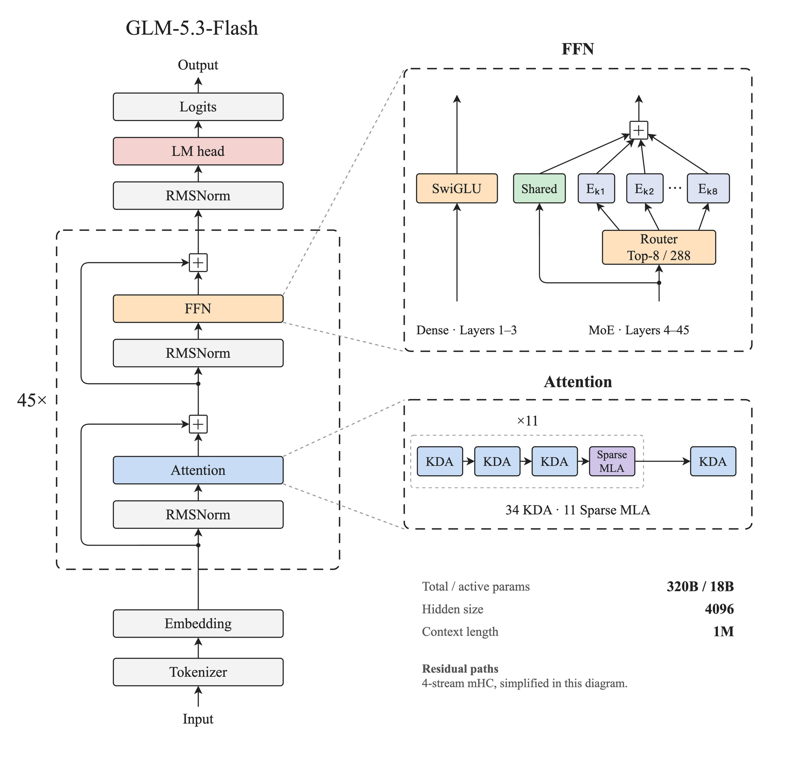
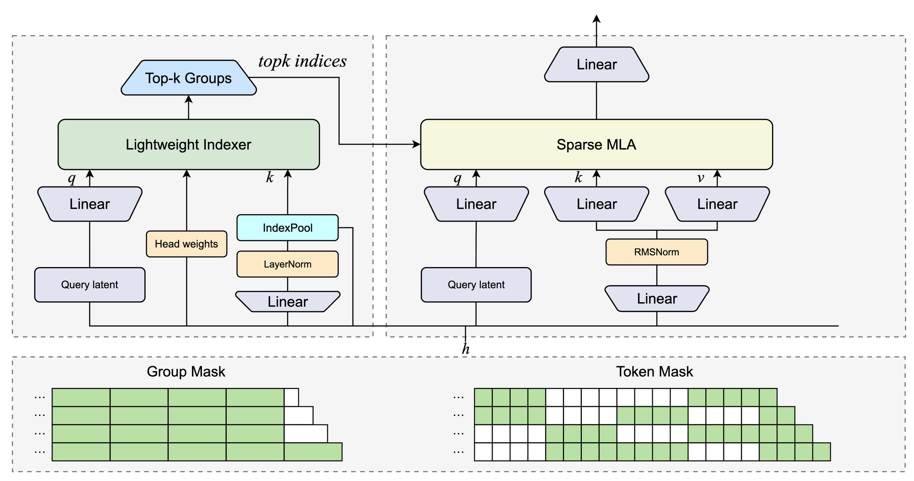
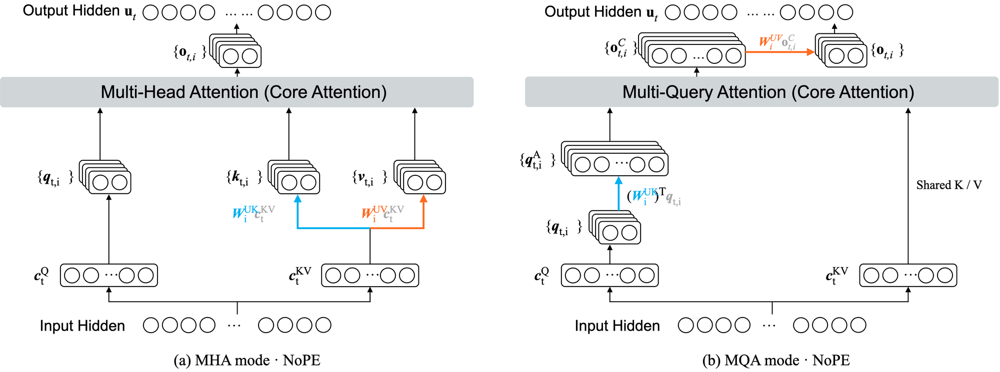
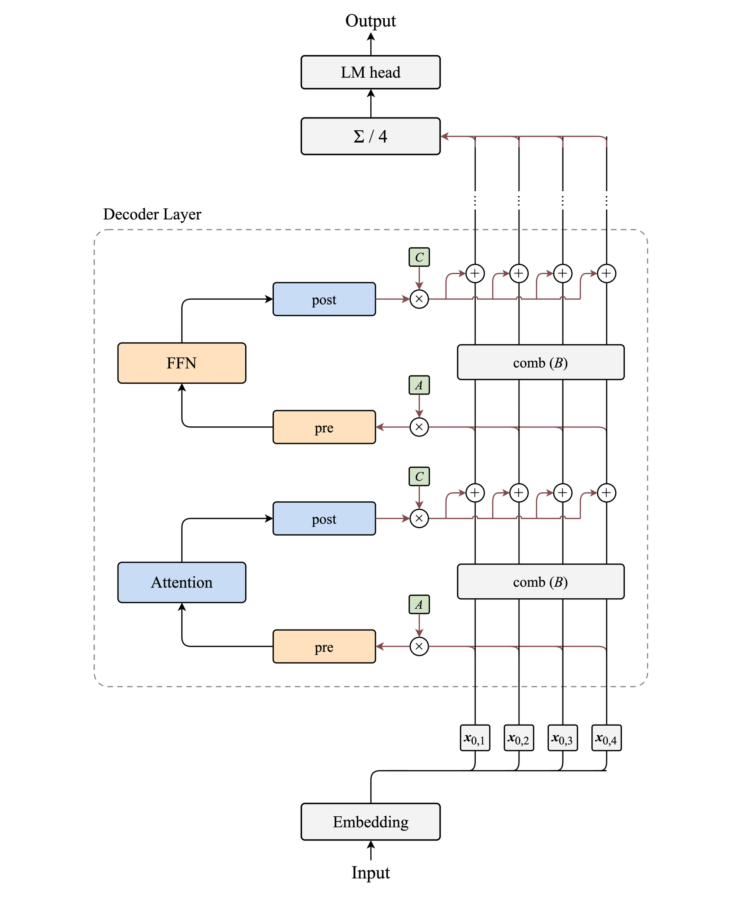
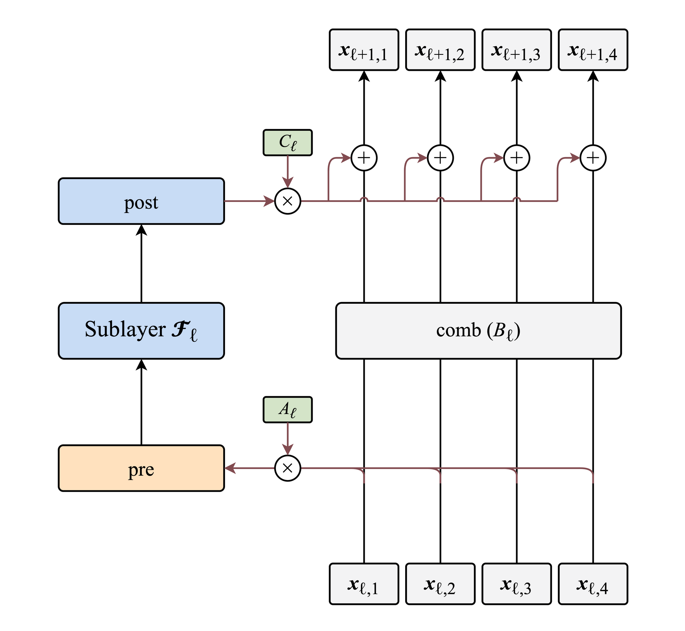

# GLM-5.3-Flash 架构学习笔记

GLM 一直给我扎实、好用的印象，我也保持着订阅，持续关注它的更新。GLM-5.3 与 GLM-5.2 使用相同的基础模型，提升主要来自后训练。这次的 GLM-5.3-Flash 则采用了新的架构设计，很值得学习。

在之前的学习中，我已经接触过混合注意力和多路残差。GLM-5.3-Flash 对这些设计的运用又有所不同，也给了我进一步深入学习的机会。这次，我想更仔细地理解混合注意力中稀疏 MLA 的计算过程，以及 mHC 怎样组织多条残差流的读写。

## 1. 模型架构

[GLM-5.3-Flash](https://huggingface.co/zai-org/GLM-5.3-Flash) 是一个多模态 MoE（混合专家模型），文本主干采用仅解码器 Transformer。模型的总参数为 320B，激活参数 18B。主干有 45 个解码器层，隐藏维度为 4096，上下文长度上限为 1M token。



*图 1　GLM-5.3-Flash 模型架构。左侧展示文本主干；右上展开前三层的稠密 FFN 和后 42 层的 MoE；右下展示 KDA 与稀疏 MLA 的交错排列。残差路径简化为单流示意，实际采用四路 mHC，图中省略视觉编码器与 MTP。*

**输入。** GLM-5.3-Flash 的词表大小为 154,880，与 GLM-5.3 一致。文本嵌入与语言模型输出头各自使用独立权重。

**解码器层。** GLM-5.3-Flash 将 KDA（Kimi Delta Attention）与稀疏 MLA 组合成混合注意力，前馈网络则采用稠密（dense）FFN 和 MoE 两种配置。注意力与 FFN 子层均采用前置 RMSNorm。图 1 右侧分别展示两个子层在主干中的排布。

**注意力子层。** KDA 用固定大小的状态汇总历史，此前已在 Kimi 架构中出现。稀疏 MLA 通过索引器选择相关位置，再读取这些位置的信息。GLM-5.3-Flash 将两者交错排列，三层 KDA 接一层稀疏 MLA 的组合重复 11 次，最后再接一层 KDA，共有 34 层 KDA 和 11 层稀疏 MLA。稀疏 MLA 的索引器采用 IndexPool，将相邻四个位置的索引信息合并后按组检索。主 MLA 采用 NoPE（No Position Encoding，无显式位置编码），不使用旋转位置编码。

**前馈子层。** 每个 MoE 层包含 288 个路由专家，处理每个 token 时激活其中 8 个，另有一个始终参与计算的共享专家。在层的排列上，前三层使用稠密 FFN，后 42 层使用 MoE，对应图 1 右上的两种结构。

**mHC 残差连接。** mHC（Manifold-Constrained Hyper-Connections）采用四路残差，通过输入相关的系数控制各路的读取与写回，并用混合矩阵重新组合旧状态。这个混合矩阵受到双随机约束。双随机约束的具体含义和作用，后面会结合 mHC 的计算过程详细解释。

**输出。** 主干末端将四条残差流取算术平均，再经最终 RMSNorm 和语言模型输出头得到 logits（未归一化分数）。

**视觉编码与辅助预测。** GLM-5.3-Flash 配有一个 24 层视觉编码器，将图像和视频编码并映射为 4096 维表示，与文本表示共同进入主干。45 层主干之外还包含一层 MTP（Multi-Token Prediction）多 token 预测模块，用于支持推测解码。

## 2. KDA 与稀疏 MLA 的混合注意力

GLM-5.3-Flash 的混合注意力由 KDA 和稀疏 MLA 组成。KDA 是一种采用逐通道遗忘和差值修正的线性注意力，通过持续更新矩阵状态汇总历史，此前已在 [Kimi K3 学习笔记](https://github.com/jamez-bondos/blog/issues/2)中详细介绍。GLM-5.3-Flash 的每个 KDA 层有 64 个头，每头的状态为 $`128\times128`$，尺寸不随上下文长度增长。

稀疏 MLA 是这次深入学习的重点。MLA（Multi-head Latent Attention，多头潜在注意力）用低维向量表示每个 token 的 K/V 信息，从而减少推理时需要缓存的数据。此前在 Kimi K3 学习笔记中介绍 Gated MLA 时，已经学习过这一设计。

### 2.1 整体流程

MLA 减少了每个 token 的缓存量，但对全部历史位置计算注意力的开销仍会随上下文增长。GLM-5.3-Flash 将 MLA 与 DSA（DeepSeek Sparse Attention）结合，先由索引器选出相关位置，再由主 MLA 对这些位置计算注意力。

索引器本身也需要为每个检索候选计算分数。为减少这部分开销，GLM-5.3-Flash 引入索引池化设计 IndexPool，将相邻四个 token 的索引向量合并为一个候选向量，按组评分和筛选。选中一组后，主 MLA 仍分别读取组内各 token 的表示。

整个过程包括候选生成、位置选择和注意力计算。图 2 左侧的索引器完成前两步，右侧的主 MLA 负责注意力计算，两侧通过选出的位置连接。



*图 2　IndexPool 与稀疏 MLA。左侧生成候选向量并选择候选组，右侧计算主注意力；topk indices 连接两条分支。底部绿色格分别表示可参与检索的完整组和主 MLA 可读取的 token，省略号表示更早的历史。*

**候选生成。** 索引器为每个 token 生成一份用于检索的向量，称为索引 K，并将相邻四个 token 划为一个候选组。IndexPool 将组内四份索引 K 合并为一份候选向量，代表该组参与评分。图 2 左侧的索引 K 路径从输入经过投影、归一化和 IndexPool，进入索引器的评分模块。

**位置选择。** 索引器根据当前 token 的表示生成查询，与候选向量匹配并评分，选出相关组。随后取出入选组内各 token 的序列位置，通过图中的 topk indices 交给主 MLA。完整组只有在组内四个 token 都对当前 token 因果可见时才能参加筛选，对应底部的 Group Mask。末尾尚未凑满一组的可见 token，其位置直接补入。最终参与主注意力的位置对应 Token Mask。

**注意力计算。** 主 MLA 用自己的查询读取入选 token 的表示。每个 token 的 K/V 信息由一份 KV latent（低维键值表示）表示。图 2 展示的是先展开 K/V 的计算过程，各注意力头通过投影从这份低维表示中得到各自的 K/V，分别计算注意力权重并汇总 V。各头输出拼接后，经图 2 右上方的输出投影，得到当前 token 的注意力输出。

### 2.2 候选生成

索引器将相邻四个 token 划为一组，每组作为一个检索候选，称为候选组。IndexPool 将组内四份索引 K 合并为一份候选向量，代表该组参与评分。组被选中后，取出组内四个 token 的序列位置，供主 MLA 使用。

**生成索引 K。** 每个 token 在当前注意力层的输入向量经过线性投影和 LayerNorm，得到一份 128 维索引 K。

**合并索引 K。** 将同组四份索引 K 合并为一份候选向量，这个过程称为池化。平均池化的做法是将四份向量分别乘以 $`1/4`$，再相加，此前学习的 Qwen3.8-Flash-Next 就采用了这种方式。

合并向量时使用的系数称为池化权重。平均池化中，四份索引 K 的权重都是 $`1/4`$，每份向量的所有通道都使用同一个权重。

IndexPool 则为每个通道分别计算池化权重。这里的通道就是向量的一个维度。例如，合并第一个通道时，四份索引 K 对应的权重可以是 $`0.1、0.6、0.2、0.1`$；合并第二个通道时，可以是 $`0.4、0.1、0.1、0.4`$。在这个示意例子中，第一个通道更偏重第二个 token，第二个通道则更偏重第一个和第四个 token。

以下固定考察一个候选组，用 $`j=1,2,3,4`$ 表示 token 的组内位置，$`d=1,\ldots,128`$ 表示通道编号。将组内第 $`j`$ 个 token 在第 $`d`$ 个通道上的池化权重记为 $`\alpha_{j,d}`$，逐通道合并可以写为

```math
\bar k_d^I=\sum_{j=1}^{4}\alpha_{j,d}k_{j,d}^I
```

上标 $`I`$ 表示索引器。$`k_{j,d}^I`$ 是组内第 $`j`$ 个 token 的索引 K 在第 $`d`$ 个通道上的数值，$`\bar k_d^I`$ 是合并后的候选向量在同一通道上的数值。

固定一个通道，取四份向量的对应数值，分别乘以各自的权重，再相加。对全部 128 个通道分别计算，就得到一份 128 维的候选向量。每个通道的四个权重之和都为 1。

**计算池化权重。** 生成池化权重涉及两份可训练参数，分别是打分投影矩阵 $`W_G`$ 和组内位置偏置 $`P`$。两者都随模型训练更新，同一层的不同组共用，推理时固定。

模型先用 $`W_G`$ 将每个 token 的输入转换为池化打分

```math
\mathbf g_j=W_G\mathbf h_j
```

$`\mathbf h_j`$ 是组内第 $`j`$ 个 token 在当前注意力层的 4096 维输入向量，$`W_G`$ 的形状为 $`128\times4096`$。输出 $`\mathbf g_j`$ 包含 128 个分数，分别对应索引 K 的 128 个通道。

组内位置偏置 $`P`$ 是另一份独立的参数，形状为 $`4\times128`$。四行分别对应四个组内位置，每列对应一个通道。组内第一个 token 的打分加上第一行偏置，第二个 token 加上第二行，依此类推。

将池化打分与组内位置偏置相加，再对同一通道上组内四个 token 的分数做 softmax，得到池化权重。固定通道 $`d`$，这个过程可以写为

```math
\alpha_{j,d}
=
\mathrm{Softmax}_{j}
\left(g_{j,d}+P_{j,d}\right)
```

这里固定通道 $`d`$，$`\mathrm{Softmax}_j`$ 表示对组内四个 token（$`j=1,2,3,4`$）的分数做 softmax，取第 $`j`$ 个 token 对应的池化权重。每个通道分别计算，四个池化权重之和为 1，再用这些权重合并索引 K 的对应通道上的数值。

$`W_G`$ 和 $`P`$ 是模型保存的参数，$`\mathbf g_j`$ 和 $`\alpha_{j,d}`$ 则是根据输入计算出的结果。池化权重只依赖组内输入和这些参数，因此形成的候选向量可以供不同查询使用。

### 2.3 位置选择

位置选择根据当前 token 与候选组的相关性，确定主 MLA 读取哪些 token。索引器先为每个候选组计算一个分数，再选出得分较高的组，取出组内各 token 的序列位置。

**生成查询。** 索引器需要根据当前 token 的输入生成查询，用来匹配候选向量。它有 32 个索引头，每个头使用一份 128 维的索引 Q。

查询的生成分两步。当前 token 的 4096 维输入向量先经过线性投影和 RMSNorm，得到一份 1536 维的中间向量，称为 query latent（低维查询表示）。用 $`\mathbf c_t^Q`$ 表示这份向量，其中 $`t`$ 是当前 token 的位置，上标 $`Q`$ 表示它用于生成查询。

索引器再将这份中间向量投影为 $`32\times128`$ 个数，分成 32 组，每组就是一个索引头使用的 128 维查询。各头分别与候选向量匹配，匹配结果再合成候选组评分。

图 2 中的两处 Query latent 表示同一份中间向量。索引器与主 MLA 使用不同的投影矩阵，从中生成各自所需的查询。

**计算候选组评分。** 索引器将 32 个索引头的匹配结果加权汇总，得到当前 token 对一个候选组的评分。各头使用的系数称为索引头权重，由当前 token 的输入计算得到。

用 $`\mathbf h_t`$ 表示当前 token 在这一注意力层的输入向量，索引头权重为

```math
\mathbf w_t^I=\frac{W_w\mathbf h_t}{\sqrt{32}}
```

$`\mathbf h_t`$ 有 4096 维，可训练的投影矩阵 $`W_w`$ 的形状为 $`32\times4096`$。得到的 $`\mathbf w_t^I`$ 包含 32 个权重，每个索引头使用其中一个，对应图 2 中的 Head weights。$`1/\sqrt{32}`$ 是固定缩放系数。

用 $`b`$ 表示候选组编号，$`\bar{\mathbf k}_b^I`$ 表示该组的候选向量，$`\mathbf q_{t,i}^I`$ 表示当前 token 在第 $`i`$ 个索引头上的查询。候选组评分为

```math
I_{t,b}
=
\sum_{i=1}^{32}
w_{t,i}^I\,
\mathrm{ReLU}
\left(
\frac{(\mathbf q_{t,i}^I)^T\bar{\mathbf k}_b^I}
{\sqrt{128}}
\right)
```

查询与候选向量的点积衡量两者的匹配程度，$`1/\sqrt{128}`$ 是按查询维度设置的缩放系数，ReLU 将负的匹配分数置零。$`w_{t,i}^I`$ 是第 $`i`$ 个索引头的权重，$`I_{t,b}`$ 是汇总后的候选组评分。同一当前 token 对不同候选组评分时，使用同一组索引头权重。

池化权重控制组内四个 token 的索引 K 怎样合并，索引头权重则控制 32 个索引头的匹配结果怎样汇总。索引器根据汇总后的候选组评分选择相关组。

**选择并取出位置。** 参加筛选的候选组必须完整且因果可见。对当前 token 而言，只有组内四个 token 都已经出现，这一组才具备入选资格，对应图 2 中的 Group Mask。

索引器选择得分最高的最多 512 个候选组，再取出组内各 token 的序列位置，得到最多 2,048 个位置。末尾尚未凑满一组的可见 token，其位置直接补入，因此还可能增加 0 至 3 个位置。最终的入选位置集合记为 $`\mathcal S_t`$，供主 MLA 的所有注意力头共同使用，对应图 2 中的 Token Mask。

以 11 个可见 token 为例，位置 1～4、5～8 构成两个完整组，9～11 为尾部。为展示筛选过程，假设这里只选择得分最高的一个组。若第二组得分更高，索引器选出位置 5～8，再补入尾部 9～11，得到

```math
\mathcal S_t=\{5,6,7,8,9,10,11\}
```

模型实际最多选择 512 个组，因此只有 11 个可见 token 时，两个完整组内的 token 和尾部 token 都会参与主注意力。第 12 个 token 出现后，9～12 成为完整组，开始参与组间筛选。

### 2.4 注意力计算

主 MLA 为当前 token 计算注意力输出，当前 token 提供 Q，入选 token 提供 K 和 V。MLA 用一份低维表示承载每个入选 token 的 K/V 信息，称为 KV latent。计算时，先从这些表示中展开各注意力头所需的 K/V，再完成多头注意力计算。这种计算方式称为 MLA 的 MHA mode（多头注意力模式）。

**生成查询。** 主 MLA 使用与索引器相同的 query latent，也就是当前 token 的 1536 维中间向量 $`\mathbf c_t^Q`$。主 MLA 通过自己的投影矩阵，将它转换为 $`64\times256`$ 个数，分成 64 组，得到各注意力头使用的 256 维查询。第 $`i`$ 个头的查询记为 $`\mathbf q_{t,i}`$，用于匹配入选 token 在同一个头上的 K。

**展开 K/V。** 每个 token 在当前注意力层的输入向量经过线性投影和 RMSNorm，得到一份 512 维的 KV latent。用 $`\mathbf c_s^{KV}`$ 表示位置 $`s`$ 上的这份向量。

以缓存 KV latent 的推理路径为例，这些向量会被保存在缓存中。索引器选出位置后，主 MLA 读取对应的向量，通过各头的投影矩阵展开 K 和 V。

```math
\mathbf k_{s,i}=W_i^{UK}\mathbf c_s^{KV},
\qquad
\mathbf v_{s,i}=W_i^{UV}\mathbf c_s^{KV}
```

$`W_i^{UK}`$ 和 $`W_i^{UV}`$ 分别是第 $`i`$ 个头的 K、V 投影矩阵，均为训练得到的模型参数，形状为 $`256\times512`$，将读取的 512 维表示展开为 256 维的 K 和 V。各头拥有自己的投影参数，同一个头处理不同位置时复用同一套参数。



*图 3　GLM-5.3-Flash MLA 的两种计算模式。左侧先展开各头的 K/V，再计算注意力；右侧将 K 投影移到查询侧，将 V 投影移到加权汇总之后。参考 [DeepSeek-V3.2 技术报告 Figure 7](https://arxiv.org/html/2512.02556v1#A1)。*

**计算注意力。** 各头根据查询与入选 token 的匹配程度，加权汇总这些 token 的 V，得到当前头的输出 $`\mathbf o_{t,i}`$。

```math
\mathbf o_{t,i}
=
\sum_{s\in\mathcal S_t}
\mathrm{Softmax}_{s}
\left(
\frac{\mathbf q_{t,i}^{T}\mathbf k_{s,i}}{\sqrt{d_h}}
\right)
\mathbf v_{s,i}
```

其中，$`s`$ 是入选 token 的序列位置，$`i`$ 是主注意力头编号。$`\mathrm{Softmax}_s`$ 表示对全部入选位置的分数做 softmax，取位置 $`s`$ 对应的权重。同组四个 token 分别参与打分，各自获得注意力权重。GLM-5.3-Flash 的主 MLA 采用 NoPE，Q/K 的 256 维全部用于内容匹配，因此这里 $`d_h=256`$。

**合并各头输出。** 64 个头各自得到一份 256 维输出，拼接后通过输出投影 $`W^O`$，得到当前 token 的 4096 维注意力输出

```math
\mathbf u_t
=
W^O
[\mathbf o_{t,1};\mathbf o_{t,2};\ldots;\mathbf o_{t,64}]
```

方括号中的分号表示向量拼接，$`W^O`$ 是模型训练得到的输出投影矩阵。

### 2.5 计算重排

MLA 还可以通过调整计算顺序，直接利用 KV latent 完成注意力的打分与加权汇总，无须展开各入选 token 的多头 K/V。具体做法是将 K 投影移到查询侧，将 V 投影移到加权汇总之后，对应图 3 右侧的两处变化。重排后，各头保留各自的查询，共用的 KV latent 同时承担 K 和 V 的作用。这种计算方式称为 MLA 的 MQA mode（多查询注意力模式）。

**K 投影移到查询侧。** 在 MLA 的 MHA mode 下，每个入选 token 的 KV latent 先经过 K 投影，再与当前头的查询做点积。利用矩阵乘法结合律，可以调整这两步的计算顺序，让查询先与 K 投影矩阵相乘。

```math
\begin{aligned}
\mathbf q_{t,i}^{T}\mathbf k_{s,i}
&=\mathbf q_{t,i}^{T}
\left(W_i^{UK}\mathbf c_s^{KV}\right)\\
&=\left(\mathbf q_{t,i}^{T}W_i^{UK}\right)\mathbf c_s^{KV}\\
&=\left((W_i^{UK})^{T}\mathbf q_{t,i}\right)^{T}
\mathbf c_s^{KV}
\end{aligned}
```

将变换后的查询记为 $`\mathbf q_{t,i}^{A}`$。

```math
\mathbf q_{t,i}^{A}
=
(W_i^{UK})^{T}\mathbf q_{t,i}
```

变换后的查询 $`\mathbf q_{t,i}^{A}`$ 是一个 512 维向量，可以直接与同为 512 维的 KV latent 做点积。对当前 token 的每个注意力头，这份查询只需计算一次，就能用于所有入选位置的打分，无须逐个展开这些位置的 K。图 3 中蓝色投影移到查询侧，表示的就是这一变化。

变换前后的点积相同。虽然点积维度从 256 变为 512，缩放系数仍为 $`1/\sqrt{d_h}`$，其中 $`d_h=256`$。在同一入选位置集合上做 softmax，得到的注意力权重也相同。将当前头对位置 $`s`$ 的注意力权重记为 $`a_{t,s,i}`$，用于后续的加权汇总。

**V 投影移到汇总之后。** 在 MLA 的 MHA mode 下，各入选 token 的 KV latent 先经过 V 投影，再按注意力权重汇总。同一个头对所有入选 token 使用同一份 V 投影矩阵，因此可以先将 KV latent 按注意力权重汇总，再对结果做一次 V 投影。

```math
\begin{aligned}
\mathbf o_{t,i}
&=\sum_{s\in\mathcal S_t}
a_{t,s,i}\mathbf v_{s,i}\\
&=\sum_{s\in\mathcal S_t}
a_{t,s,i}\left(W_i^{UV}\mathbf c_s^{KV}\right)\\
&=W_i^{UV}
\left(
\sum_{s\in\mathcal S_t}
a_{t,s,i}\mathbf c_s^{KV}
\right)
\end{aligned}
```

括号内将入选 token 的 KV latent 按当前头的注意力权重加权汇总，结果记为 $`\mathbf o_{t,i}^{C}`$，与图 3 右侧的符号一致。模型先得到这份 512 维汇总向量，再通过 $`W_i^{UV}`$ 投影为 256 维的头输出。整个过程无需显式生成各入选 token 的 V，对应图中橙色投影移到注意力汇总之后。

**多个查询头共用 K/V。** 将重排后的打分与汇总合在一起，注意力核心可以写为

```math
\mathbf o_{t,i}^{C}
=
\sum_{s\in\mathcal S_t}
\mathrm{Softmax}_{s}
\left(
\frac{(\mathbf q_{t,i}^{A})^{T}\mathbf c_s^{KV}}
{\sqrt{d_h}}
\right)
\mathbf c_s^{KV}
```

每个头使用自己的查询 $`\mathbf q_{t,i}^{A}`$，因此可以得到不同的注意力权重。对于同一个入选位置 $`s`$，参与点积和加权汇总的都是同一份 $`\mathbf c_s^{KV}`$，由 64 个查询头共用。这种多个查询头共用一套 K/V 的计算结构，对应 MQA（Multi-Query Attention，多查询注意力），也是 MLA 的这一计算模式称为 MQA mode 的原因。

各头得到各自的汇总结果后，再通过对应的 V 投影得到头输出。

```math
\mathbf o_{t,i}
=
W_i^{UV}\mathbf o_{t,i}^{C}
```

64 个头的输出继续拼接，并通过 $`W^O`$ 得到当前 token 的注意力输出。

两处重排使用原有投影参数。KV latent 的 RMSNorm 已在生成表示时完成，softmax 仍位于打分之后、加权汇总之前，因此重排在精确算术下保持结果一致。

**缓存与实现。** 在缓存 KV latent 的推理路径中，MLA 的 MQA mode 可以直接利用缓存中的低维向量完成打分和汇总，无须展开多头 K/V。本文核对的 [Transformers 参考实现](https://github.com/huggingface/transformers/blob/f62dc9bf2c90353b442a56e74391fbb8c689b55e/src/transformers/models/glm5_next/modeling_glm5_next.py)则先展开并缓存 K/V，再根据索引器选出的位置构造注意力掩码，限定主注意力可以访问的范围。两者的计算组织与缓存布局不同，实际效率取决于所用的注意力内核和运行条件。

## 3. mHC 残差连接

mHC 是一种带约束的多路残差连接，通过读取、混合和写回更新多条残差流。这些操作的系数根据输入生成，其中旧流混合采用双随机约束，以限制连续混合造成的放大。

此前在 [Qwen3.8-Flash-Next 架构学习笔记](https://github.com/jamez-bondos/blog/issues/3)中，已经接触过 mHC 的基本设计。这次结合 GLM-5.3-Flash 的四路 mHC，进一步学习读取、混合和写回的具体计算。

### 3.1 整体流程

GLM-5.3-Flash 采用四路 mHC。进入主干时，每个 token 的 4096 维输入向量被复制为四份，分别作为四条残差流的初始状态。随后，各子层通过读取、旧流混合和输出写回更新四条流中的状态。

图 4 右侧的四条纵向线路表示同一个 token 的四条残差流。注意力和 FFN 子层分别从四条流中读取一份输入，再将各自的输出写回混合后的旧状态。每次更新后仍保留四条流，供下一子层使用。



*图 4　mHC 的残差主干。右侧四条纵向线路表示四条残差流。pre 从四条流中加权读取子层输入；comb 混合子层入口的四条旧流；post 将子层输出按各流的写入系数缩放，在加号处与混合结果相加。虚线框展开一个解码器层，顶部的 $`\Sigma/4`$ 表示四条流取平均。图中 $`A`$、$`B`$、$`C`$ 分别表示读取、混合和写回映射，省略子层下标；底部的 $`\mathbf x_{0,i}`$ 表示第 $`i`$ 条流的初始状态。*

**读取（pre）。** 四条残差流加权相加，合成一份输入，沿图 4 左侧送往注意力或 FFN 子层。原来的四条流保留在右侧残差路径上。

**旧流混合（comb）。** 四组系数分别对子层入口的四条旧流做加权求和，得到四条混合结果。参与混合的都是本次子层计算之前的残差状态。

**输出写回（post）。** 同一份子层输出按四个写入系数分别缩放，再与对应的混合结果相加。图中的四个加号完成这一步，得到下一子层使用的四条残差流。

### 3.2 读取输入

读取将四条残差流在当前子层入口的状态加权合成为一份输入。每条流使用一个读取系数，控制其状态向量对合成结果的贡献，对应图 5 左下方的 pre。



*图 5　mHC 的一次子层更新。底部的 $`\mathbf x_{\ell,1},\ldots,\mathbf x_{\ell,4}`$ 表示四条残差流在子层入口的状态，顶部是更新后的状态。pre 使用 $`A_\ell`$ 读取输入，comb 使用 $`B_\ell`$ 混合旧流，post 使用 $`C_\ell`$ 将子层输出写回。*

**残差状态。** 以下固定考察一个 token，用 $`\ell`$ 表示子层编号，注意力和 FFN 分别占一个编号。在第 $`\ell`$ 个子层入口，第 $`i`$ 条残差流的状态记为 $`\mathbf x_{\ell,i}`$，用一个 4096 维列向量表示。将这四个向量分别转置为行向量，再按行排列，得到状态矩阵

```math
X_\ell=
\begin{bmatrix}
\mathbf x_{\ell,1}^{T}\\
\mathbf x_{\ell,2}^{T}\\
\mathbf x_{\ell,3}^{T}\\
\mathbf x_{\ell,4}^{T}
\end{bmatrix}
\in\mathbb R^{4\times4096}.
```

$`X_\ell`$ 的每行对应一条残差流，每列对应一个通道。小写 $`\mathbf x_{\ell,i}`$ 表示一条流在当前子层入口的状态，大写 $`X_\ell`$ 表示四条流在该入口的完整状态。

**合成输入。** 四条流各有一个读取系数，分别记为 $`a_{\ell,1}`$、$`a_{\ell,2}`$、$`a_{\ell,3}`$、$`a_{\ell,4}`$。它们组成读取映射

```math
A_\ell=
\begin{bmatrix}
a_{\ell,1}&a_{\ell,2}&a_{\ell,3}&a_{\ell,4}
\end{bmatrix}
\in\mathbb R^{1\times4}.
```

每条流的状态向量乘以对应的读取系数，再将四份结果相加，就得到子层输入。这个线性组合写为

```math
A_\ell X_\ell
=
a_{\ell,1}\mathbf x_{\ell,1}^{T}
+a_{\ell,2}\mathbf x_{\ell,2}^{T}
+a_{\ell,3}\mathbf x_{\ell,3}^{T}
+a_{\ell,4}\mathbf x_{\ell,4}^{T}.
```

每个 $`a_{\ell,i}`$ 都是一个标量，第 $`i`$ 条流的状态向量在所有通道上使用同一个读取系数。合成后的输入为 $`1\times4096`$ 的行向量。

**子层计算。** 合成输入经过 RMSNorm，再进入当前注意力或 FFN 子层。本章用 $`\mathcal F_\ell`$ 表示包含这一步前置 RMSNorm 的子层计算，输出记为 $`\mathcal F_\ell(A_\ell X_\ell)`$。输入与输出均按 $`1\times4096`$ 的行向量表示。子层得到的一份输出，随后由 post 写回四条残差流。

### 3.3 混合旧流

旧流混合将子层入口的四条残差流状态重新组合，对应图 5 主干中央的 comb。每条混合结果都由这四份状态加权相加得到，四条结果分别使用各自的一组混合系数。

**计算一条混合结果。** 第一组混合系数组成行向量 $`\mathbf b_{\ell,1}\in\mathbb R^{1\times4}`$。它与状态矩阵 $`X_\ell`$ 相乘，得到第一条混合结果

```math
\mathbf b_{\ell,1}X_\ell
=
b_{\ell,11}\mathbf x_{\ell,1}^{T}
+b_{\ell,12}\mathbf x_{\ell,2}^{T}
+b_{\ell,13}\mathbf x_{\ell,3}^{T}
+b_{\ell,14}\mathbf x_{\ell,4}^{T}.
```

$`b_{\ell,11},\ldots,b_{\ell,14}`$ 是第一组混合系数。下标 $`\ell`$ 表示当前子层，后面的两个数字分别表示混合结果的编号和旧流的编号。例如，$`b_{\ell,12}`$ 是计算第一条混合结果时，第二条旧流的状态所使用的系数。

四份状态向量分别乘以对应系数，再相加，得到一份 $`1\times4096`$ 的结果。每个系数作用于对应状态向量的所有通道。

**合并四次计算。** 其余三条结果分别使用系数行向量 $`\mathbf b_{\ell,2}`$、$`\mathbf b_{\ell,3}`$、$`\mathbf b_{\ell,4}`$。将四个行向量上下排列，就得到混合矩阵

```math
B_\ell=
\begin{bmatrix}
\mathbf b_{\ell,1}\\
\mathbf b_{\ell,2}\\
\mathbf b_{\ell,3}\\
\mathbf b_{\ell,4}
\end{bmatrix}
\in\mathbb R^{4\times4}.
```

$`B_\ell`$ 的每行对应一条混合结果，每列对应一条旧流。用 $`B_\ell`$ 左乘 $`X_\ell`$，就将四次线性组合合写成一次矩阵乘法

```math
B_\ell X_\ell
=
\begin{bmatrix}
\mathbf b_{\ell,1}X_\ell\\
\mathbf b_{\ell,2}X_\ell\\
\mathbf b_{\ell,3}X_\ell\\
\mathbf b_{\ell,4}X_\ell
\end{bmatrix}
\in\mathbb R^{4\times4096}.
```

四组系数都作用于同一份入口状态矩阵 $`X_\ell`$，它由本次注意力或 FFN 计算之前的四条残差流状态组成。每组系数对这四份状态做线性组合，得到一条混合结果。

### 3.4 写回输出

写回将本次子层输出加入四条混合结果，更新四条残差流的状态。四条流接收同一份子层输出，各自的写入系数决定加入多少，对应图 5 中从 post 通向四个加号的分支。

**更新一条流。** 四条流的写入系数分别记为 $`c_{\ell,1},c_{\ell,2},c_{\ell,3},c_{\ell,4}`$。以第一条流为例，将子层输出乘以 $`c_{\ell,1}`$，再与第一条混合结果 $`\mathbf b_{\ell,1}X_\ell`$ 相加，得到更新后的状态

```math
\mathbf x_{\ell+1,1}^{T}
=
\mathbf b_{\ell,1}X_\ell
+
c_{\ell,1}\mathcal F_\ell(A_\ell X_\ell).
```

第一项是四条旧流状态的混合结果，第二项是按写入系数缩放后的子层输出。同一个写入系数作用于输出的所有通道。两项相加，得到第一条流更新后的状态 $`\mathbf x_{\ell+1,1}^{T}`$，作为下一子层的入口状态。

**合并四次更新。** 其余三条流各自使用对应的混合结果和写入系数。将四个写入系数排列为列向量

```math
C_\ell=
\begin{bmatrix}
c_{\ell,1}\\
c_{\ell,2}\\
c_{\ell,3}\\
c_{\ell,4}
\end{bmatrix}
\in\mathbb R^{4\times1},
```

四条流的更新就可以合写为

```math
X_{\ell+1}
=
B_\ell X_\ell
+
C_\ell\mathcal F_\ell(A_\ell X_\ell).
```

$`C_\ell`$ 与一份 $`1\times4096`$ 的子层输出相乘，得到一个 $`4\times4096`$ 的矩阵，每行是写入对应残差流的更新量。将它与旧流混合结果逐行相加，得到下一子层使用的状态矩阵 $`X_{\ell+1}`$，形状仍为 $`4\times4096`$。

**不同的写入比例。** 以主干开始处的注意力和 FFN 两次更新为例，四条流的初始状态相同，都来自输入嵌入。为单独观察写入系数的作用，假设这两次更新的混合矩阵均为单位矩阵，即 $`B_0=B_1=I`$，使旧流混合这一步保持各条流的状态不变。两次更新的写入系数分别设为

```math
C_0=[0.8,0.2,0.8,0.2]^T,
\qquad
C_1=[0.2,0.8,0.2,0.8]^T.
```

两次更新后，第 1、3 条流的状态在初始嵌入之外，加入了 $`0.8`$ 倍注意力输出和 $`0.2`$ 倍 FFN 输出；第 2、4 条流的比例则相反。FFN 输出由注意力更新后的状态计算得到，这些系数只表示两份输出分别以多少比例写入。

后续子层通过各自的读取系数，对这四份状态加权求和，合成输入。若后续混合矩阵不为单位矩阵，各条流积累的内容还会重新组合。

### 3.5 双随机约束

先只考虑旧状态沿 comb 路径的传递，暂不计入子层输出的写回。一次混合得到 $`B_\ell X_\ell`$，再经过下一子层的混合，就得到 $`B_{\ell+1}B_\ell X_\ell`$。随着经过的子层增多，混合矩阵不断连乘。如果每次混合都放大数值，连续多次混合就可能使数值越来越大。

**从相加到加权平均。** 先看一组混合系数怎样影响结果。假设四条旧流的状态在某个通道上的数值为 2、4、6、8，若四个系数都是 1，相加就得到 20，超出了原来四个数的范围。

若将四个系数都设为 $`0.25`$，结果就是四个数的平均值 5。也可以分配不同的权重，例如取 $`0.1、0.2、0.3、0.4`$，加权求和得到 6。

权重改变了结果偏向哪条旧流。只要系数非负且和为 1，结果就始终落在 2 到 8 之间。对其他通道也一样，混合结果不会超出四条旧流状态在该通道上的数值范围。

$`B_\ell`$ 的每一行是一组混合系数。因此，要求每行系数非负且和为 1，就能使每条混合结果成为四份旧流状态的加权平均。

**保持状态总和。** 每条混合结果都是加权平均，仍不保证四份状态相加的结果保持不变。继续使用 2、4、6、8 的例子，如果四组系数都取 $`[0,0,0,1]`$，混合结果就都变成 8，这个通道上的数值总和从 20 增加到 32。

这里每组系数之和都是 1，但第四条旧流的状态被使用了四次，其余三条没有参与。要保持总和，还需要约束每条旧流的状态在四条混合结果中的总贡献。

以第二条旧流为例，它在四条混合结果中对应的系数分别为 $`b_{\ell,12}`$、$`b_{\ell,22}`$、$`b_{\ell,32}`$、$`b_{\ell,42}`$。将四条结果相加时，这四个系数也会相加。只要它们的和为 1，第二条旧流的状态在总和中就仍然保留一份。对每条旧流都作相同要求，混合前后四份状态的向量总和及平均值就保持不变。

这四个系数位于 $`B_\ell`$ 的第二列。对其他列也要求系数之和为 1，就得到混合矩阵的列约束。

**双随机条件。** mHC 将这些要求结合起来，约束混合系数非负，每行、每列之和均为 1。满足这些条件的矩阵称为双随机矩阵。

```math
b_{\ell,ij}\geq0,
\qquad
\sum_{j=1}^{4}b_{\ell,ij}=1,
\qquad
\sum_{i=1}^{4}b_{\ell,ij}=1.
```

这样的混合仍然可以改变各条流的状态。例如，若矩阵的全部系数均为 $`0.25`$，2、4、6、8 就会变成 5、5、5、5。总和仍为 20，但流间差异消失了。

严格满足双随机条件的矩阵相乘，结果仍是双随机矩阵。因此，只考虑旧状态的连续混合时，每条结果仍是最初四份状态的加权平均，四份状态的向量总和也保持不变。完整更新还包含子层输出的写回，这部分会改变残差状态。

**实际约束与实验。** GLM-5.3-Flash 使用 Sinkhorn 归一化生成近似双随机矩阵。有限迭代与浮点精度下，行和、列和只能近似为 1，连续混合也会积累一定偏差。

mHC 在 HC（Hyper-Connections）的基础上，对旧流混合矩阵增加了双随机约束。[mHC 论文](https://arxiv.org/html/2512.24880v2)在 27B 模型上比较了 HC 与 mHC 的传播稳定性，以混合矩阵连乘后的行和、列和的最大绝对值衡量传播增益，并对选定序列的 token 求平均。严格满足双随机条件时，这一指标为 1；实验中 HC 的增益峰值接近 3,000，mHC 约为 1.6，表明 mHC 显著抑制了旧流连续混合带来的放大。这组结果来自论文中的实验模型。

### 3.6 系数生成

读取映射 $`A_\ell`$、混合矩阵 $`B_\ell`$ 和写回映射 $`C_\ell`$ 中的系数，都根据当前 token 在子层入口的四份残差状态计算得到。

模型先为每个连接系数计算一个对应的中间值，再将这些值转换为最终系数。读取和写回的转换分别作用于每个数；混合矩阵需要满足双随机约束，因此要结合矩阵的行、列一起调整。

**准备输入。** 状态矩阵 $`X_\ell`$ 的每行是一条残差流的状态，共有四行。模型将这四行首尾相接，得到一份 16384 维行向量，再进行 RMSNorm 归一化。这里的 RMSNorm 不使用可训练的逐通道缩放参数。

```math
\hat X_\ell
=
\mathrm{RMSNorm}(\mathrm{vec}(X_\ell))
\in\mathbb R^{1\times16384}.
```

这里的 $`\mathrm{vec}`$ 表示按行展平状态矩阵，$`\hat X_\ell`$ 是归一化后的行向量。它用于生成系数，读取和混合操作使用的仍是原始状态 $`X_\ell`$。

**计算中间值。** 读取需要 4 个系数，混合需要 16 个，写回需要 4 个，因此模型先计算三组共 24 个中间值。它们分别记为 $`\tilde A_\ell`$、$`\tilde B_\ell`$ 和 $`\tilde C_\ell`$，形状依次为 $`1\times4`$、$`4\times4`$ 和 $`4\times1`$。波浪号表示它们尚未转换为最终系数。

三组计算都包括线性投影、缩放和偏置相加。用 $`W`$ 表示投影矩阵，$`\alpha`$ 表示缩放标量，$`S`$ 表示偏置。读取、混合和写回各有一套参数，分别用上标 $`\mathrm{pre}`$、$`\mathrm{res}`$、$`\mathrm{post}`$ 区分，其中 $`\mathrm{res}`$ 对应图中的 comb。

```math
\begin{aligned}
\tilde A_\ell
&=\alpha_\ell^{\mathrm{pre}}
(\hat X_\ell W_\ell^{\mathrm{pre}})
+S_\ell^{\mathrm{pre}},\\
\tilde B_\ell
&=\alpha_\ell^{\mathrm{res}}
\mathrm{Mat}(\hat X_\ell W_\ell^{\mathrm{res}})
+S_\ell^{\mathrm{res}},\\
\tilde C_\ell
&=\alpha_\ell^{\mathrm{post}}
(\hat X_\ell W_\ell^{\mathrm{post}})^T
+S_\ell^{\mathrm{post}}.
\end{aligned}
```

读取与写回的投影矩阵形状均为 $`16384\times4`$，各自得到四个数。读取按行向量排列，写回转置为列向量。混合的投影矩阵形状为 $`16384\times16`$，得到的 16 个数由 $`\mathrm{Mat}`$ 按混合矩阵的行列顺序排成 $`4\times4`$ 矩阵。

每组使用一个缩放标量，作用于该组的全部数值；偏置则与该组结果形状相同，按对应位置相加。$`W`$、$`\alpha`$ 和 $`S`$ 都是训练得到的参数，推理时固定，三组中间值则随当前输入变化。

这里的 $`\alpha_\ell^{\mathrm{pre}}`$ 是读取这一组共用的缩放参数，前文的 $`a_{\ell,i}`$ 则是最终作用于第 $`i`$ 条流的读取系数，两者处于不同的计算步骤。

**转换为连接系数。** 三组中间值的位置与最终系数一一对应，但转换方式不同。

```math
\begin{aligned}
A_\ell&=\sigma(\tilde A_\ell)+10^{-6},\\
B_\ell&=\mathrm{Sinkhorn}(\tilde B_\ell),\\
C_\ell&=2\sigma(\tilde C_\ell).
\end{aligned}
```

$`\sigma`$ 表示逐元素应用 sigmoid。读取的四个中间值分别经过 sigmoid，再加上小常数，得到四个读取系数 $`a_{\ell,i}`$。写回采用两倍的 sigmoid 结果，得到四个写入系数 $`c_{\ell,i}`$。这两组系数都不要求和为 1。

混合的 16 个中间值则通过 Sinkhorn 归一化，得到近似双随机矩阵 $`B_\ell`$。虽然每个位置都对应一个混合系数 $`b_{\ell,ij}`$，但转换时需要用到同行、同列的其他数值，不能逐个独立计算。

**混合矩阵的归一化。** Sinkhorn 交替进行行归一化和列归一化。行归一化将每个数除以所在行的和，使行和接近 1；列归一化对列作相同处理。调整列时可能改变刚得到的行和，因此需要反复交替。

按本文 $`B_\ell`$ 的行列方向表示，GLM-5.3-Flash 先对 $`\tilde B_\ell`$ 按列做 softmax，再逐元素加上小常数，得到正值矩阵。随后进行一次行归一化，再执行 19 次“列归一化、行归一化”，对应配置中的 20 轮迭代。前面公式中的 $`\mathrm{Sinkhorn}`$ 概括了这一完整过程。

归一化分母中也加入小常数。由于迭代次数有限，并受到小常数与浮点误差的影响，最终的行和、列和只能近似为 1。

注意力和 FFN 分别拥有自己的系数生成参数。同一子层处理不同 token 时复用这些参数，根据各自入口的四份残差状态，计算对应的读取、混合和写回系数。

## 4. 模型比较与技术来源

### 4.1 与 GLM-5.3 的架构比较

GLM-5.3 与 GLM-5.2 使用相同的基础模型，改进来自后训练。GLM-5.3-Flash 则重新设计了架构与训练方案，并重新训练基础模型。两者的主要架构差异如下。

| 项目 | GLM-5.3 | GLM-5.3-Flash |
|---|---|---|
| 解码器层数 | 78 | 45 |
| 隐藏维度 | 6144 | 4096 |
| 注意力组成 | 全部采用稀疏 MLA | 34 层 KDA、11 层稀疏 MLA |
| 索引器的检索单位 | 单个 token | 四个相邻 token 组成的组 |
| 索引机制 | 采用 IndexShare，部分层复用选择结果 | 采用 IndexPool，各稀疏 MLA 层分别检索 |
| 主 MLA 位置编码 | 包含 RoPE 分量 | NoPE |
| 残差连接 | 单条残差流 | 四路 mHC |
| FFN 组成 | 前 3 层稠密，后 75 层 MoE | 前 3 层稠密，后 42 层 MoE |
| 每个 MoE 层的专家 | 256 个路由专家、1 个共享专家 | 288 个路由专家、1 个共享专家 |
| 处理每个 token 时激活的路由专家数 | 8 | 8 |
| 输入模态 | 文本 | 文本、图像、视频 |

**注意力组成。** GLM-5.3 的所有解码器层均采用稀疏 MLA。GLM-5.3-Flash 则将 KDA 与稀疏 MLA 配合使用。KDA 层通过固定大小的状态汇总历史，稀疏 MLA 层通过索引器选择相关位置，再读取这些位置的信息。

**检索机制。** IndexShare 与 IndexPool 改变的是检索过程中的不同环节。GLM-5.3 的 IndexShare 让部分层复用前面层选出的位置。GLM-5.3-Flash 的 IndexPool 则将四个相邻位置的索引 K 合并为一个候选向量，按组检索。组被选中后，主 MLA 仍分别读取组内各位置的 K/V 信息。

### 4.2 主要组件的技术来源

**MLA 与 DSA。** MLA 由 [DeepSeek-V2](https://arxiv.org/abs/2405.04434) 提出，用低维向量表示每个 token 的 K/V 信息。[DeepSeek-V3.2](https://arxiv.org/html/2512.02556v1#S2.SS1) 在 MLA 中引入 DSA 稀疏选择机制，通过索引器选出参与主注意力计算的位置。GLM-5.3-Flash 沿用这一框架，并引入 IndexPool，将检索单位从单个位置改为相邻位置组成的组。

**KDA 与混合注意力。** KDA（Kimi Delta Attention）来自 [Kimi Linear](https://arxiv.org/abs/2510.26692)。Kimi Linear 已采用三层 KDA 接一层全局 MLA 的组合。此前学习的 [Kimi K3](https://github.com/jamez-bondos/blog/issues/2) 也采用 KDA，并将它与 Gated MLA 配合使用。GLM-5.3-Flash 同样以三层 KDA 接一层 MLA 为基本组合，其中 MLA 采用稀疏检索。

**mHC。** mHC 来自 DeepSeek 的 [Manifold-Constrained Hyper-Connections](https://arxiv.org/abs/2512.24880)，通过多条残差流传递和更新状态，并对旧流混合矩阵施加双随机约束。GLM-5.3-Flash 采用四路 mHC。

**IndexPool。** IndexPool 是 GLM 官方在 GLM-5.3-Flash 中介绍的索引池化设计，将四个相邻位置的索引 K 按通道加权合并，形成一个检索候选，减少索引器需要评分的候选数量。

## 5. 结语

这次学习让我对 GLM 后续的架构演进多了一份期待。GLM-5.3-Flash 吸收了已有研究，也通过 IndexPool 等设计作出自己的改进。这些具体的尝试，是我在关注模型能力提升之外，也很愿意看到的变化。

官方在[发布文章](https://z.ai/blog/glm-5.3-flash)中提到，正在将这套方案扩展到更大的模型，开发 GLM-5.3-Flash 的经验也在影响下一款旗舰模型。我期待看到这些设计在更大规模下的表现，也希望下一代 GLM 能带来更多值得深入学习的架构创新。

<!-- issue-blog:article-id=103-glm53-flash -->
